# VDM Path Tracking Simulation

This repository contains path-tracking simulation experiments for a vehicle dynamics and motion control course. It develops and compares Pure Pursuit (PP), LQR, and MPC controllers using bicycle models, and studies how speed, vehicle parameters, controller settings, and vehicle models affect tracking performance.

---

## 1. Pure Pursuit (PP)

### 1.1 Experimental objectives

At this stage, the following tasks have been completed:

1. Understand the closed loop formed by the kinematic bicycle model and path-tracking controller;
2. Complete the core PP implementation in `vdm_lab/student/pure_pursuit.py`;
3. Validate the student PP implementation against the `solution` version;
4. Run low-, medium-, and high-speed experiments on the fixed-radius `circle` route;
5. Use theory and simulation data to explain why path tracking generally becomes more difficult as vehicle speed increases.

The core idea of PP is to select a **look-ahead target point** on the reference path instead of tracking the nearest point directly. The controller uses geometric relationships to calculate a front-wheel steering angle that continuously guides the vehicle toward that target.

---

### 1.2 PP Implementation

Student version PP located at:

```text
vdm_lab/student/pure_pursuit.py
```

The implementation consists of four steps.

#### Step 1: Calculate the Look-Ahead Distance

The look-ahead distance increases with speed:

\[
L_f = L_0 + k_v v
\]

Code realization:

```python
lookahead = controller.pp_base_lookahead + controller.pp_speed_gain * state.v
```

Of which:

- `L0 = pp_base_lookahead`: base look-ahead distance;
- `kv = pp_speed_gain`: Speed gain;
- `v = state.v`: Current speed of vehicle.

At higher speed, the controller selects a point farther ahead, which generally produces a smoother steering response. An excessively large look-ahead distance can, however, cause corner cutting and larger lateral deviations.

#### Step 2: Search for the Look-Ahead Target Point

Starting at the current nearest path point, `reference.nearest_index`, search forward until the Euclidean distance to a candidate point is at least `lookahead`:

```python
target_index = reference.nearest_index

while target_index < len(path.x) - 1:
    distance = math.hypot(
        path.x[target_index] - state.x,
        path.y[target_index] - state.y,
    )

    if distance >= lookahead:
        break

    target_index += 1
```

This prevents the vehicle from repeatedly tracking points it has already passed.

#### Step 3: Calculate the Target Direction Relative to the Vehicle

The target point's direction relative to the current vehicle heading is:

\[
\alpha =
\operatorname{atan2}(y_t-y,\;x_t-x)-\psi
\]

The code uses `pi_to_pi()` to normalize the angle to \([-\pi,\pi]\):

```python
alpha = pi_to_pi(
    math.atan2(
        target_y - state.y,
        target_x - state.x,
    ) - state.yaw
)
```

When:

- \(\alpha > 0\): Target point is on the left side of the vehicle;
- \(\alpha < 0\): Target point on the right side of the vehicle;
- \(\alpha \approx 0\): the target point is approximately straight ahead.

#### Step 4: Calculate the Front-Wheel Steering Angle

The PP geometric steering relationship is:

\[
\delta_f =
\operatorname{atan2}
\left(
2L\sin\alpha,\;L_f
\right)
\]

where \(L\) is the vehicle wheelbase.

Code realization:

```python
steer = math.atan2(
    2.0 * vehicle.wheelbase * math.sin(alpha),
    lookahead,
)
```

Final controller returns:

```python
return ControlCommand(
    acceleration=acceleration,
    steer=steer,
)
```

Longitudinal acceleration is calculated by the existing proportional speed controller, `speed_pid()`, while PP is primarily responsible for lateral steering control.

---

### 1.3 Student PP and Reference Validation

`solution` and `student`, respectively, are running at low speed.

Example:

```powershell
python run_experiment.py --algo pp --version student --route double_lane_change --speed-mode low --save-log --save-fig
python run_experiment.py --algo pp --version student --route circle --speed-mode low --save-log --save-fig
```

The results are as follows.

| Route              | Version  | Reached Goal | Mean Lateral Error / m | Max Lateral Error / m |
| ------------------ | -------- | ------------ | ---------------------: | --------------------: |
| double_lane_change | solution | True         |                  0.313 |                 0.756 |
| double_lane_change | student  | True         |                  0.313 |                 0.756 |
| circle             | solution | True         |                  0.286 |                 0.446 |
| circle             | student  | True         |                  0.286 |                 0.446 |

The student version is consistent with the key indicators of the reference achievement, thus confirming the core logic of the PP achieved by the group.

---

### 1.4 Circular-Route Speed Experiment

#### 1.4.1 Experimental settings

In order to study separately the effects of velocity changes on PP tracking performance, fix:

- Controller: Pure Pursuit;
- Vehicles: `student_car`;
- Route: `circle`;
- Arc radius: \(R = 12\,m\);
- Vehicle axial distance: \(L = l_f + l_r = 2.5\,m\);
- Other controllers and simulation parameters remain unchanged.

Change target speed only:

| Speed Mode | Target Speed |
| ---------- | -----------: |
| low        |      3.0 m/s |
| medium     |      5.0 m/s |
| high       |      7.0 m/s |

Run command:

```powershell
python run_experiment.py --algo pp --version student --route circle --speed-mode low --save-log --save-fig
python run_experiment.py --algo pp --version student --route circle --speed-mode medium --save-log --save-fig
python run_experiment.py --algo pp --version student --route circle --speed-mode high --save-log --save-fig
```

This experiment corresponds to the output catalogue:

```text
outputs/20260915_080400_pp_circle_low
outputs/20260915_080444_pp_circle_medium
outputs/20260915_080458_pp_circle_high
```

#### 1.4.2 Overall indicators

From each experiment `metrics.json`:

| Metric                          |    Low | Medium |   High |
| ------------------------------- | -----: | -----: | -----: |
| Target speed / m/s              |    3.0 |    5.0 |    7.0 |
| Mean lateral error / m          |  0.286 |  0.288 |  0.275 |
| Max lateral error / m           |  0.446 |  0.505 |  0.525 |
| Mean heading error / rad        | 0.0646 | 0.0582 | 0.0505 |
| Max steer / rad                 |  0.232 |  0.242 |  0.229 |
| Max normal acceleration / m/s² |  0.750 |  2.083 |  4.082 |
| Max side-slip\(\beta\) / rad    |  0.118 |  0.123 |  0.116 |
| Max yaw rate / rad/s            |  0.282 |  0.490 |  0.636 |
| Reached goal                    |   True |   True |   True |

As can be seen, the maximum lateral error increases with speed:

\[
0.446 \rightarrow 0.505 \rightarrow 0.525\,m
\]

From low to high, the maximum lateral error increased by about **17.7 per cent**.

The full-route mean lateral error does not increase monotonically, so high-speed tracking difficulty cannot be summarized simply as a larger mean error. The steady-state arc segment must be examined separately.

---

### 1.5 Steady-State Circular-Arc Analysis

Theoretical curvature of the circular path in the task:

\[
\kappa = \frac{1}{R}
       = \frac{1}{12}
       \approx 0.08333\,m^{-1}
\]

`trajectory.csv` for steady-state analysis:

```text
abs(curvature - 1/12) < 0.005
```

The candidate records are trimmed by 10% at both ends to reduce the influence of transients when entering and leaving the arc.

Analysis script:

```text
analyze_circle.py
```

Summary results:

```text
circle_speed_analysis.csv
```

#### 1.5.1 Steady-State Results

| Metric                              |    Low |   Medium |   High |
| ----------------------------------- | -----: | -------: | -----: |
| Target speed / m/s                  |  3.000 |    5.000 |  7.000 |
| Mean actual speed / m/s             |  3.000 |    4.794 |  6.071 |
| Mean steer / rad                    | 0.2136 |   0.2146 | 0.2148 |
| Mean yaw rate / rad/s               | 0.2588 |   0.4155 | 0.5268 |
| Mean normal acceleration / m/s²    | 0.7500 |   1.9232 | 3.1694 |
| Mean lateral error / m              | 0.4379 |   0.4724 | 0.4804 |
| Max lateral error / m               | 0.4462 |   0.5046 | 0.5251 |
| Lateral error std / m               | 0.0037 |   0.0169 | 0.0144 |
| Max\(                               |  \beta | \) / rad | 0.1176 |
| Mean steer rate\(J_\delta\) / rad/s | 0.1941 |   0.0340 | 0.1091 |

Steady-state average lateral error:

\[
0.438 \rightarrow 0.472 \rightarrow 0.480\,m
\]

Increase from low to high by about **9.7%**.

The lateral-error standard deviations at medium and high speed are also considerably larger than at low speed, indicating greater error fluctuation on the circular arc.

---

### 1.6 Comparison Between Theory and Simulation

#### 1.6.1 Steady front-wheel steering angles

For a kinematic bicycle model under small-angle, near-steady-state conditions:

\[
\delta_f \approx \arctan(L\kappa)
\]

Substitute:

\[
L=2.5\,m,\qquad
\kappa=\frac{1}{12}\,m^{-1}
\]

This gives:

\[
\delta_f
\approx
\arctan\left(\frac{2.5}{12}\right)
\approx
0.2054\,rad
\approx
11.77^\circ
\]

The simulated mean steering angles at the three speeds are:

| Speed  | Simulation / rad | Theory / rad | Relative Error |
| ------ | ---------------: | -----------: | -------------: |
| low    |           0.2136 |       0.2054 |          4.01% |
| medium |           0.2146 |       0.2054 |          4.48% |
| high   |           0.2148 |       0.2054 |          4.57% |

The steering angles are nearly independent of speed. This shows that the steady geometric steering angle for a fixed circular arc is determined mainly by the **wheelbase and path curvature**, rather than directly by vehicle speed.

#### 1.6.2 Yaw Rate

Steady state approximation:

\[
\dot{\psi} \approx v\kappa
\]

Theory value when using target speed:

| Speed  | Target\(v\) / m/s | Theory yaw rate / rad/s | Simulation / rad/s |
| ------ | ----------------: | ----------------------: | -----------------: |
| low    |               3.0 |                  0.2500 |             0.2588 |
| medium |               5.0 |                  0.4167 |             0.4155 |
| high   |               7.0 |                  0.5833 |             0.5268 |

It should be noted that the actual average arc speed of the medium and high conditions is only about `4.794 m/s` and `6.071 m/s`, respectively, and has not fully achieved the target speed.

When the theoretical yaw rate is calculated using the actual speed, its relative error from the simulation result remains approximately 3.5%–4.1%. This shows that `vκ` is a good steady-state approximation, while the simulation uses the complete kinematic bicycle relationship:

\[
\dot\psi =
\frac{v}{L}
\tan(\delta_f)
\cos(\beta)
\]

There is therefore some difference.

#### 1.6.3 Normal acceleration

For circular motion:

\[
a_n=v^2\kappa
\]

Using the target speeds gives:

| Speed  | Theory\(a_n\) / m/s² | Simulation Mean / m/s² |
| ------ | --------------------: | ----------------------: |
| low    |                0.7500 |                  0.7500 |
| medium |                2.0833 |                  1.9232 |
| high   |                4.0833 |                  3.1694 |

From 3 m/s to 7 m/s, the speed increased to approximately:

\[
\frac{7}{3}\approx2.33
\]

The theoretical normal-acceleration demand increases by:

\[
\left(\frac{7}{3}\right)^2\approx5.44
\]

times.

The medium- and high-speed simulation means are below the theoretical values calculated from target speed because the vehicle does not fully reach the target speed within the steady-state arc segment.

It should be noted that `normal_accel` in this project is itself based on:

```python
normal_accel = speed * speed * curvature
```

Therefore, recalculating the value from the same instantaneous speed and curvature produces the same result. This comparison checks consistency between the implementation and course theory; it is not independent physical validation of a real vehicle.

---

### 1.7 Why is high-speed tracking more difficult?

Together with the theory and this PP experiment, the following conclusions can be drawn.

#### 1. Lateral Dynamic Demand Grows Rapidly with Speed

When path curvature is fixed:

\[
a_n=v^2\kappa
\]

Therefore, lateral-acceleration demand grows with the square of speed. A faster vehicle must establish its lateral motion more quickly, placing greater demands on the vehicle's lateral response.

#### 2. Yaw-Rate Demand Increases with Speed

Approximately:

\[
\dot{\psi}\approx v\kappa
\]

At the same curvature, a faster vehicle therefore requires a higher yaw rate.

#### 3. The Vehicle Travels Farther per Sampling Period

Simulation sampling time `dt` fixed:

\[
\Delta s \approx v\,dt
\]

At higher speed, the vehicle travels farther during each control period, leaving less time to detect and correct an error.

#### 4. Increase in maximum and steady-state errors at high speed

For this experiment:

- Maximum lateral error: `0.446 m → 0.525 m`;
- steady-state mean lateral error: `0.438 m → 0.480 m`;
- The steady-state error fluctuations for medium/ high are significantly higher than the low.

As a result, high-speed tracking is more vulnerable to transient response, control delays and vehicle constraints.

#### 5. High Speed Does Not Require a Much Larger Steady-State Steering Angle

The steady-state mean steering angle at all three speeds is approximately:

\[
0.214\,rad
\]

For a circular arc with the same radius, the steady-state geometric steering angle is essentially unchanged.

High-speed tracking difficulties arise mainly from:

- higher yaw-rate demand;
- Higher lateral-acceleration demand;
- Shorter error correction time;
- dynamic limits of the controller and vehicle actuators.

---

### 1.8 PP Stage Conclusion

The student version of the Pure Pursuit controller was completed at this stage and the correctness was confirmed by comparison between `solution` and `student`.

The advantages of PP include:

- Simple algorithm structure;
- Geometric clarity;
- Low computational cost;
- Easy integration with different reference paths and vehicle models.

PP performance is sensitive to look-ahead distance. Increasing it with speed can improve smoothness, but can also increase corner cutting and path deviation.

The circular path experiment showed that:

1. At fixed curvature, the steady-state steering angle changes little with speed;
2. As speed increases, yaw-rate and lateral-acceleration demands increase significantly;
3. There has been some increase in the steady state and the maximum lateral error;
4. High-speed tracking is difficult mainly because response demands increase and less time is available for error correction, rather than because a much larger steering angle is required.

These results provide the PP baseline for the subsequent **LQR and MPC comparison experiments**.

---

### 1.9 Current PP Related Documents

```text
vdm_lab/student/pure_pursuit.py
analyze_circle.py
circle_speed_analysis.csv
```

Results chart:

| Low                             | Medium                             | High                             |
| ------------------------------- | ---------------------------------- | -------------------------------- |
| 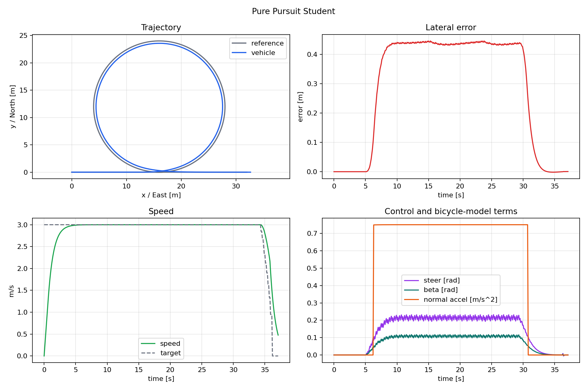 | 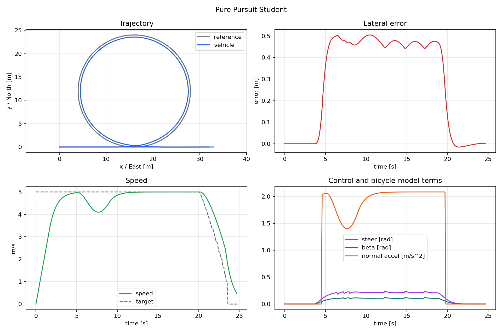 | 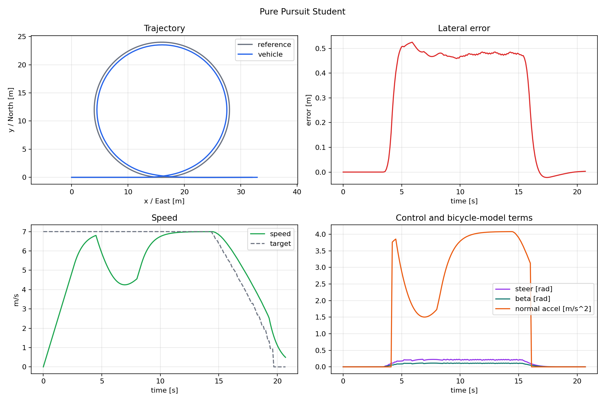 |

---

## 2. Kinematic LQR

### 2.1 Algorithm Objective

After completing Pure Pursuit, this stage implements a kinematic Linear Quadratic Regulator (LQR) for path tracking.

Unlike PP, which tracks a geometric look-ahead point, LQR directly feeds back the vehicle's error state relative to the reference path. The error state used here is:

\[
x_e =
\begin{bmatrix}
e_y \\
\dot e_y \\
e_\psi \\
\dot e_\psi
\end{bmatrix}
\]

Of which:

- \(e_y\): Lateral error;
- \(\dot e_y\): lateral error rate;
- \(e_\psi\): heading error;
- \(\dot e_\psi\): heading-error rate.

The control objective is to reduce both path tracking errors and control input costs.

---

### 2.2 Kinematic Error Model

LQR uses the following discrete state-space model:

\[
x_{k+1}=Ax_k+Bu_k
\]

The control input \(u_k\) is the front-wheel steering angle.

The student version constructs the following kinematic error model:

```python
A[0, 0] = 1.0
A[0, 1] = dt

A[1, 2] = speed

A[2, 2] = 1.0
A[2, 3] = dt

B[3, 0] = speed / wheelbase
```

The approximation:

\[
\dot e_y \approx v e_\psi
\]

This relationship shows that the same heading error turns into lateral position error more quickly at higher speed, which is one reason high-speed path tracking is more difficult.

The error status is calculated as:

```python
e_y = reference.lateral_error

e_y_dot = speed * math.sin(
    reference.heading_error
)

e_yaw = reference.heading_error

e_yaw_dot = (
    speed / vehicle.wheelbase
    * math.tan(previous_control.steer)
    - speed * reference.curvature
)

error_state = np.array([
    [e_y],
    [e_y_dot],
    [e_yaw],
    [e_yaw_dot],
])
```

where:

\[
\dot e_\psi
=
\dot\psi_{\text{vehicle}}
-
\dot\psi_{\text{reference}}
\]

And use:

\[
\dot\psi_{\text{vehicle}}
\approx
\frac{v}{L}\tan\delta
\]

and:

\[
\dot\psi_{\text{reference}}
\approx
v\kappa
\]

These relationships are used to construct the heading-error rate.

---

### 2.3 Optimal LQR Feedback

LQR minimization cost function:

\[
J=
\sum
\left(
x^TQx+u^TRu
\right)
\]

Of which:

- (a) \(Q\) determines the degree of importance the controller attaches to the state error;
- \(R\) determines the degree of penalty for moving the controller to input size.

\(P\) by separating Riccati 's iterative quest matrix and calculating feedback gain:

\[
K=
(R+B^TPB)^{-1}B^TPA
\]

Feedback control is:

\[
\delta_{fb}=-Kx
\]

Code uses:

```python
feedback = float(
    -(K @ error_state)[0, 0]
)
```

---

### 2.4 Curvature Feedforward

If only:

\[
\delta=-Kx
\]

When the vehicle is exactly on the path centreline with zero heading error, the feedback term is also zero. On a curved path, feedback alone would therefore fail to establish the required steering angle in advance.

A curvature feedforward term is therefore added:

\[
\delta_{ff}=L\kappa
\]

Code:

```python
feedforward = (
    vehicle.wheelbase
    * reference.curvature
)
```

Final Control:

\[
\boxed{
\delta=-Kx+L\kappa
}
\]

The final steering command is also limited by the vehicle's maximum steering angle.

---

### 2.5 Student and Solution Validation

`double_lane_change` is used to validate student versions.

```powershell
python run_experiment.py --algo lqr_kinematic --version student --route double_lane_change --speed-mode low --save-log --save-fig
python run_experiment.py --algo lqr_kinematic --version solution --route double_lane_change --speed-mode low --save-log --save-fig
```

Results of experiments:

| Metric                 | Student | Solution |
| ---------------------- | ------: | -------: |
| Steps                  |     191 |      191 |
| Reached goal           |    True |     True |
| Mean lateral error / m |   0.221 |    0.221 |
| Max lateral error / m  |   0.562 |    0.562 |
| Finish error / m       |   0.784 |    0.784 |

The student and solution versions produce identical results, validating the student kinematic LQR implementation.

---

### 2.6 Circular Route at Three Speeds

Fixed:

- Algorithm: Kinematic LQR;
- Vehicles: `student_car`;
- Route: `circle`;
- Arc radius: \(R=12\,m\);
- Other controls and vehicle parameters remain unchanged.

Change target speed only:

```powershell
python run_experiment.py --algo lqr_kinematic --version student --route circle --speed-mode low --save-log --save-fig
python run_experiment.py --algo lqr_kinematic --version student --route circle --speed-mode medium --save-log --save-fig
python run_experiment.py --algo lqr_kinematic --version student --route circle --speed-mode high --save-log --save-fig
```

Corresponding output directories:

```text
outputs/20260915_113151_lqr_kinematic_circle_low
outputs/20260915_113156_lqr_kinematic_circle_medium
outputs/20260915_113201_lqr_kinematic_circle_high
```

All-way statistics:

| Metric                 |   Low | Medium |  High |
| ---------------------- | ----: | -----: | ----: |
| Target speed / m/s     |   3.0 |    5.0 |   7.0 |
| Mean lateral error / m | 0.219 |  0.239 | 0.190 |
| Max lateral error / m  | 0.342 |  0.413 | 0.476 |
| Reached goal           |  True |   True |  True |

Maximum lateral error increases with speed:

\[
0.342\rightarrow0.413\rightarrow0.476\,m
\]

Description of peak path deviations at high speed is more pronounced.

---

### 2.7 LQR steady-state arc analysis

Use the same filter conditions as PP:

```text
abs(curvature - 1/12) < 0.005
```

and removes the transition record of 10 per cent of the end of the candidate arc.

The results are as follows:

| Metric                              |    Low |   Medium |   High |
| ----------------------------------- | -----: | -------: | -----: |
| Target speed / m/s                  |  3.000 |    5.000 |  7.000 |
| Mean actual speed / m/s             |  3.000 |    4.787 |  6.060 |
| Mean steer / rad                    | 0.2104 |   0.2115 | 0.1997 |
| Theory steer / rad                  | 0.2054 |   0.2054 | 0.2054 |
| Steer relative error                |  2.45% |    2.96% |  2.77% |
| Mean yaw rate / rad/s               | 0.2554 |   0.4092 | 0.5224 |
| Mean normal acceleration / m/s²    | 0.7500 |   1.9179 | 3.1622 |
| Mean lateral error / m              | 0.3294 |   0.3791 | 0.3255 |
| Max lateral error / m               | 0.3419 |   0.4130 | 0.4761 |
| Lateral error std / m               | 0.0099 |   0.0196 | 0.0708 |
| Max\(                               |  \beta | \) / rad | 0.1364 |
| Mean steer rate\(J_\delta\) / rad/s | 0.9726 |   0.5035 | 5.6422 |

From the results:

1. The average turn at the third velocity is still close to the theoretical value \(0.2054\,rad\);
2. Maximum lateral error at high speed continues to increase;
3. (a) The lateral error standard for the high profile is significantly higher;
4. The maximum \(|\beta|\) and steering-rate metric increase significantly;
5. So, while LQR is able to maintain a good path accuracy, it is clearly more intense at high speed.

In particular:

\[
J_\delta:
0.9726,\ 0.5035,\ 5.6422\,rad/s
\]

The average turning rate of the high condition is much higher than the low / medium, indicating that the high-speed time controller has made a faster shift correction to suppress errors.

---

### 2.8 PP vs. Kinematic LQR

#### 2.8.1 Full-way lateral error

| Speed  | PP Mean / m |    LQR Mean / m | PP Max / m |     LQR Max / m |
| ------ | ----------: | --------------: | ---------: | --------------: |
| low    |       0.286 | **0.219** |      0.446 | **0.342** |
| medium |       0.288 | **0.239** |      0.505 | **0.413** |
| high   |       0.275 | **0.190** |      0.525 | **0.476** |

The average and maximum error of LQR is lower than that of PP at the third-tier rate.

The average error of the entire journey relative to the PP is about to decrease:

- low: 23.4%;
- medium: 17.0%;
- high: 30.9%.

---

#### 2.8.2 Lateral error of the steady-state arc

| Speed  | PP Mean / m |     LQR Mean / m | Improvement |
| ------ | ----------: | ---------------: | ----------: |
| low    |      0.4379 | **0.3294** |       24.8% |
| medium |      0.4724 | **0.3791** |       19.8% |
| high   |      0.4804 | **0.3255** |       32.3% |

LQR reduced average lateral error of the steady-state arc at the third velocity.

But higher precision is accompanied by more intense control.

---

#### 2.8.3 Control Smoothness Comparison

| Speed  | PP\(J_\delta\) / rad/s | LQR\(J_\delta\) / rad/s |
| ------ | ---------------------: | ----------------------: |
| low    |                 0.1941 |                  0.9726 |
| medium |                 0.0340 |                  0.5035 |
| high   |                 0.1091 |        **5.6422** |

Especially in the high:

\[
\frac{J_{\delta,LQR}}{J_{\delta,PP}}
\approx
51.7
\]

Note that LQR, in order to obtain a higher degree of tracking precision, has made a much more frequent or drastic shift correction than PP.

Therefore, control performance cannot be judged solely on the basis of lateral error, but needs to be evaluated simultaneously:

- Tracking precision;
- Control smoothing;
- (b) Slanting response;
- Whether or not rounding saturation occurs;
- High-speed stability.

---

#### 2.8.4 Sideslip Comparison

| Speed | PP max \(|\beta|\) / rad | LQR max \(|\beta|\) / rad |
| --- | ---: | ---: |
| low | 0.1176 | 0.1364 |
| medium | 0.1230 | 0.1785 |
| high | 0.1162 | **0.3368** |

The maximum side angle of the high LQR is about 2.9 times that of the PP.

The simulation still uses a kinematic bicycle model, so these results mainly reflect geometric sideslip and control intensity. Real high-speed dynamic effects such as lateral tyre-force saturation require a dynamic vehicle model.

---

### 2.9 LQR Stage Conclusion

This stage completes the kinematic LQR implementation, including:

- State spatial error model;
- Riccati iterative;
- Optimal calculation of feedback gain;
- curvature feedforward;
- Student version and reference version validation;
- Low-, medium- and high-speed experiments;
- PP preliminary comparison with LQR.

The experiment showed that:

1. In the tested `double_lane_change` and `circle` cases, LQR has lower lateral tracking error than PP;
2. The average steady-state rotation of LQR is close to the theoretical value of the circular path;
3. The maximum lateral error of LQR continues to increase significantly with speed;
4. At high speed, lateral-error variation, sideslip, and steering-rate demand increase significantly;
5. LQR provides higher tracking accuracy but may require more aggressive control;
6. Therefore, subsequent comparisons with the MPC need to take account of errors and control smoothness at the same time, rather than just a single average lateral error.

**MPC** will be implemented and tested next under the same route and speed conditions to provide a consistent PP / LQR / MPC comparison.

---

### 2.10 Current LQR Related Files

```text
vdm_lab/student/lqr_kinematic.py
analyze_circle_lqr.py
circle_speed_analysis_lqr.csv
```

Results chart:

| Low                                     | Medium                                     | High                                     |
| --------------------------------------- | ------------------------------------------ | ---------------------------------------- |
| 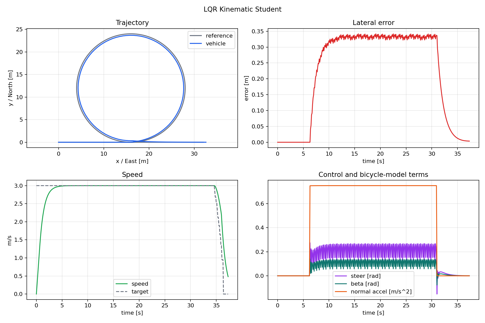 | 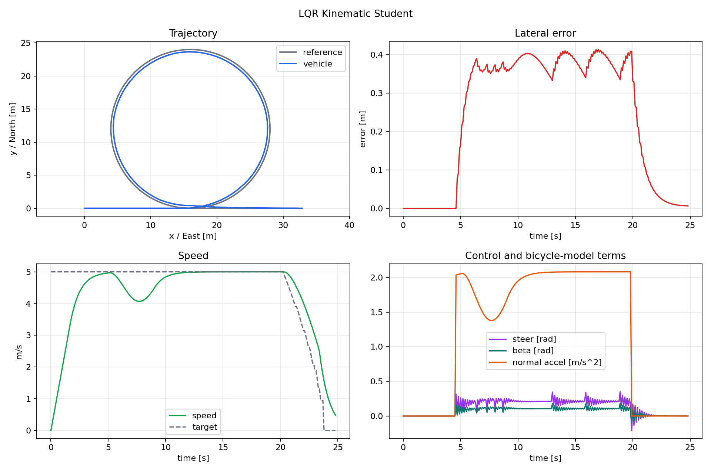 | 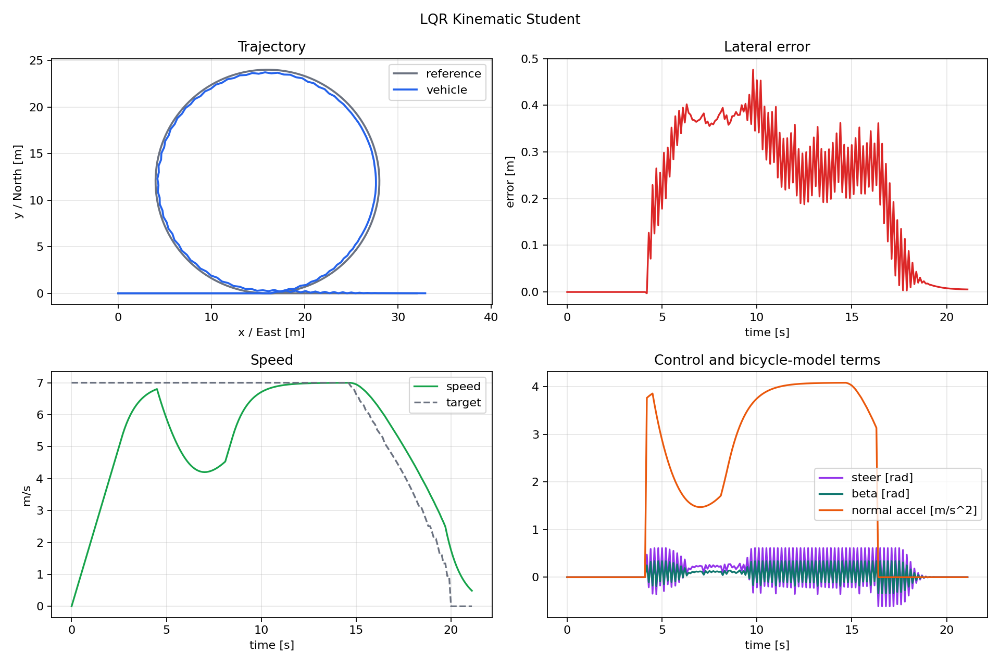 |

---

## 3. Linear MPC

### 3.1 Algorithm Objective

After completing Pure Pursuit and kinematic LQR, this stage implements linear Model Predictive Control (MPC).

Unlike the first two methods, MPC not only calculates the current one-step control, but predicts the vehicle's state over a certain period of time at each simulation, while optimizing a series of future control inputs:

\[
u_0,u_1,\ldots,u_{T-1}
\]

Where the control input is:

\[
u=\begin{bmatrix}a\\\delta\end{bmatrix}
\]

MPC obtains the most appropriate control order at the current time by minimizing errors in tracking, controlling input sizes and controlling changes in the future projection time range, while meeting vehicle velocity, acceleration, turn and turn change rate constraints.

Finally, only the first step in the optimal control sequence is implemented:

\[
\boxed{a_0,\delta_0}
\]

At the next simulation step, the prediction and optimization are repeated from the new vehicle state. This is receding-horizon control.

---

### 3.2 Predicted Reference Trajectory

MPC status is defined as:

\[
z=\begin{bmatrix}x\\y\\v\\\psi\end{bmatrix}
\]

For the projection time zone \(T\), construct:

\[
z_{ref}\in\mathbb{R}^{4\times(T+1)}
\]

is the future \(T+1\) reference state.

The reference point starts at the current latest path point and is based on the projected distance:

\[
\Delta s\approx v\Delta t
\]

Selects the corresponding path point forward.

For a circular path, the reference heading must also be unwrapped. Because \(+\pi\) and \(-\pi\) represent adjacent directions, direct subtraction can produce a false error close to \(2\pi\). Heading unwrapping keeps yaw continuous across the prediction horizon.

---

### 3.3 Linearized vehicle model

MPC predictions are based on the kinematic bicycle model:

\[
x_{k+1}=x_k+v_k\cos\psi_k\Delta t
\]

\[
y_{k+1}=y_k+v_k\sin\psi_k\Delta t
\]

\[
v_{k+1}=v_k+a_k\Delta t
\]

\[
\psi_{k+1}=\psi_k+\frac{v_k}{L}\tan\delta_k\Delta t
\]

Because the model contains non-linear items such as \(\sin\), \(\cos\) and \(\tan\), it is linear at the current projection trajectory:

\[
\boxed{z_{k+1}=Az_k+Bu_k+C}
\]

The matrices \(A\), \(B\), and \(C\) are updated from the predicted speed, yaw, and steering angle. The linear MPC process first predicts the future state, locally linearizes the model along that trajectory, and then solves a quadratic program subject to linear constraints.

---

### 3.4 MPC Objective Function

The MPC cost function consists of four parts:

\[
J=
\sum_{t=0}^{T-1}
\left[
(z_t-z_t^{ref})^TQ(z_t-z_t^{ref})
+u_t^TRu_t
\right]
\]

And control change penalties:

\[
\sum_{t=0}^{T-2}
(u_{t+1}-u_t)^TR_d(u_{t+1}-u_t)
\]

And end state costs:

\[
(z_T-z_T^{ref})^TQ_f(z_T-z_T^{ref})
\]

The role of the matrices is to:

- \(Q\): Error between penalty forecast and reference;
- \(R\): Punishment of excessive acceleration and turn;
- \(R_d\): Punishment of rapid changes in neighbouring control input;
- \(Q_f\): Ensure that the end of the domain remains close to the reference state at the time of projection.

This allows the MPC to strike a visible balance:

\[
\boxed{\text{tracking accuracy}\quad\text{vs.}\quad\text{control smoothness}}
\]

---

### 3.5 Vehicle constraints

The physical limits of vehicles are added to the optimization process:

\[
v_{min}\le v\le v_{max}
\]

\[
-a_{decel,max}\le a\le a_{max}
\]

\[
|\delta|\le\delta_{max}
\]

The steering-rate constraint is:

\[
|\delta_{t+1}-\delta_t|
\le
\dot\delta_{max}\Delta t
\]

Unlike applying `clamp()` after a PP or LQR command is calculated, MPC includes control bounds directly in the optimization, so feasibility is considered while selecting the control sequence.

The quadratic program is solved using OSQP.

---

### 3.6 Iterative MPC and Receding Horizon

Since the linear model \(A,B,C\) relies on the future state of prediction, which in turn relies on the control input, this has resulted in an iterative approach:

```text
Use the previous control sequence as the initial guess
        ↓
predict_motion()
        ↓
Obtain the predicted trajectory z_bar
        ↓
Construct A, B, and C along z_bar
        ↓
solve_linear_mpc()
        ↓
Obtain a new control sequence
        ↓
If the control change is still large, predict and solve again
        ↓
Converge or reach the maximum iteration count
        ↓
Execute only a[0] and steer[0]
```

Thus, at every simulation moment, the state of the vehicle is reused for optimization.

---

### 3.7 Student and Solution Validation

Validate with `double_lane_change` low speed status

```powershell
python run_experiment.py --algo mpc --version student --route double_lane_change --speed-mode low --save-log --save-fig
python run_experiment.py --algo mpc --version solution --route double_lane_change --speed-mode low --save-log --save-fig
```

Results:

| Metric                 | Student | Solution |
| ---------------------- | ------: | -------: |
| Steps                  |     187 |      187 |
| Reached goal           |    True |     True |
| Mean lateral error / m |   0.177 |    0.177 |
| Max lateral error / m  |   0.450 |    0.450 |
| Finish error / m       |   0.088 |    0.088 |

Student and Solution are fully consistent, so MPC achieves validation.

Under the same `double_lane_change + low`:

| Algorithm     | Mean lateral error / m | Max lateral error / m | Finish error / m |
| ------------- | ---------------------: | --------------------: | ---------------: |
| PP            |                  0.313 |                 0.756 |            0.879 |
| Kinematic LQR |                  0.221 |                 0.562 |            0.784 |
| MPC           |        **0.177** |       **0.450** |  **0.088** |

Under this single situation, MPC has the lowest lateral error, but the result cannot be directly extended to all routes and parameters.

---

### 3.8 Circular Route at Three Speeds

Run:

```powershell
python run_experiment.py --algo mpc --version student --route circle --speed-mode low --save-log --save-fig
python run_experiment.py --algo mpc --version student --route circle --speed-mode medium --save-log --save-fig
python run_experiment.py --algo mpc --version student --route circle --speed-mode high --save-log --save-fig
```

Output directory:

```text
outputs/20260915_120823_mpc_circle_low
outputs/20260915_120946_mpc_circle_medium
outputs/20260915_121034_mpc_circle_high
```

All-way statistics:

| Metric                 |   Low | Medium |  High |
| ---------------------- | ----: | -----: | ----: |
| Target speed / m/s     |   3.0 |    5.0 |   7.0 |
| Mean lateral error / m | 0.144 |  0.157 | 0.168 |
| Max lateral error / m  | 0.226 |  0.254 | 0.348 |
| Finish error / m       | 0.031 |  0.041 | 0.029 |
| Reached goal           |  True |   True |  True |

MPC ' s average and maximum lateral error increases with speed:

\[
0.144\rightarrow0.157\rightarrow0.168\,m
\]

\[
0.226\rightarrow0.254\rightarrow0.348\,m
\]

Thus, in the MPC experiment, the trend of “higher speed and greater difficulty of tracking” is clear.

---

### 3.9 MPC steady-state arc analysis

The same filter as PP/LQR:

```text
abs(curvature - 1/12) < 0.005
```

and removes the transition record of 10 per cent of the end of the candidate arc.

| Metric                              |              Low |           Medium |             High |
| ----------------------------------- | ---------------: | ---------------: | ---------------: |
| Target speed / m/s                  |            3.000 |            5.000 |            7.000 |
| Mean actual speed / m/s             |            3.019 |            4.893 |            6.935 |
| Mean steer / rad                    |           0.2097 |           0.2107 |           0.2101 |
| Theory steer / rad                  |           0.2054 |           0.2054 |           0.2054 |
| Steer error                         |            2.07% |            2.57% |            2.30% |
| Mean yaw rate / rad/s               |           0.2555 |           0.4162 |           0.5900 |
| Mean normal acceleration / m/s²    |           0.7593 |           1.9949 |           4.0085 |
| Mean lateral error / m              | **0.2188** | **0.2520** | **0.3001** |
| Max lateral error / m               | **0.2260** | **0.2541** | **0.3468** |
| Lateral error std / m               |           0.0049 |          0.00065 |           0.0155 |
| Max\(                               |            \beta |         \) / rad |           0.1370 |
| Mean steer rate\(J_\delta\) / rad/s |           0.7728 |          0.00056 |           1.2451 |

Steady-state average lateral error:

\[
0.2188\rightarrow0.2520\rightarrow0.3001\,m
\]

From low to high increased by about 37.2 per cent.

At the same time, the actual average speed of the high situation reached:

\[
6.935\,m/s
\]

Already very close to target \(7\,m/s\). Corresponding average method of acceleration:

\[
4.0085\,m/s^2
\]

It's close to the target speed theory:

\[
\frac{7^2}{12}=4.0833\,m/s^2
\]

It needs to be noted that `normal_accel` in the log is itself calculated by velocity and path curvature, so the theoretical values obtained using the same physical velocity and curvature are internal consistency checks rather than independent vehicle power certification.

---

### 3.10 Three-Algorithm Circular-Route Accuracy Comparison

#### Average and maximum lateral error of the entire journey

| Speed  | PP Mean | LQR Mean |        MPC Mean | PP Max | LQR Max |         MPC Max |
| ------ | ------: | -------: | --------------: | -----: | ------: | --------------: |
| low    |   0.286 |    0.219 | **0.144** |  0.446 |   0.342 | **0.226** |
| medium |   0.288 |    0.239 | **0.157** |  0.505 |   0.413 | **0.254** |
| high   |   0.275 |    0.190 | **0.168** |  0.525 |   0.476 | **0.348** |

In the current circular-route experiment, the error ranking at all three speeds is:

\[
\boxed{\text{MPC}<\text{LQR}<\text{PP}}
\]

This indicates only the size of the lateral error in the current experiment and does not indicate the general merits of algorithms in all scenarios.

#### An average lateral error in a steady-state arc

| Speed  | PP / m | LQR / m |          MPC / m |
| ------ | -----: | ------: | ---------------: |
| low    | 0.4379 |  0.3294 | **0.2188** |
| medium | 0.4724 |  0.3791 | **0.2520** |
| high   | 0.4804 |  0.3255 | **0.3001** |

MPC's steady-state average error is about lower than that of PP:

- low: 50.0%;
- medium: 46.6%;
- high: 37.5%.

MPC is about lower than LQR:

- low: 33.6%;
- medium: 33.5%;
- high: 7.8%.

Under high conditions, the MPC still has the lowest average error, but its advantage over LQR has significantly diminished.

---

### 3.11 Three-Algorithm Control Smoothness Comparison

Using the average rounding rate of \(J_\delta\) in the steady-state arc:

| Speed  |       PP / rad/s | LQR / rad/s |       MPC / rad/s |
| ------ | ---------------: | ----------: | ----------------: |
| low    | **0.1941** |      0.9726 |            0.7728 |
| medium |           0.0340 |      0.5035 | **0.00056** |
| high   | **0.1091** |      5.6422 |            1.2451 |

Under the conditions:

\[
J_{\delta,LQR}=5.6422
\]

And:

\[
J_{\delta,MPC}=1.2451
\]

MPC is about 77.9 per cent lower than LQR, indicating that under the current high-speed arc process, MPC, while obtaining a lower tracking error, is also significantly inhibiting fast change in the wheel.

However, the \(J_\delta\) of PP High is still the lowest, so the control is not simply smoother to the MPC. The current experiment is better summarized as:

```text
PP: simplest and relatively smooth control, but larger tracking error
LQR: lower tracking error, but potentially very aggressive control at high speed
MPC: lowest tracking error and substantially smoother high-speed control than LQR
```

---

### 3.12 Sideslip Response Comparison

Highest \(|\beta|\):

| Algorithm | max \(|\beta|\) / rad |
| --- | ---: |
| PP | 0.1162 |
| LQR | **0.3368** |
| MPC | 0.1628 |

LQR high has the most significant side-side response; MPC is higher than PP but much lower than LQR.

Because the simulation plant still uses a kinematic bicycle model, \(\beta\) mainly reflects geometric sideslip and steering intensity in this experiment. Real dynamic effects such as lateral tyre force, friction limits, and high-speed instability require a dynamic vehicle model.

---

### 3.13 Why is it harder to track when speed increases?

The circular-route experiment provides a clear connection between theory and simulation.

Fixed curvature:

\[
\kappa=\frac{1}{R}
\]

Theoretically stable rotation approximates:

\[
\delta\approx\arctan(L\kappa)
\]

At a fixed radius, the theoretical steady-state steering angle is therefore nearly independent of speed. All three algorithms produce an average steady-state steering angle of approximately \(0.20\sim0.21\,rad\).

However, the required yaw rate:

\[
\dot\psi\approx v\kappa
\]

Increased linear with speed, and normal acceleration:

\[
a_n=v^2\kappa
\]

Increases with speed.

In addition, for the fixed simulation long \(\Delta t\):

\[
\Delta s\approx v\Delta t
\]

The higher the speed, the greater the distance the vehicle moves over the same control period, the lower the number of amendments available per metre path and the easier for errors to continue to accumulate before the controller ' s next amendment.

The current kinematic model does not simulate lateral tyre-force saturation. The claim that tyres are more likely to reach their friction limit at high speed must therefore be tested with a dynamic model and cannot be demonstrated directly by these kinematic experiments.

---

### 3.14 MPC Stage Conclusion

This stage completes the following Linear MPC work:

- construction of the reference trajectory over the prediction horizon;
- local linearization of the nonlinear kinematic model;
- state-error, control-input, control-increment, and terminal-state costs;
- speed, acceleration, steering-angle, and steering-rate constraints;
- OSQP quadratic-program solving;
- iterative linear MPC;
- receding-horizon control;
- student / solution consistency validation;
- circular-route experiments at three speeds;
- a preliminary comparison of PP, LQR, and MPC accuracy and smoothness.

The current experiments show that MPC achieves the lowest lateral error in both the `double_lane_change + low` case and the three circular-route speed cases. In the high-speed circular case, its steering-rate metric is substantially lower than LQR's, indicating that prediction and control-increment penalties can reduce aggressive high-speed steering. PP still has the lowest steering-rate metric in some conditions, so the three algorithms trade tracking accuracy against control smoothness and computational complexity.

The next phase would require continued comparison of the three algorithms under additional route and uniform conditions, such as `right_angle`, `s_curve`, to avoid drawing overly broad conclusions based solely on Circle and single road conditions.

---

### 3.15 Current MPC Related Documents

```text
vdm_lab/student/mpc.py
analyze_circle_mpc.py
circle_speed_analysis_mpc.csv
```

Results chart:

| Low                               | Medium                               | High                               |
| --------------------------------- | ------------------------------------ | ---------------------------------- |
| 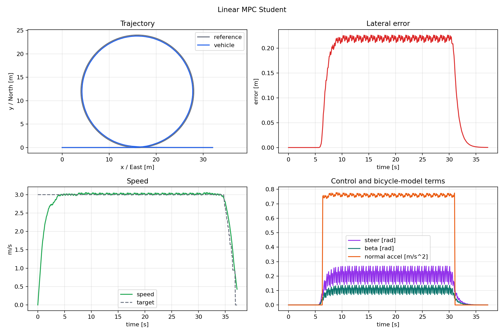 | 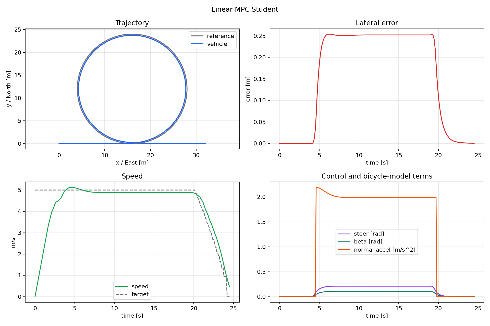 | 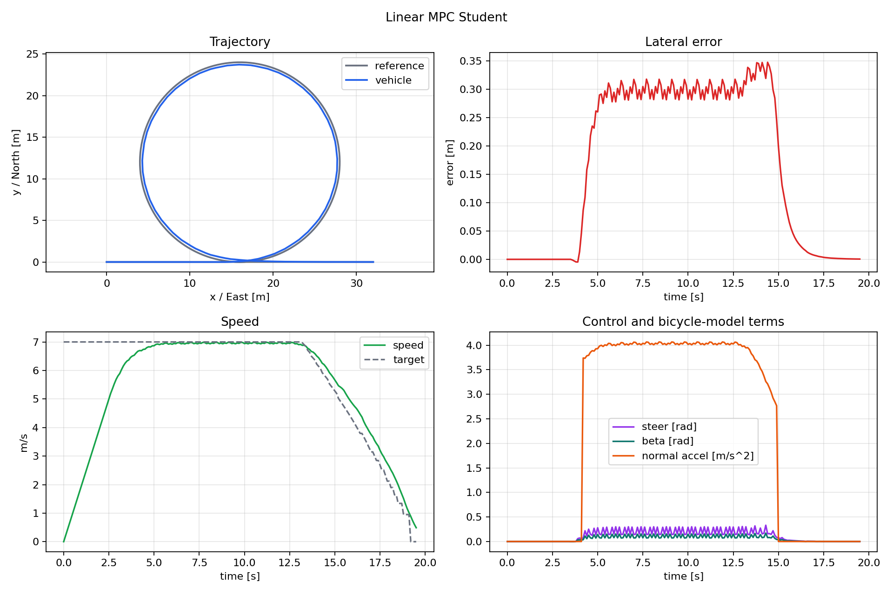 |

---

## 4. Parameter sensitivity experiment

> To be completed: sensitivity analysis for PP look-ahead distance, maximum steering angle, wheelbase, and other parameters.

---

## 5. Kinematic / Dynamic Model Comparison

### 5.1 Objective and Experimental Setup

This experiment compares kinematic LQR with dynamic LQR on two continuous-curvature routes. Both controllers use the same `student_car`, `student` implementation, and medium-speed mode; only the lateral-error model and its curvature feedforward differ.

| Item | Setting |
| --- | --- |
| Routes | `s_curve`, `mixed_course` |
| Speed mode | `medium` |
| Vehicle | `student_car` |
| Controllers | `lqr_kinematic`, `lqr_dynamic` |

Run the four comparisons from the repository root:

```powershell
python run_experiment.py --algo lqr_kinematic --version student --route s_curve --speed-mode medium --save-log --save-fig
python run_experiment.py --algo lqr_dynamic --version student --route s_curve --speed-mode medium --save-log --save-fig
python run_experiment.py --algo lqr_kinematic --version student --route mixed_course --speed-mode medium --save-log --save-fig
python run_experiment.py --algo lqr_dynamic --version student --route mixed_course --speed-mode medium --save-log --save-fig
```

### 5.2 Why Use a Dynamic Vehicle Model?

The kinematic bicycle model assumes pure rolling: tyre side-slip is ignored and the lateral response is determined only by geometry. This is a useful approximation at low speed and small steering angle. As speed and lateral acceleration rise, tyre side-slip and the force/moment balance increasingly affect the response; a dynamic model can then represent the vehicle more faithfully.

The physical chain is:

```text
front-wheel steering angle
        → tyre slip angles → lateral tyre forces
        → lateral acceleration and yaw moment
        → lateral and yaw response
```

| Quantity | Meaning | Role in the dynamic model |
| --- | --- | --- |
| `m` | vehicle mass | Converts lateral force into lateral acceleration |
| `Iz` | yaw moment of inertia | Converts yaw moment into yaw acceleration |
| `Cf`, `Cr` | front/rear cornering stiffness | Relate tyre side-slip to lateral force |
| `lf`, `lr` | CG-to-front/rear-axle distances | Define force moment arms |
| `v` | longitudinal speed | Appears in the lateral/yaw dynamics |

The kinematic model does not contain `m`, `Iz`, `Cf`, or `Cr` because, under its no-side-slip assumption, it describes geometric motion rather than a force equilibrium.

### 5.3 Dynamic LQR Model and Control Law

Both LQR controllers use the error state

\[
x = [e_y,\; \dot e_y,\; e_\psi,\; \dot e_\psi]^T,
\]

where the terms are lateral error, lateral-error rate, heading error, and heading-error rate. For the linear two-degree-of-freedom dynamic model,

\[
\dot{x}=A_cx+B_c\delta,
\]

\[
A_c =
\begin{bmatrix}
0&1&0&0\\
0&-\frac{C_f+C_r}{mv}&\frac{C_f+C_r}{m}&\frac{l_rC_r-l_fC_f}{mv}\\
0&0&0&1\\
0&\frac{l_rC_r-l_fC_f}{I_zv}&\frac{l_fC_f-l_rC_r}{I_z}&-\frac{l_f^2C_f+l_r^2C_r}{I_zv}
\end{bmatrix},\qquad
B_c =
\begin{bmatrix}0\\C_f/m\\0\\l_fC_f/I_z\end{bmatrix}.
\]

The implementation uses trapezoidal discretization:

\[
A=(I-0.5\Delta t A_c)^{-1}(I+0.5\Delta t A_c),\qquad B=B_c\Delta t.
\]

LQR minimizes the weighted state error and steering effort. Its feedback is \(\delta_{fb}=-Kx\). A curvature feedforward term compensates for the steering needed in a sustained turn:

\[
\delta_{ff}=L\kappa+k_vv^2\kappa-K_{0,2}e_{\psi,ss},
\]

\[
k_v=\frac{l_rm}{2C_fL}-\frac{l_fm}{2C_rL},\qquad L=l_f+l_r.
\]

The final command is limited by the vehicle steering constraint:

\[
\delta=\operatorname{clamp}(\delta_{fb}+\delta_{ff},-\delta_{max},\delta_{max}).
\]

### 5.4 Results

Both controllers reached the goal on both routes. Dynamic LQR substantially reduced lateral error and, especially on `mixed_course`, also required less steering, side-slip, and yaw-rate demand.

#### `s_curve` at Medium Speed

| Metric | Kinematic LQR | Dynamic LQR | Change |
| --- | ---: | ---: | ---: |
| Steps | 150 | 152 | — |
| Reached goal | True | True | — |
| Mean lateral error / m | 0.2164 | 0.0922 | ↓ 57% |
| Max lateral error / m | 0.5469 | 0.2148 | ↓ 61% |
| Finish error / m | 0.8429 | 0.8976 | slightly higher |
| Mean heading error / rad | 0.0516 | 0.0690 | slightly higher |
| Max steer / rad | 0.6109 | 0.5598 | ↓ 8% |
| Max side-slip `beta` / rad | 0.3368 | 0.3036 | ↓ 10% |
| Max yaw rate / rad/s | 1.7177 | 1.5542 | ↓ 10% |

| Kinematic LQR | Dynamic LQR |
| --- | --- |
| 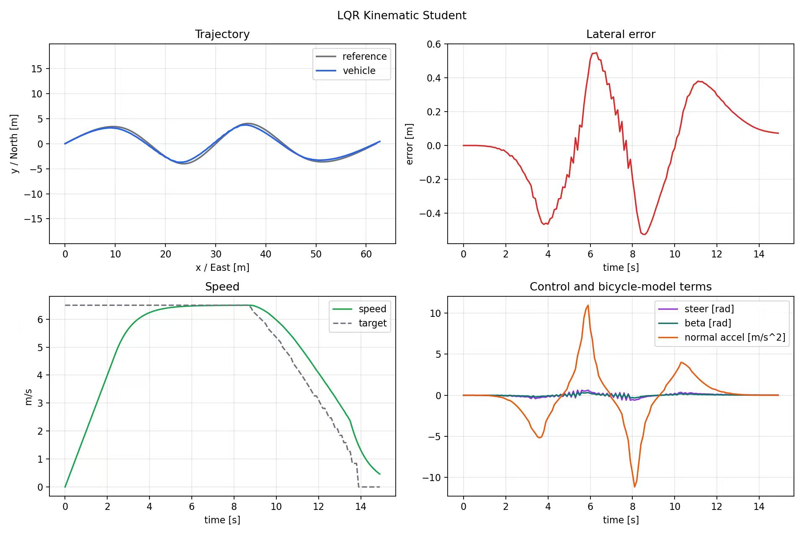 | 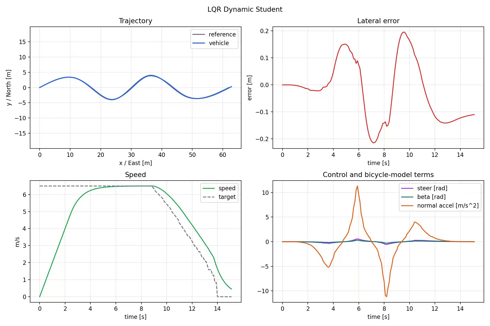 |

The kinematic controller reaches about ±0.55 m lateral error in the bends and has visible steering spikes. Dynamic LQR limits the lateral error to about ±0.20 m with a smoother steering trace.

#### `mixed_course` at Medium Speed

| Metric | Kinematic LQR | Dynamic LQR | Change |
| --- | ---: | ---: | ---: |
| Steps | 184 | 183 | — |
| Reached goal | True | True | — |
| Mean lateral error / m | 0.1568 | 0.0706 | ↓ 55% |
| Max lateral error / m | 0.4770 | 0.1518 | ↓ 68% |
| Finish error / m | 0.9489 | 0.8231 | ↓ 13% |
| Mean heading error / rad | 0.0547 | 0.0466 | ↓ 15% |
| Max steer / rad | 0.6109 | 0.3344 | ↓ 45% |
| Max side-slip `beta` / rad | 0.3368 | 0.1720 | ↓ 49% |
| Max yaw rate / rad/s | 1.8504 | 0.9585 | ↓ 48% |

| Kinematic LQR | Dynamic LQR |
| --- | --- |
| 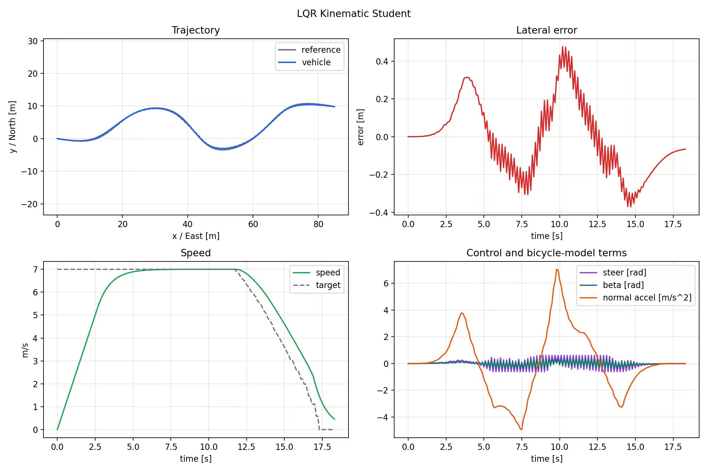 | 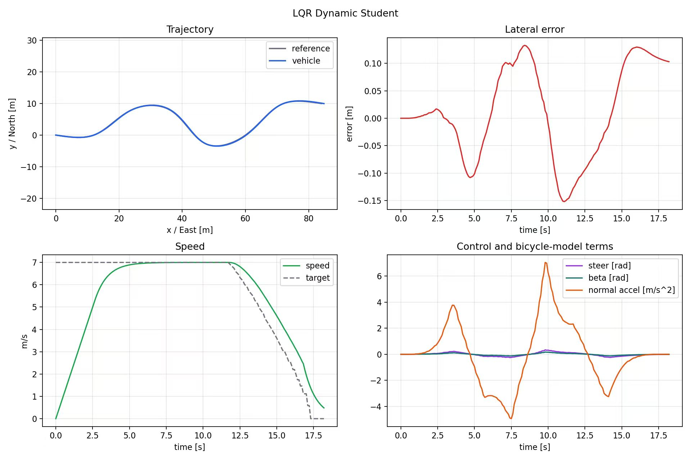 |

The kinematic controller shows high-frequency, saw-tooth lateral-error oscillation of roughly ±0.50 m. Dynamic LQR keeps the peak near ±0.15 m and largely removes this oscillation.

### 5.5 Interpretation and Validation

At low speed, side-slip and lateral acceleration are small, so the dynamic model approaches the kinematic approximation and the simpler model can be sufficient. As speed rises, the lateral-acceleration demand grows with \(v^2\kappa\), side-slip becomes more important, and the parameters `m`, `Iz`, `Cf`, and `Cr` help capture the resulting response.

For these medium-speed continuous-turn experiments, dynamic LQR reduces mean lateral error by **55–57%** and maximum lateral error by **61–68%**. It also produces lower peak side-slip and yaw rate, indicating a more controlled lateral/yaw response. The results support using the dynamic model where tyre behaviour and repeated curvature changes matter; they do not by themselves prove performance for all speeds, routes, or non-linear tyre conditions.

The dynamic student implementation was also checked against the reference implementation on `s_curve` at medium speed:

```powershell
python run_experiment.py --algo lqr_dynamic --version student --route s_curve --speed-mode medium --save-log --save-fig
python run_experiment.py --algo lqr_dynamic --version solution --route s_curve --speed-mode medium --save-log --save-fig
```

| Metric | Student | Solution |
| --- | ---: | ---: |
| Steps | 152 | 152 |
| Reached goal | True | True |
| Mean lateral error / m | 0.0922 | 0.0922 |
| Max lateral error / m | 0.2148 | 0.2148 |
| Finish error / m | 0.8976 | 0.8976 |

The matching metrics verify that the student Dynamic LQR implementation is consistent with the provided solution. Supporting source data and the original conclusion are available in [`vdm_lab/tasks/dynamic_lqr`](vdm_lab/tasks/dynamic_lqr/).

---

## 6. Campus GPX Route Tracking

### 6.1 Objective

After completing the standard-route experiments, this stage uses a planned campus route from a dormitory to a classroom to compare PP, kinematic LQR, and MPC on a path combining long straights with several tight turns.

This section is based on [Campus_Analysis_EN.md](vdm_lab/tasks/campus/results/Campus_Analysis_EN.md) and the result tables in the same directory. It examines:

1. coordinate alignment between the GPX route and offline map;
2. tracking accuracy and arrival time under a shared vehicle, path, and speed plan;
3. the maximum lateral-deviation locations and their relationships with curvature, speed, and steering;
4. route geometry feasibility and the effect of reducing the cruise-speed cap.

The route is a **planned route**, rather than a measured GNSS trace. All travel times reported below are simulation results.

---

### 6.2 Route and Experimental Setup

#### 6.2.1 Campus Route and Map Alignment

The route file is `data/gpx/campus_route.gpx`. Its WGS84 longitude and latitude coordinates are converted into local metric coordinates using a spherical projection. The map and route share the following origin:

\[
(\mathrm{longitude},\mathrm{latitude})=(118.8145,\;31.8885)
\]

The current route retains the original road sequence and endpoints while widening several local turns. The adjusted smooth route is used directly as the tracking reference. It is **879.539 m** long and contains **4,399 samples** at **0.2 m** spacing, with a slightly shorter final interval.

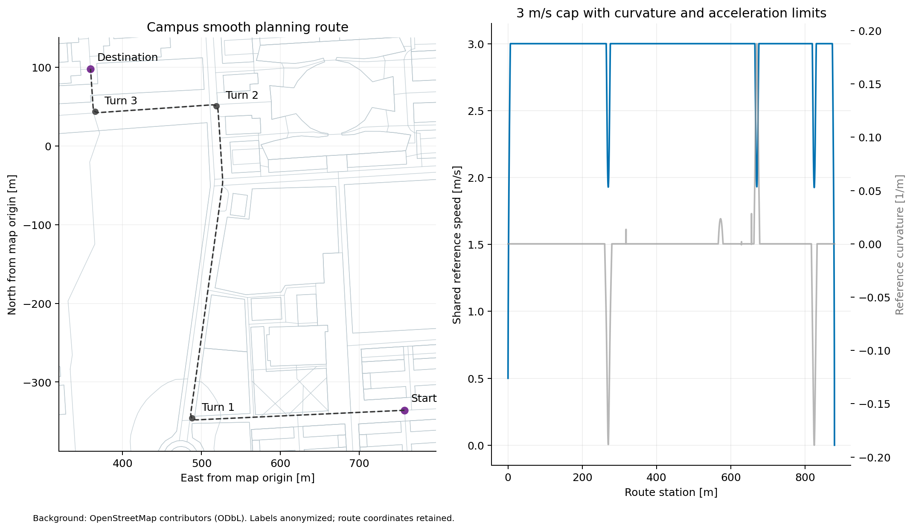

#### 6.2.2 Shared Experimental Parameters

| Parameter | Setting |
| --- | --- |
| Controllers | Student PP / Kinematic LQR / MPC |
| Vehicle model | Kinematic bicycle model, `student_car` |
| Wheelbase | `lf + lr = 1.25 + 1.25 = 2.5 m` |
| Maximum front-wheel steering angle | 35° |
| Simulation time step | 0.1 s |
| Initial speed | 0 m/s |
| Simulation time limit | 900 s |
| Baseline cruise-speed cap | 3 m/s |
| Reference normal-acceleration magnitude limit | 0.7 m/s² |
| Speed-profile acceleration / deceleration limits | 0.7 / 0.8 m/s² |
| Start / end target speeds | 0.5 / 0 m/s |

All three algorithms use exactly the same path geometry, reference-speed sequence, vehicle, and simulation settings. Each controller retains its default parameters, and MPC retains its original prediction horizon and constraints.

The reference speed is limited according to curvature. At nonzero curvature:

\[
v_{\mathrm{ref}}(s)\leq
\min\left(v_{\mathrm{cruise}},\sqrt{\frac{0.7}{|\kappa(s)|}}\right)
\]

Forward and backward passes then enforce the acceleration and deceleration limits. Therefore, **3 m/s is a cruise-speed cap, not a constant speed over the whole route**. The actual speed may also differ from the local target because of the longitudinal response.

---

### 6.3 Campus Tracking Results for the Three Algorithms

The following results are taken from `campus_results.csv`:

| Algorithm | Reached Goal | Arrival Time / s | Mean Absolute Lateral Error / m | Max Absolute Lateral Error / m | Finish Distance / m |
| --- | --- | ---: | ---: | ---: | ---: |
| PP | True | 299.7 | 0.03071 | 0.77417 | 0.52964 |
| Kinematic LQR | True | 300.2 | 0.02496 | 0.55586 | 0.63035 |
| MPC | True | 299.5 | 0.01462 | 0.32623 | 0.00685 |

The goal is reached when the vehicle is within **1.5 m** of the endpoint and its speed is below **0.5 m/s**. `Finish Distance` is the final distance from the vehicle to the endpoint, rather than a lateral tracking error.

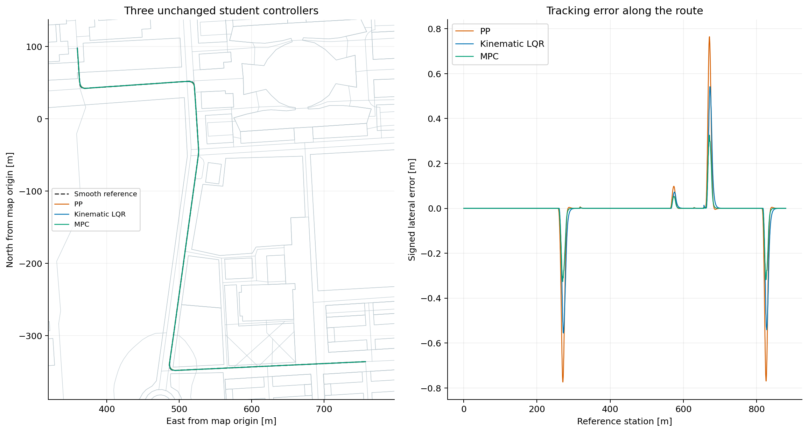

All three algorithms reach the destination in approximately 300 s, with a maximum difference of only 0.7 s. Under the shared speed profile, their main difference is tracking accuracy:

- MPC has the lowest mean and maximum absolute lateral errors;
- kinematic LQR lies between MPC and PP for both metrics;
- compared with PP, MPC reduces the mean error by approximately **52.4%** and the maximum error by approximately **57.9%**.

The full-route mean is diluted by long straight sections. Centimetre-level mean errors alone therefore do not characterize tight-turn performance; local trajectories and peak errors must also be examined.

Using the same steering-rate metric as in the preceding sections:

\[
J_\delta=\operatorname{mean}\left(\frac{|\delta_k-\delta_{k-1}|}{\Delta t}\right)
\]

the results are:

| Algorithm | Mean Absolute Steer Rate / rad/s | Steering Saturation Fraction |
| --- | ---: | ---: |
| PP | 0.00866 | 0 |
| Kinematic LQR | 0.03264 | 0 |
| MPC | 0.01903 | 0 |

PP produces the smoothest steering changes, MPC achieves the best tracking accuracy, and LQR has the highest steering rate. None of the three reaches the 35° steering limit, so the observed errors cannot simply be attributed to steering-angle saturation.

---

### 6.4 Maximum-Deviation Locations and Interpretation

#### 6.4.1 Peak-Error Statistics

For each trajectory, the peak row is selected using `argmax(abs(lateral_error))`. Time, speed, curvature, and steering are all taken from that same row:

| Algorithm | Time / s | Reference Station / m | Signed Lateral Error / m | Actual Speed / m/s | Reference Curvature / m⁻¹ | Steer / ° |
| --- | ---: | ---: | ---: | ---: | ---: | ---: |
| PP | 93.9 | 270.80 | -0.77417 | 2.176 | -0.1828 | -21.38 |
| Kinematic LQR | 94.8 | 272.60 | -0.55586 | 2.100 | -0.1409 | -20.47 |
| MPC | 93.2 | 270.20 | -0.32623 | 2.142 | -0.1880 | -21.63 |

The station and curvature in the table refer to the controller-selected reference point. `campus_max_error.csv` stores both the vehicle and reference-point locations; the following table reports the **vehicle longitude and latitude at maximum deviation**:

| Algorithm | Vehicle Longitude / ° | Vehicle Latitude / ° |
| --- | ---: | ---: |
| PP | 118.81966502 | 31.88540257 |
| Kinematic LQR | 118.81965545 | 31.88541493 |
| MPC | 118.81966414 | 31.88539696 |

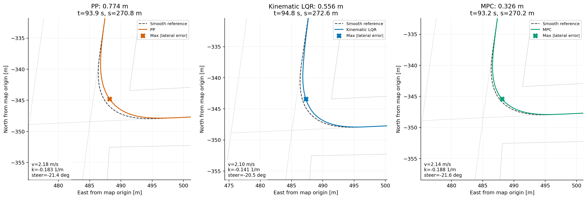

#### 6.4.2 Relationship Between the Peaks and the First Turn

Major turns are identified as connected intervals satisfying \(|\kappa|>0.015\,m^{-1}\) with an integrated heading change above 30°. All three algorithms peak within the first major turn, which spans approximately **261.4–278.6 m**. Its maximum absolute curvature occurs at **270.0 m**.

The reference stations at the PP, LQR, and MPC error peaks are respectively **0.8 m, 2.6 m, and 0.2 m** beyond the curvature peak. The error and curvature peaks therefore need not coincide. These values are spatial offsets and cannot be interpreted directly as controller time delays.

In terms of control mechanisms, PP's look-ahead target selection can encourage corner cutting in tight bends; LQR's local error feedback is affected by curvature changes and discrete response; and MPC can coordinate its control using the predicted path. These mechanisms help interpret the observed results, but a single experiment cannot establish the causal contribution of each factor independently.

At the PP and MPC peaks, the actual speeds are approximately 2.176 and 2.142 m/s, exceeding their corresponding local target speeds of approximately 1.957 and 1.930 m/s. A constraint-compliant reference-speed profile therefore does not imply that the actual vehicle satisfies the same bound at every instant.

---

### 6.5 Route Adjustment and Steering-Geometric Feasibility

Several turns in the previous smooth route were widened locally. The adjustment covers three major turns and a pair of short high-curvature transitions while retaining the same endpoints. Route length changes from **885.417 m** to **879.539 m**, and the maximum same-parameter displacement is approximately **2.26 m**. Local quintic joins preserve position, tangent, and second derivative at their boundaries.

For the kinematic bicycle model used in this project, whose position is referenced at the centre of gravity, the steering limit corresponds to the following geometric curvature limit:

\[
\kappa_{\max}=
\frac{\tan\delta_{\max}}
{\sqrt{L^2+l_r^2\tan^2\delta_{\max}}}
\approx0.2644\,m^{-1}
\]

The adjusted reference route has a maximum curvature of approximately **0.1889 m⁻¹**. Dense sampling gives a minimum radius of approximately **5.29 m** and a maximum geometric steering angle of approximately **25.92°**, below the 35° limit. The current route therefore satisfies the model's steering-geometric constraint.

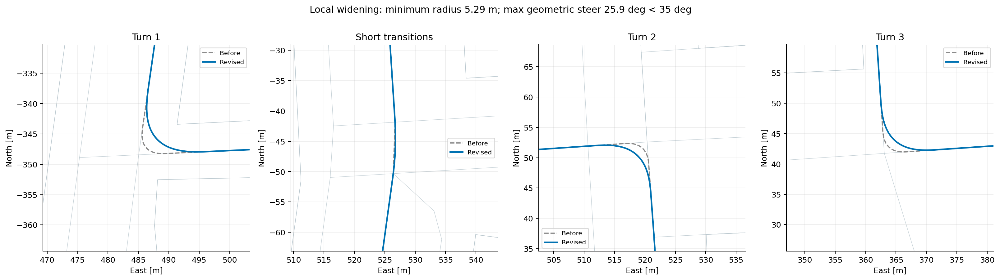

Improved geometric feasibility does not imply that every tracking metric improves. `campus_route_change.csv` gives:

| Algorithm | Before Mean Error / m | After Mean Error / m | Before Max Error / m | After Max Error / m |
| --- | ---: | ---: | ---: | ---: |
| PP | 0.03267 | 0.03071 | 1.37579 | 0.77417 |
| Kinematic LQR | 0.01683 | 0.02496 | 0.53532 | 0.55586 |
| MPC | 0.01017 | 0.01462 | 0.40539 | 0.32623 |

The maximum errors of PP and MPC decrease, whereas the LQR maximum error increases slightly. The full-route mean errors of LQR and MPC also increase. This adjustment corrects route-geometry feasibility without tuning controller parameters. Because changing curvature also changes the reference-speed sequence, the before-and-after comparison is not an isolated curvature-only experiment with speed held constant.

---

### 6.6 PP Speed-Reduction Trial

Keeping the route geometry, vehicle, controller, curvature-based speed rule, and acceleration/deceleration rules unchanged, only the PP cruise-speed cap is reduced from **3 m/s** to **2 m/s**:

| Metric | PP: 3 m/s Cap | PP: 2 m/s Cap |
| --- | ---: | ---: |
| Reached goal | True | True |
| Arrival time / s | 299.7 | 441.8 |
| Mean absolute lateral error / m | 0.03071 | 0.02483 |
| Max absolute lateral error / m | 0.77417 | 0.73853 |
| Mean absolute steer rate / rad/s | 0.00866 | 0.00550 |

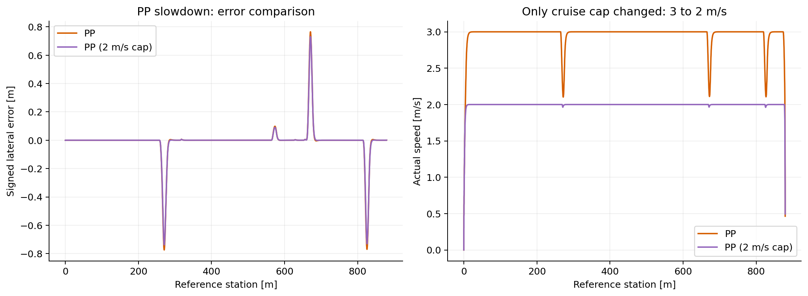

After the speed reduction, mean error decreases by approximately **19.2%**, maximum error decreases by approximately **4.6%**, and steering changes become smoother. The trade-off is an arrival-time increase of **142.1 s**, or approximately **47.4%**.

The maximum error improves less than the mean because the tightest turn is already governed by the curvature-based speed limit, with a local target below 2 m/s. Reducing the straight-line cruise cap does not proportionally reduce speed at the tightest turn, so the peak error does not decrease proportionally either.

---

### 6.7 Campus-Stage Conclusions and Limitations

This stage compares all three algorithms using a shared campus reference route and speed profile. The results show that:

1. PP, kinematic LQR, and MPC all reach the goal with similar simulation times;
2. MPC has the lowest mean and maximum lateral errors, while PP produces the smoothest steering changes;
3. all three maximum deviations occur in the first major turn, so tight-turn performance should be evaluated using local trajectories;
4. even after the route satisfies the steering-geometric limit, preview behavior, finite sampling, and speed and steering transients still produce tracking error;
5. reducing the PP cruise-speed cap improves accuracy and smoothness at the cost of a longer completion time.

All checks recorded in `validation.json` pass, including shared baseline references and configurations, unchanged geometry in the speed-reduction trial, independent lateral-error recomputation, coordinate conversion, and steering-geometric limits. These checks validate the existing result files; they do not constitute real-road validation.

The simulation does not model pedestrians, obstacles, traffic lights, right of way, real speed limits, collision checking, or tyre-force saturation. The offline map provides spatial context only, and geometric route feasibility does not prove sufficient road width or collision-free travel. The approximately 300 s result therefore cannot be interpreted directly as a real dormitory-to-classroom commute time.

In addition, `normal_accel` in the logs is calculated as actual speed squared times reference curvature; it is not an independently measured actual normal acceleration. Generic endpoint labels also do not mean that the GPX coordinates have been anonymized.

### 6.8 Current Campus Files

| File | Contents |
| --- | --- |
| [Campus_Analysis_EN.md](vdm_lab/tasks/campus/results/Campus_Analysis_EN.md) | English analysis report |
| [campus_route.gpx](data/gpx/campus_route.gpx) | Planned campus route |
| [campus_results.csv](vdm_lab/tasks/campus/results/campus_results.csv) | Baseline statistics for the three algorithms |
| [campus_max_error.csv](vdm_lab/tasks/campus/results/campus_max_error.csv) | Maximum deviations and vehicle/reference-point locations |
| [campus_route_change.csv](vdm_lab/tasks/campus/results/campus_route_change.csv) | Comparison before and after route adjustment |
| [campus_improvement.csv](vdm_lab/tasks/campus/results/campus_improvement.csv) | PP speed-reduction results |
| [validation.json](vdm_lab/tasks/campus/results/validation.json) | Validation record for the existing results |

The original English report refers to `readme_wyh.md`, which is not present in the repository. This section therefore relies on the available results and data tables and does not present the missing reproduction instructions as executable steps.

Map data: © [OpenStreetMap contributors](https://www.openstreetmap.org/copyright), ODbL.
