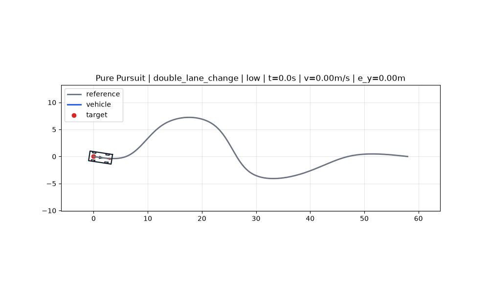
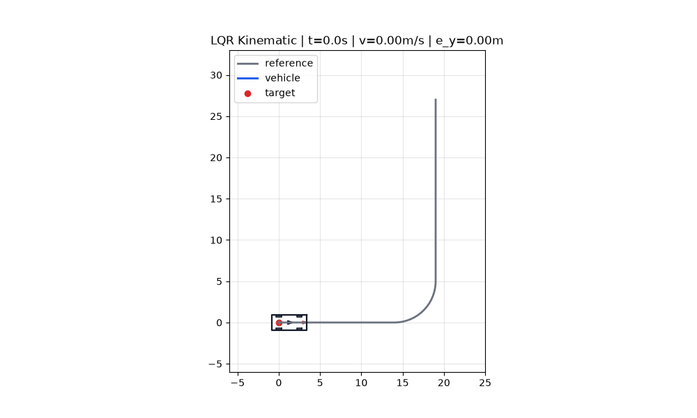
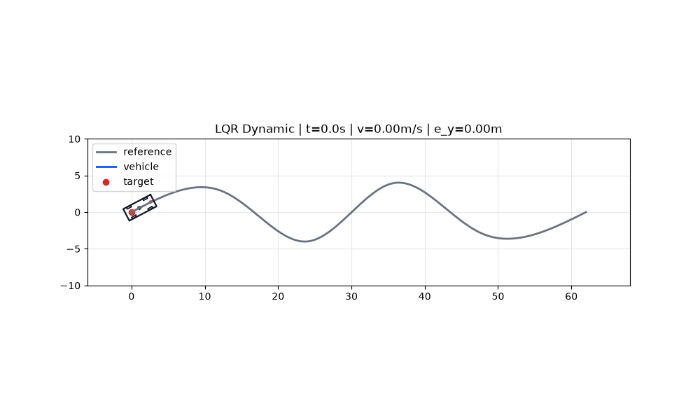
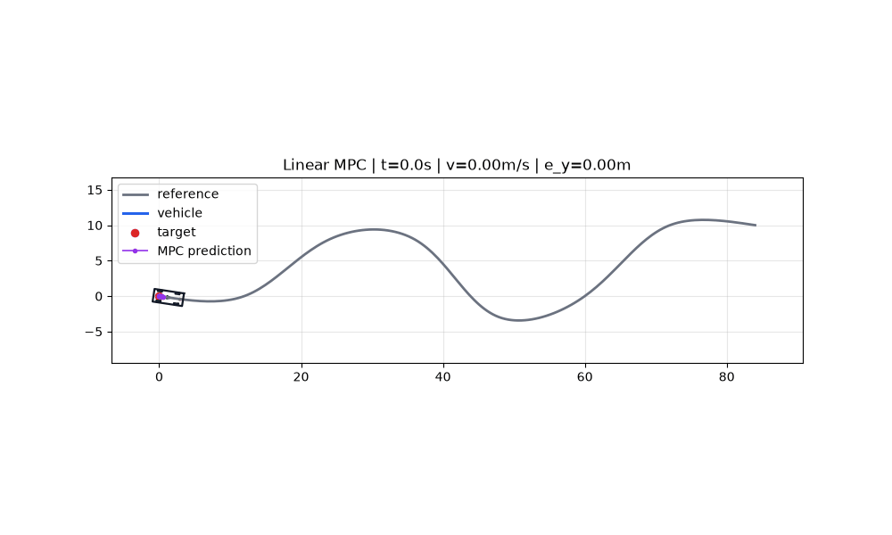

<a id="zh"></a>

# 学生 VDM 路径跟踪仿真实验

语言 / Language: **中文** | [English](#en)

本仓库用于车辆动力学与运动控制课程实验。实验聚焦路径跟踪控制，让学生学习并实现：

- Pure Pursuit，简称 PP
- LQR，包含运动学 LQR 和动力学 LQR 扩展
- Linear MPC

车辆统一只允许前进，速度下限为 `0.0 m/s`。仓库已移除倒车路径、泊车路径、复杂规划器和其他控制算法，学生主要关注“参考路径 -> 误差计算 -> 控制律 -> 车辆状态更新 -> 数据分析”的闭环流程。

## 效果预览

以下 GIF 由当前新实验框架在低速档 `low` 下生成，可直接作为课堂演示或实验报告参考。

| PP 双移线 | LQR 运动学直角弯 |
| --- | --- |
|  |  |

| LQR 动力学 S 弯 | MPC 综合路线 |
| --- | --- |
|  |  |

原仓库中与本实验相关的历史演示 GIF 保留在 `vdm_lab/assets/original_gifs/`，用于和当前实验效果对照。

## 1. 从 Conda 新建环境

推荐使用独立 Conda 环境，避免系统 Python 或全局 Anaconda 环境里的 `numpy/scipy/cvxpy` 版本冲突。

```bash
conda create -n vdm-lab python=3.10 -y
conda activate vdm-lab
python -m pip install --upgrade pip
python -m pip install -r requirements.txt
```

检查依赖是否安装成功：

```bash
python - <<'PY'
import numpy
import scipy
import matplotlib
import cvxpy
from PIL import Image

print("numpy", numpy.__version__)
print("scipy", scipy.__version__)
print("matplotlib", matplotlib.__version__)
print("cvxpy", cvxpy.__version__)
print("pillow", Image.__module__.split(".")[0])
PY
```

如果只学习 PP 和 LQR，`cvxpy` 暂时不会被调用；运行 MPC 时必须安装 `cvxpy`。

## 2. 运行完整答案版

完整答案版位于 `vdm_lab/solutions/`。建议先运行完整版本，确认环境、绘图、日志和 GIF 保存都正常。

```bash
python run_experiment.py --algo pp --version solution --route double_lane_change --save-log --save-fig --save-gif
python run_experiment.py --algo lqr_kinematic --version solution --route right_angle --save-log --save-fig --save-gif
python run_experiment.py --algo lqr_dynamic --version solution --route s_curve --save-log --save-fig --save-gif
python run_experiment.py --algo mpc --version solution --route mixed_course --save-log --save-fig --save-gif
```

实时可视化并同步保存完整 GIF：

```bash
python run_experiment.py --algo pp --version solution --route double_lane_change --animate --save-gif
```

在本地桌面环境中会弹出 Matplotlib 动画窗口；同时程序会把每一帧保存为 `outputs/<时间戳>_<算法>_<路线>_<速度档位>/animation.gif`。

## 3. 速度档位

目标速度分为低速、中速、高速三档。当前默认是低速 `low`。

```bash
python run_experiment.py --algo pp --route double_lane_change
python run_experiment.py --algo pp --route double_lane_change --speed-mode low
python run_experiment.py --algo pp --route double_lane_change --speed-mode medium
python run_experiment.py --algo pp --route double_lane_change --speed-mode high
```

各路线速度设定：

| 路线 | 低速 low | 中速 medium | 高速 high |
| --- | ---: | ---: | ---: |
| `double_lane_change` 双移线 | `4.0 m/s` | `7.0 m/s` | `9.0 m/s` |
| `right_angle` 直角弯 | `3.5 m/s` | `5.5 m/s` | `7.0 m/s` |
| `s_curve` S 弯道 | `4.0 m/s` | `6.5 m/s` | `8.0 m/s` |
| `mixed_course` 综合路线 | `4.0 m/s` | `7.0 m/s` | `9.0 m/s` |

需要临时指定任意速度时，可以覆盖档位：

```bash
python run_experiment.py --algo lqr_kinematic --route s_curve --target-speed 5.0
```

## 4. 路线库

路线集中定义在 `vdm_lab/config/routes.py`。

- `double_lane_change`：双移线，用于观察换道时的横向误差和前视距离影响
- `right_angle`：直角弯，使用直线加圆弧构造，用于考察大曲率弯道跟踪
- `s_curve`：S 弯道，用于考察连续左右转向时的控制平滑性
- `mixed_course`：综合路线，包含直线、缓弯、S 弯和换道式曲线

切换路线：

```bash
python run_experiment.py --algo lqr_kinematic --version solution --route right_angle
python run_experiment.py --algo mpc --version solution --route mixed_course
```

## 5. 车辆参数

车辆参数集中定义在 `vdm_lab/config/vehicle_params.py`。学生调参时优先修改或新增参数组，不要在算法文件里直接写死车辆参数。

默认参数组为 `student_car`，另提供 `compact_ev` 用于对比：

```bash
python run_experiment.py --algo pp --version solution --vehicle student_car
python run_experiment.py --algo pp --version solution --vehicle compact_ev
```

参数包括轴距、车宽、轮距、轮胎尺寸、最大转角、最大转角速度、加速度限幅、减速度限幅、速度范围、质量、转动惯量、前后轴到质心距离和侧偏刚度。

## 6. 学生待填写版

学生版位于 `vdm_lab/student/`。未填写时，程序会在关键公式位置抛出中文 `NotImplementedError`。

```bash
python run_experiment.py --algo pp --version student --route double_lane_change
```

建议填写顺序：

1. `vdm_lab/student/pure_pursuit.py`
2. `vdm_lab/student/lqr_kinematic.py`
3. `vdm_lab/student/lqr_dynamic.py`
4. `vdm_lab/student/mpc.py`

学生版保留函数签名、输入输出、车辆限幅、日志接口和中文 TODO。学生主要补控制算法关键公式，不需要重写仿真框架。

## 7. 输出文件

使用 `--save-log`、`--save-fig` 或 `--save-gif` 后，结果保存到：

```text
outputs/<时间戳>_<算法>_<路线>_<速度档位>/
```

常见文件：

- `trajectory.csv`：每个仿真步的车辆状态、控制量、目标点编号、横向误差和航向误差
- `metrics.json`：平均横向误差、最大横向误差、终点误差、最大转角、最大加速度、是否到达终点
- `summary.png`：轨迹、误差、速度、控制输入汇总图
- `animation.gif`：路径跟踪过程动图，便于实验报告和课堂展示
- `mpc_predictions.csv`：MPC 预测轨迹采样，仅 MPC 输出

## 8. 代码结构

```text
run_experiment.py
vdm_lab/
  config/
    vehicle_params.py  # 车辆参数组
    routes.py          # 双移线、直角弯、S 弯和综合路线
    speed_profiles.py  # 低速、中速、高速档位解析
  common/
    path.py            # 路径生成和速度曲线
    reference.py       # 最近点、横向误差、航向误差
    simulation.py      # 统一仿真循环
    vehicle.py         # 仅前进自行车模型
    visualization.py   # 实时绘图、汇总图、GIF 制作
    logging.py         # CSV/JSON 记录
  solutions/           # 教师完整答案
  student/             # 学生待填写版
  assets/
    demo_gifs/         # 当前框架生成的效果 GIF
    original_gifs/     # 原仓库 PP/LQR/MPC 历史 GIF
```

## 9. 常见问题

`ModuleNotFoundError: No module named 'cvxpy'`

```bash
conda activate vdm-lab
python -m pip install -r requirements.txt
```

`ValueError: numpy.dtype size changed`

这通常是 `numpy` 和 `scipy` 二进制版本不兼容。建议重新创建 Conda 环境：

```bash
conda deactivate
conda env remove -n vdm-lab -y
conda create -n vdm-lab python=3.10 -y
conda activate vdm-lab
python -m pip install -r requirements.txt
```

`NotImplementedError`

说明你正在运行学生版，并且对应 TODO 还没有填写。先打开报错中提示的 `vdm_lab/student/*.py` 文件。

实时动画窗口没有弹出

确认当前环境支持 Matplotlib 图形界面。服务器或远程终端上建议先使用 `--save-fig` 或 `--save-gif` 查看结果。

<a id="en"></a>

# Student VDM Path Tracking Lab

Language / 语言: [中文](#zh) | **English**

This repository is designed for a Vehicle Dynamics and Motion Control lab. The lab focuses on path tracking and asks students to understand or implement:

- Pure Pursuit, PP
- LQR, including a kinematic baseline and a dynamic extension
- Linear MPC

The vehicle can only move forward. The minimum speed is fixed at `0.0 m/s`. Reverse motion, parking paths, complex planners and unrelated controllers have been removed so that students can focus on the closed loop: reference path, error computation, control law, vehicle update and data analysis.

## Demo Videos

The following GIFs are generated by the current lab framework in the low-speed mode.

| PP Double Lane Change | Kinematic LQR Right Angle |
| --- | --- |
|  |  |

| Dynamic LQR S-Curve | MPC Mixed Course |
| --- | --- |
|  |  |

Historical PP/LQR/MPC GIFs from the original repository are kept in `vdm_lab/assets/original_gifs/` for comparison.

## 1. Create a Conda Environment

Use an isolated Conda environment to avoid version conflicts among `numpy`, `scipy` and `cvxpy`.

```bash
conda create -n vdm-lab python=3.10 -y
conda activate vdm-lab
python -m pip install --upgrade pip
python -m pip install -r requirements.txt
```

Check the installation:

```bash
python - <<'PY'
import numpy
import scipy
import matplotlib
import cvxpy
from PIL import Image

print("numpy", numpy.__version__)
print("scipy", scipy.__version__)
print("matplotlib", matplotlib.__version__)
print("cvxpy", cvxpy.__version__)
print("pillow", Image.__module__.split(".")[0])
PY
```

`cvxpy` is only required for MPC. PP and LQR can run without calling it.

## 2. Run Reference Solutions

Reference implementations are in `vdm_lab/solutions/`. Run them first to verify the environment, plots, logs and GIF export.

```bash
python run_experiment.py --algo pp --version solution --route double_lane_change --save-log --save-fig --save-gif
python run_experiment.py --algo lqr_kinematic --version solution --route right_angle --save-log --save-fig --save-gif
python run_experiment.py --algo lqr_dynamic --version solution --route s_curve --save-log --save-fig --save-gif
python run_experiment.py --algo mpc --version solution --route mixed_course --save-log --save-fig --save-gif
```

Show the real-time animation and record a GIF at the same time:

```bash
python run_experiment.py --algo pp --version solution --route double_lane_change --animate --save-gif
```

On a desktop environment, a Matplotlib animation window will open. The full animation is also saved to `outputs/<timestamp>_<algorithm>_<route>_<speed_mode>/animation.gif`.

## 3. Speed Modes

The target speed has three modes: low, medium and high. The default mode is `low`.

```bash
python run_experiment.py --algo pp --route double_lane_change
python run_experiment.py --algo pp --route double_lane_change --speed-mode low
python run_experiment.py --algo pp --route double_lane_change --speed-mode medium
python run_experiment.py --algo pp --route double_lane_change --speed-mode high
```

Route speed settings:

| Route | low | medium | high |
| --- | ---: | ---: | ---: |
| `double_lane_change` | `4.0 m/s` | `7.0 m/s` | `9.0 m/s` |
| `right_angle` | `3.5 m/s` | `5.5 m/s` | `7.0 m/s` |
| `s_curve` | `4.0 m/s` | `6.5 m/s` | `8.0 m/s` |
| `mixed_course` | `4.0 m/s` | `7.0 m/s` | `9.0 m/s` |

To override the mode with a custom speed:

```bash
python run_experiment.py --algo lqr_kinematic --route s_curve --target-speed 5.0
```

## 4. Routes

Routes are defined in `vdm_lab/config/routes.py`.

- `double_lane_change`: lane-change style route for lateral response analysis
- `right_angle`: straight segment plus circular arc, useful for large-curvature tracking
- `s_curve`: alternating left-right turns for smoothness and stability analysis
- `mixed_course`: a combined route with straight, gentle curve, S-curve and lane-change parts

Examples:

```bash
python run_experiment.py --algo lqr_kinematic --version solution --route right_angle
python run_experiment.py --algo mpc --version solution --route mixed_course
```

## 5. Vehicle Parameters

Vehicle parameters are centralized in `vdm_lab/config/vehicle_params.py`. Students should tune or add vehicle presets there instead of hard-coding values in algorithm files.

The default vehicle preset is `student_car`; `compact_ev` is also provided for comparison.

```bash
python run_experiment.py --algo pp --version solution --vehicle student_car
python run_experiment.py --algo pp --version solution --vehicle compact_ev
```

The parameters include wheelbase, width, track width, tire size, steering limits, acceleration limits, speed range, mass, yaw inertia, axle-to-CG distances and cornering stiffness.

## 6. Student Templates

Student templates are in `vdm_lab/student/`. Before completion, they raise a Chinese `NotImplementedError` at the key formula positions.

```bash
python run_experiment.py --algo pp --version student --route double_lane_change
```

Recommended order:

1. `vdm_lab/student/pure_pursuit.py`
2. `vdm_lab/student/lqr_kinematic.py`
3. `vdm_lab/student/lqr_dynamic.py`
4. `vdm_lab/student/mpc.py`

The templates keep function signatures, inputs, outputs, saturation, logging and Chinese TODO comments. Students mainly fill in the control formulas.

## 7. Outputs

With `--save-log`, `--save-fig` or `--save-gif`, outputs are written to:

```text
outputs/<timestamp>_<algorithm>_<route>_<speed_mode>/
```

Common files:

- `trajectory.csv`: state, input, target index, lateral error and heading error at each simulation step
- `metrics.json`: mean and max lateral error, final error, max steering angle, max acceleration and goal status
- `summary.png`: trajectory, error, speed and control summary
- `animation.gif`: path tracking animation for reports and classroom demonstration
- `mpc_predictions.csv`: MPC predicted trajectory samples, only generated by MPC

## 8. Project Structure

```text
run_experiment.py
vdm_lab/
  config/
    vehicle_params.py
    routes.py
    speed_profiles.py
  common/
    path.py
    reference.py
    simulation.py
    vehicle.py
    visualization.py
    logging.py
  solutions/
  student/
  assets/
    demo_gifs/
    original_gifs/
```

## 9. Troubleshooting

`ModuleNotFoundError: No module named 'cvxpy'`

```bash
conda activate vdm-lab
python -m pip install -r requirements.txt
```

`ValueError: numpy.dtype size changed`

This usually means that `numpy` and `scipy` binary builds are incompatible. Recreate the Conda environment:

```bash
conda deactivate
conda env remove -n vdm-lab -y
conda create -n vdm-lab python=3.10 -y
conda activate vdm-lab
python -m pip install -r requirements.txt
```

`NotImplementedError`

You are running a student template and a required TODO formula is still missing. Open the `vdm_lab/student/*.py` file mentioned in the error message.

No animation window appears

Make sure your environment supports Matplotlib GUI windows. On a remote server, use `--save-fig` or `--save-gif` and inspect the saved files instead.
