# 问题 1：为什么车辆速度越快，路径跟踪越难

> 平台：`VDM_tracking`（运动学自行车模型，`dt = 0.1 s`）
> 车辆：`student_car`，轴距 `L = 2.50 m`（`lf = lr = 1.25 m`），
> 转角限幅 `±35° = ±0.6109 rad`，转角速率限幅 `45°/s = 0.7854 rad/s`
> 路径：`circle`，半径 `R = 12.0 m`，`κ = 1/12 m⁻¹`；速度档 `3.0 / 5.0 / 7.0 m/s`
> 控制器：Pure Pursuit、LQR(kinematic)、MPC —— 均为 `vdm_lab/student/` 下的学生实现

---

## 结论：三条原因，一条被推翻的直觉

| # | 原因 | 定量关系 | 实测证据 | 图 |
| --- | --- | --- | --- | --- |
| **1** | **转弯的侧向加速度按速度平方增长**（物理硬约束） | `a_n = v²κ` | 3→7 m/s 时需求从 `0.75` 涨到 `4.083 m/s²`（×5.44）；三算法实测相对误差 ≤ 3.42% | 图 3 |
| **2** | **PP 的稳态内切量正比于前视距离，而前视距离随速度线性增长**（几何缺陷，本文主因） | `e_ss ≈ 0.93·(L₀+0.35v)·β` | 13 点受控实验 `R² = 0.99881`；`Lf` 从 4.05 涨到 5.12 m | 图 6–12 |
| **3** | **每拍前进距离随速度增长，可用修正次数按 `1/v` 减少** | 每拍 `v·dt`：0.3 m → 0.7 m | 稳态段拍数 PP 215 → 89。**本实验未把它单独验证出来**，见 §4 | — |

**一条被数据推翻的直觉：不是"转向不够用"。** 稳态转角 `δ ≈ arctan(Lκ)` 与速度**无关**
（图 1），三档实测 0.2126 / 0.2146 / 0.2149 rad，几乎不动；PP 在高速下最大转角 `0.2293 rad`，
只用掉限幅的 38%。**速度改变的不是"要拐多少度"，而是这个度数对应的横向漂移有多快、
以及控制器看得有多远。**

---

## 1 速度改变了什么

**图 1 —— 稳态转角与速度无关**（`figures/fig01_steer_vs_v.png`）

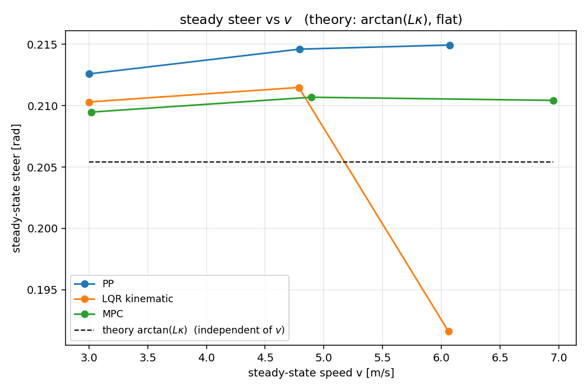

理论线 `arctan(Lκ) = 0.2054 rad` 是水平的。三条实测曲线基本贴合。
LQR 高速那一点掉到 `0.1916` 是振荡信号的均值，不是真的转角变小（§5 解释）。

**图 2 —— 横摆角速度随速度线性增长**（`figures/fig02_yawrate_vs_v.png`）

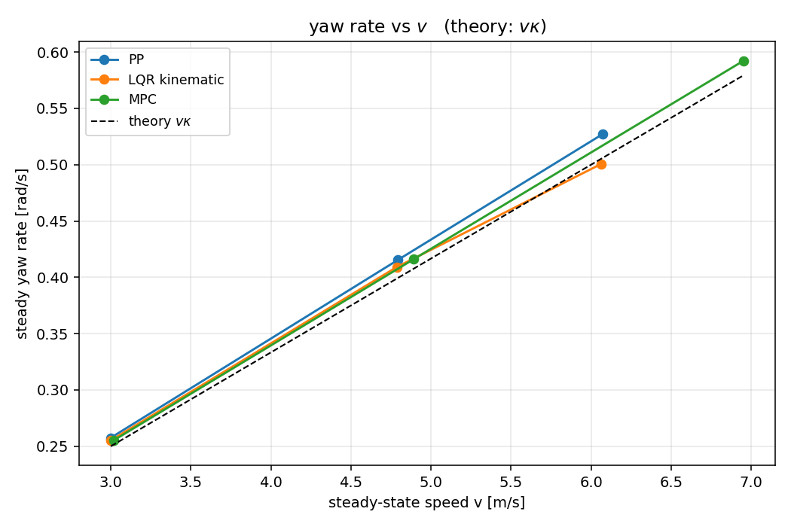

**图 3 —— 法向加速度随速度平方增长**（`figures/fig03_an_vs_v.png`）

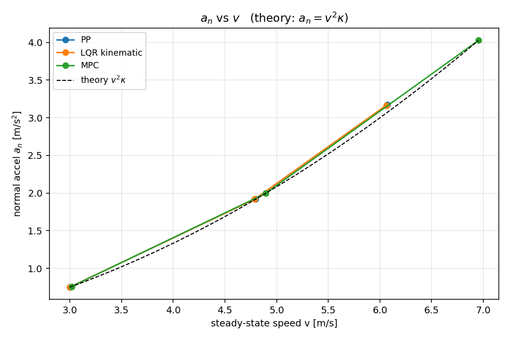

| 速度档 | v / m/s | `a_n` 理论 `v²κ` | PP 实测 | LQR k 实测 | MPC 实测 | 最大相对误差 |
| --- | ---: | ---: | ---: | ---: | ---: | ---: |
| low | 3.000 | 0.75000 | 0.74999 | 0.74999 | 0.75923 | 0.00% |
| medium | 4.79 | 1.915 | 1.92319 | 1.91787 | 1.99494 | 0.44% |
| high | 6.07 | 3.071 | 3.17191 | 3.16509 | 4.02728 | 3.42% |

`max_normal_acceleration` 在高速档为 **4.082 / 4.082 / 4.066 m/s²**（PP / LQR k / MPC），
而 `7.0²/12 = 4.0833` —— 三者都达到理论值的 **99.6% 以上**。

**偏离理论的原因是统计口径，不是模型误差**：理论值用稳态段**平均**速度算，而 `v²` 对 `v`
是凸函数，`mean(v²) ≥ mean(v)²`，段内速度波动越大仿真值越偏高。高速档 PP / LQR k 的稳态段
混入了速度下凹段（§5 缺陷二），波动最大，所以误差也最大。

---

## 2 主因：PP 的稳态内切量正比于 `Lf·β`

### 2.1 先确认它是几何偏心，不是漂移

PP 在 3 m/s 时稳态横向误差就用掉 `0.4369 m`，而理论转角只有 `0.2054 rad`，转向远未饱和。
**这个 0.44 m 从哪来？** 对稳态段轨迹做最小二乘拟合圆：

**图 6 —— PP 低速：车辆轨迹稳定缩在参考轨迹内侧**（`figures/fig06_trajectory_pp_low.png`）

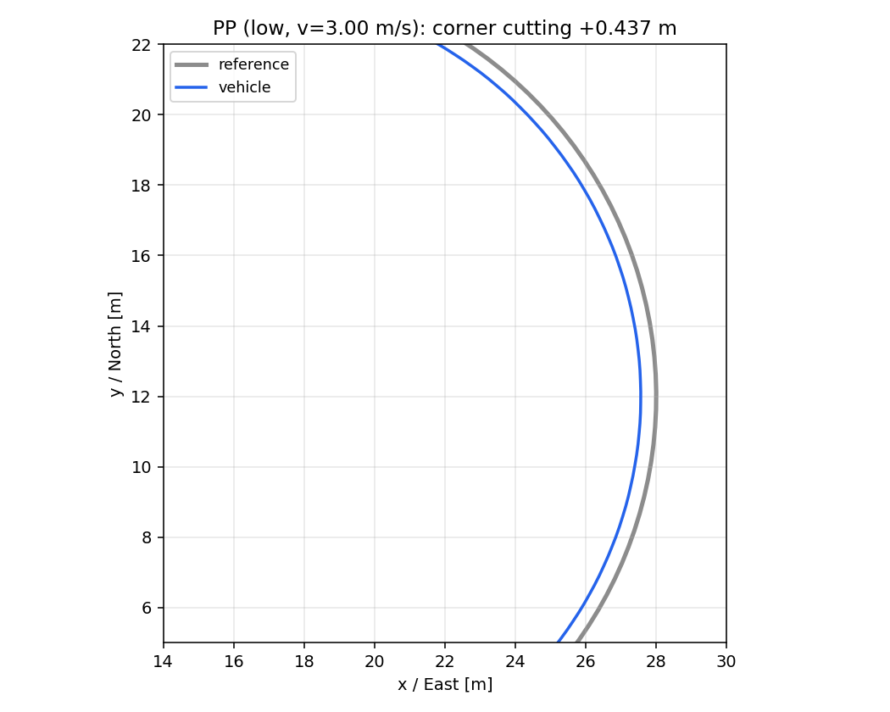

**图 7 —— PP 高速**（`figures/fig07_trajectory_pp_high.png`）

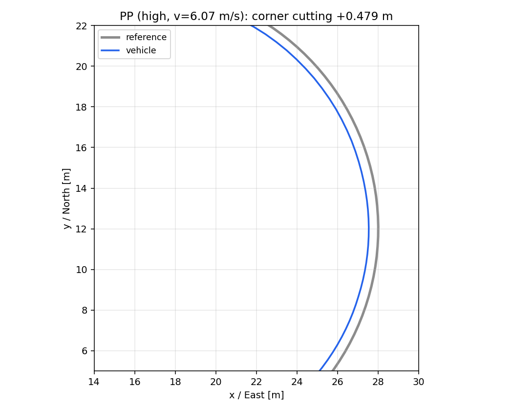

**图 8 —— 到圆心的距离随时间：稳定在一个更小的同心圆上**（`figures/fig08_radius_vs_time_pp.png`）

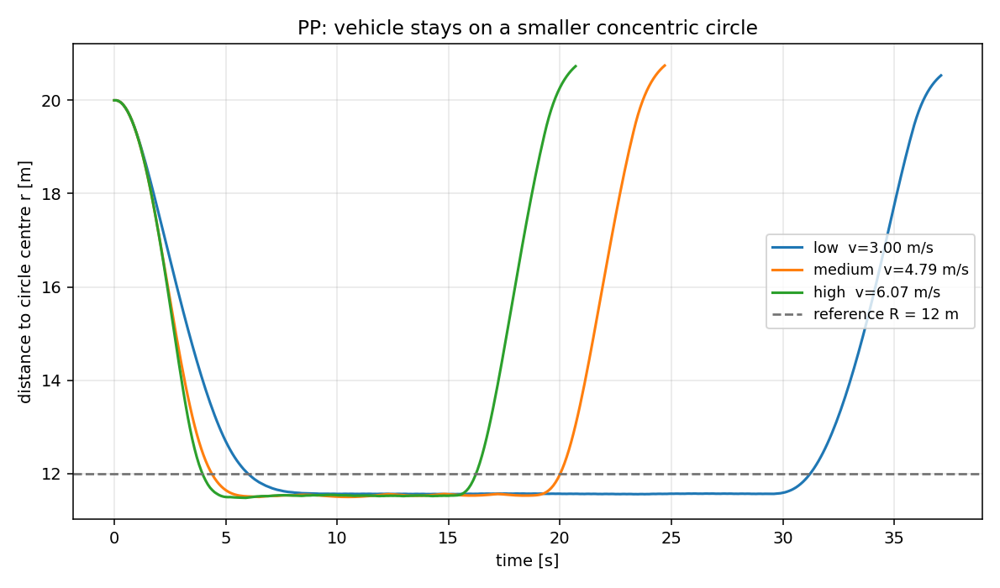

三档速度的拟合圆心都落在 `(16, 12)` 附近（偏差 < 1.5 cm），`横向误差 ≈ R − r` 在**毫米级**
成立（最大 2.77 mm）。**所以是稳态几何偏心，不是漂移，也不是跟踪失败。**
这个结论对三个算法都成立：

| 算法 | 内切量 `R−r` / m（low / medium / high） | 与横向误差均值的最大偏差 |
| --- | --- | ---: |
| PP | 0.4357 / 0.4708 / 0.4817 | 2.77 mm |
| LQR kinematic | 0.3243 / 0.3780 / 0.3187 | 10.52 mm † |
| MPC | 0.2168 / 0.2514 / 0.2988 | 1.16 mm |

† LQR k 高速那行的偏差来自它的振荡（§5），轨迹不再是光滑圆 —— 这个残差本身就是振荡的证据。

### 2.2 三组受控实验定位来源

固定 `v = 3.0 m/s, lf = lr = 1.25, ds = 0.05`，每次只改一个变量。

**A 组：只改基础前视距离 `L₀`** —— 内切量随 `Lf` 线性增长

**图 9 —— 内切量 vs 前视距离**（`figures/fig09_cut_vs_lookahead.png`）

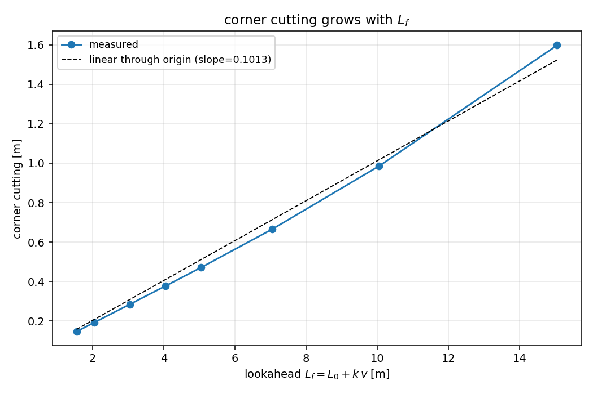

**B 组：只改 `lf/lr` 分配（轴距 `L` 不变）—— 决定性的一组**

**图 10 —— 内切量由侧偏角 β 驱动**（`figures/fig10_cut_vs_beta.png`）

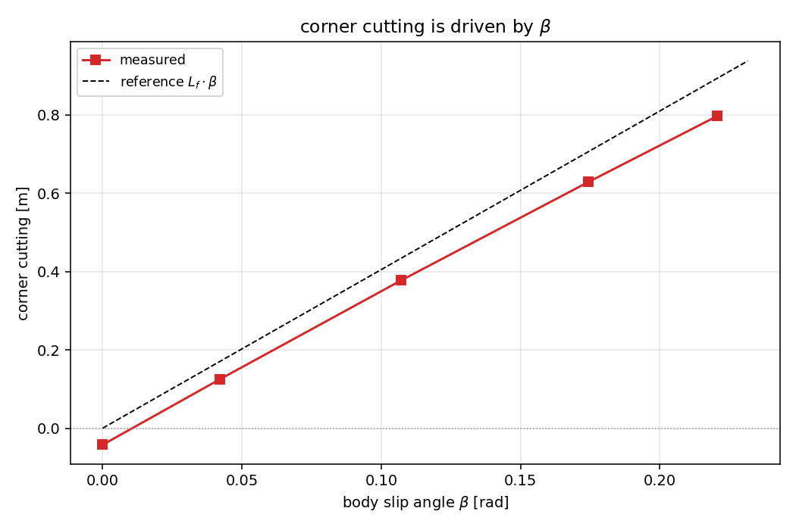

| `(lf, lr)` / m | 稳态 `β` / rad | 内切量 / m |
| --- | ---: | ---: |
| (2.5, 0.0) | **0.00000** | **−0.0423** ← β = 0，内切消失 |
| (2.0, 0.5) | 0.04217 | +0.1253 |
| (1.25, 1.25) | 0.10716 | +0.3774 |
| (0.5, 2.0) | 0.17440 | +0.6288 |
| (0.0, 2.5) | 0.22057 | +0.7968 |

**只改 `lf/lr` 的分配、让 `β` 从 0 涨到 0.22 rad，内切量就从 −0.04 m 涨到 +0.80 m。**

**C 组：只改参考路径重采样间距 `ds`** —— 次要项，不是主因

**图 12 —— 离散化的次要贡献**（`figures/fig12_cut_vs_ds.png`）

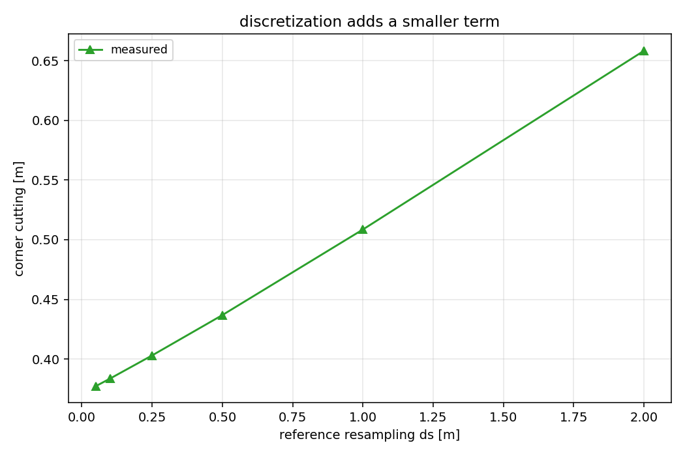

### 2.3 回归结论

用 A、B 两组共 13 个 `ds = 0.05` 的点：

```
corner_cut ≈ 0.9302 · (Lf · β) − 0.0280 m        R² = 0.99881，最大残差 0.0227 m
```

**图 11 —— 主回归**（`figures/fig11_cut_regression.png`）

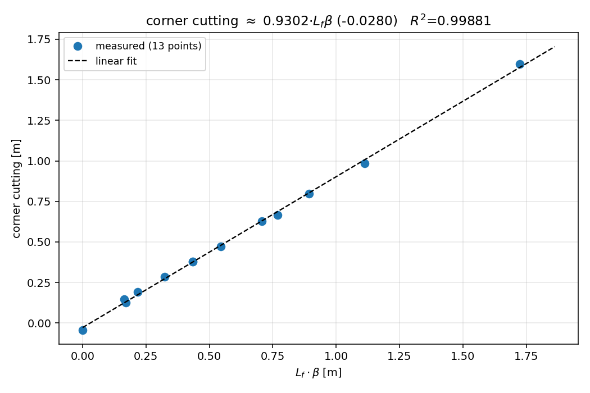

系数 `0.9302 ≈ 1`，即 **PP 在恒曲率路径上的稳态内切量约等于 `Lf·β`**。

### 2.4 为什么是 `Lf·β`，以及速度如何进入这条链

PP 的转角公式 `δ = arctan(2L·sinα / Lf)` 是从**无侧偏的单轮模型**推出来的：它假设车辆沿
**弦的切线方向**运动。但实际车辆沿 `ψ+β` 方向运动（`β ≠ 0`）。PP 认为"沿 `α` 走就能到前视点"，
实际车却沿 `α+β` 方向走，**每个控制周期都向内多拐一点**，偏差被前视距离放大，
稳态时表现为整条轨迹向内平移。

```
v ↑  →  Lf = L₀ + 0.35·v ↑  →  corner_cut ≈ 0.93·Lf·β ↑  →  稳态横向误差 ↑
```

`β` 本身几乎不随速度变化（PP 三档：0.1176 / 0.1229 / 0.1162 rad，基本持平），
**所以内切量随速度的增长几乎全部由 `Lf` 承担**：3.0 → 6.07 m/s 时
`Lf` 从 `4.05` 涨到 `5.12 m`（+26.5%），实测稳态内切 `0.4369 → 0.4790 m`（+9.6%）。
（增长不到 26.5%，因为闭环反馈在高速段补偿掉了一部分。）

> **撤回一个错误公式。** 归因过程中我曾先验假设内切量满足 `e_ss ≈ Lf²κ/8`。
> 该式预测三档内切为 `0.171 / 0.235 / 0.309 m`，实测是 `0.437 / 0.472 / 0.479 m`，
> 低估 1.7～2.6 倍；且它预测内切量与 `β` **无关**，被 B 组 `β = 0` 的对照直接否定。
> 正确的规律是上式 `corner_cut ≈ 0.93·Lf·β`。

### 2.5 这条机理不适用于 LQR / MPC

**不成立。** LQR 和 MPC 的公式里**根本没有 `Lf`**，它们都显式带了曲率前馈
（LQR：`δ = −K·e + L·κ`；MPC：优化目标里直接最小化与带曲率参考的偏差）。
判别方法就是 B 组的对照：若是 `Lf·β` 机理，`β = 0` 时偏心应消失 —— 而 LQR / MPC 不使用前视距离。

**三者偏心量的排序恰好与"控制器对曲率的显式建模程度"一致**：

| 算法 | 建模曲率的方式 | 低速内切 / m | 高速稳态误差 / m |
| --- | --- | ---: | ---: |
| MPC | 写进优化目标 | 0.2168 | **0.2987** |
| LQR kinematic | 写成前馈项 | 0.3243 | 0.3292 |
| PP | 完全没有，只能靠反馈 | 0.4357 | 0.4790 |

⚠️ **注意不要看相对增长率**：低速→高速的相对增长是 PP +9.6%、LQR k −1.7%、MPC +37.8%。
MPC 增长率最高，却始终最准（0.2987 仍小于 PP 的低速值 0.4357）。
**评价跟踪质量要看绝对误差，不能只看增长率。**

---

## 3 误差随速度的增长：必须看稳态段和最大值

**图 4 —— 稳态最大横向误差:三算法全部单调上升**（`figures/fig04_lateral_max_vs_v.png`）

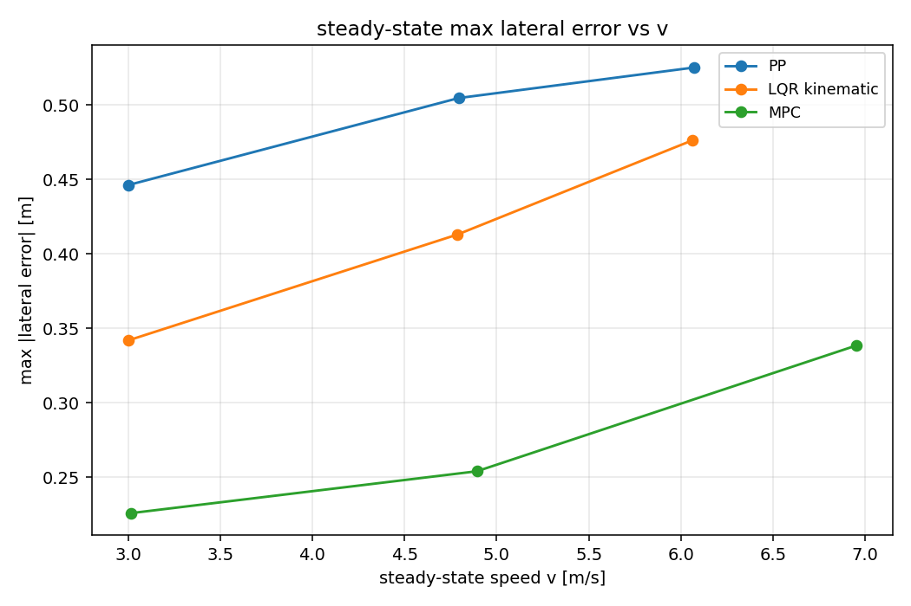

**图 5 —— 稳态平均横向误差:会骗人**（`figures/fig05_lateral_mean_vs_v.png`）

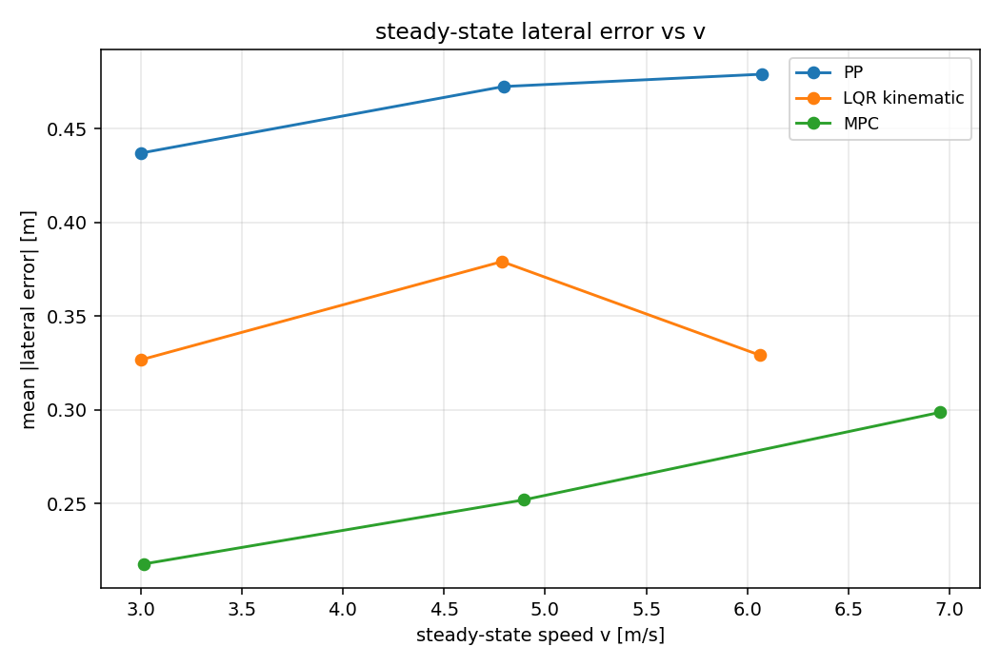

| 算法 | 稳态最大误差 / m（low→high） | **全程平均**误差 / m（low→high） |
| --- | --- | --- |
| PP | 0.4462 → 0.5046 → **0.5251** ↑ | 0.2859 → 0.2878 → **0.2750** ↓ |
| LQR kinematic | 0.3419 → 0.4130 → **0.4761** ↑ | 0.2195 → 0.2387 → **0.1900** ↓ |
| MPC | 0.2260 → 0.2541 → **0.3475** ↑ | 0.1442 → 0.1566 → **0.1679** ↑ |

### ⚠️ 统计口径陷阱：全程平均横向误差随速度**不增反降**

PP 从 `0.2859` 降到 `0.2750`，LQR k 从 `0.2195` 降到 `0.1900`。**这不是"高速更准"。**
原因是分母变了：速度越高，整条轨迹里**直线段（误差恒为 0）占的采样点比例越大**
（PP：低速稳态 215 拍 / 全程 372 拍 = 58%；高速 89 拍 / 208 拍 = 43%），
零误差样本把全程平均稀释掉了。

**判断跟踪难度必须用稳态圆弧段的误差和最大误差，不能用全程平均。**

### 误差几乎全部来自稳态段，不是瞬态

用"全程最大误差"减"稳态段最大误差"：九组中有**八组两者完全相等**（瞬态额外贡献 0%），
唯一的例外是 MPC 高速（0.0090 m，2.6%）。也就是说，**最大误差不是切入圆弧时冲出去的
瞬态尖峰，而是稳态偏置本身** —— 看图 17 的误差曲线：进入圆弧后迅速升到平台值并一直平在那里。

**图 17 —— PP 高速误差曲线：平台，不是尖峰**（`figures/fig17_pp_high_lateral_error.png`）

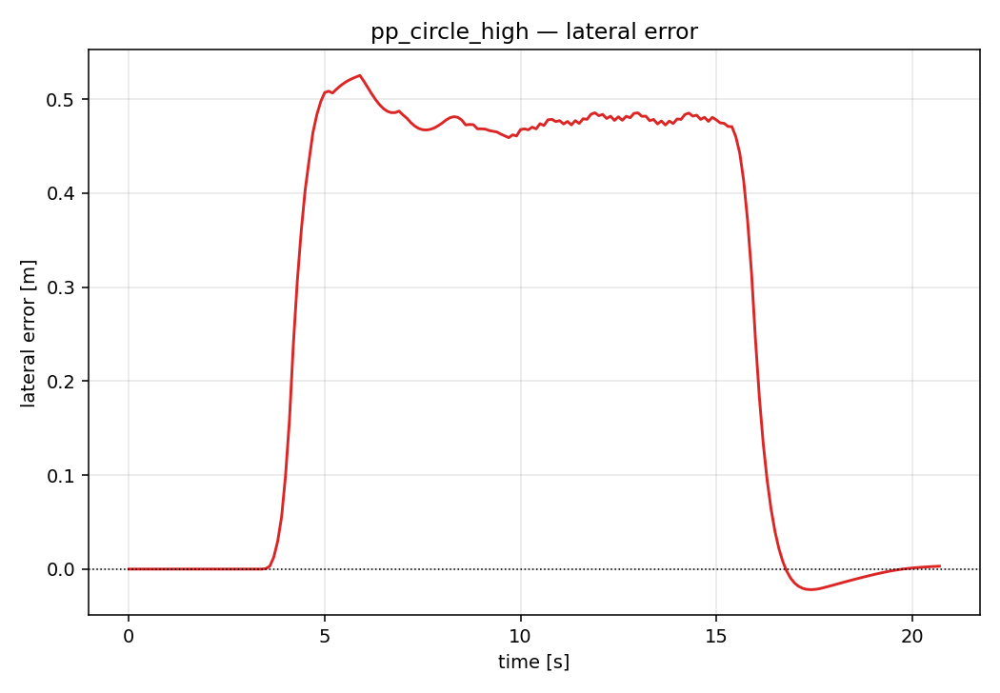

**图 18 —— MPC 高速误差曲线**（`figures/fig18_mpc_high_lateral_error.png`）

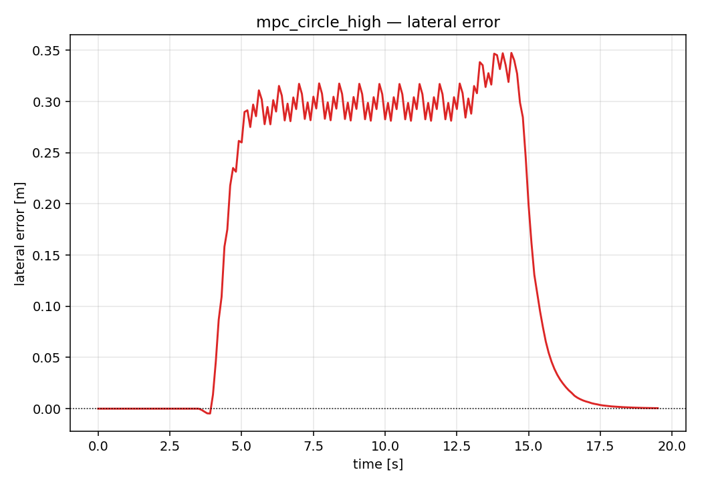

### 为什么均值会出现非单调（LQR k 高速）

LQR k 稳态平均误差是 `0.3267 → 0.3791 → 0.3292`，高速档反而比中速档小。
**不是变准了，是它从"平稳跟踪带固定偏置"切换到了"围绕均值振荡"** ——
标准差从 0.0196 涨到 0.0701（涨 3.6 倍）。振荡让均值看起来回落，
但**最大误差仍在单调上升**（0.3419 → 0.4130 → 0.4761）。
**这正是为什么必须同时看均值和最大值。**

---

## 4 原因 3（单位路程修正机会变少）——本实验未能单独验证

`dt = 0.1 s` 固定，每拍前进 `v·dt`：3 m/s 时 0.3 m，7 m/s 时 0.7 m。同一个弯道可用的
控制拍数按 `1/v` 减少，留给纠偏的迭代次数被压缩。

**这条机理符合直觉，但没有被本实验单独验证出来。** 数据上只看到"精度随速度单调下降"
（与它一致），而 §5 的排查确认**没有任何一组实验出现真正的闭环失稳**。
把"每拍前进更远"列为难度来源是合理的，但它的效应在本实验中被其他因素掩盖了。
**要单独验证它需要设计新实验（例如固定每拍前进距离、只改控制器更新率），本报告没做。**

---

## 5 三个被数据否定的"想当然"解释

### ❌ ①"高速时转向不够用"

稳态转角 `δ ≈ arctan(Lκ) = 0.2054 rad` 只依赖 `L` 和 `κ`，**与 `v` 无关**。
实测三档几乎不变（图 1）。PP 在高速下最大转角仅 `0.2293 rad`，只用到 `±0.6109 rad`
限幅的 **38%**。转向余量充足。

### ❌ ②"误差随速度单调累积"

全程平均横向误差随速度**不增反降**（PP 0.2859 → 0.2750 m），见 §3 的口径陷阱。

### ❌ ③"高速下 LQR 闭环失稳，必须做 gain scheduling"

LQR k 在高速档出现转角在 `±0.61 rad` 上逐拍等幅振荡（`J_delta = 5.4927`，
是中速档的 10.9 倍，`β` 振荡到 `0.33677 rad = 19.3°`，横摆角速度瞬时冲到 `1.850 rad/s`）。
我一度采信"极点随 `v/L` 越出单位圆"的解释，**但被数据推翻**。逐条排查：

| 假设 | 检验方法 | 结论 |
| --- | --- | --- |
| 固定 `K` 线性化模型失稳 | 算 `eig(A − BK)`，`v = 3…8 m/s` | **否定**：`max\|λ\|` 从 `0.844 (v=3)` **降到** `0.706 (v=7)`，极点始终在单位圆内且裕度充足 |
| 上一拍转角构成代数回路发散 | 回路增益 `K₃·v/L` | **否定**：`v = 7` 时仅 `0.655 < 1`，临界速度约 `10.7 m/s` |
| 参考点重采样混叠（7 m/s 每拍走 0.7 m > `ds = 0.5 m`） | 把 `ds` 从 0.5 扫到 0.05 | **否定**：`J_delta` 仍有 3.4～5.6，振荡不消失 |

**真正的线索在原始数据里**：圆弧段 91 拍中有 **58 拍转角符号翻转**，逐拍 `|Δsteer|` 最大
到 `0.9 rad` —— 折合 **9 rad/s**，而车辆声明的上限是 `0.7854 rad/s`。**超标 11 倍。**

查 `vdm_lab/common/vehicle.py`：

```python
def limit_command(command, vehicle_config):
    ...
    steer = clamp(command.steer, -vehicle_config.max_steer, vehicle_config.max_steer)
    # 只限幅转角大小，从不施加 max_steer_rate
```

**决定性验证**：在同一次实验的控制器外面套一层真实速率限制后再跑 ——
`scripts/verify_steer_rate_limit.py`：

| 速度档 | `J_delta`（稳态段）原始 → 加速率限 | `max\|steer\|` / rad | 稳态 `σ(e)` / m | 稳态 `max\|e\|` / m |
| --- | --- | --- | --- | --- |
| medium | 0.5035 → **0.1087** | 0.3514 → 0.2909 | 0.0196 → 0.0183 | 0.4130 → 0.4063 |
| high | 5.4927 → **0.4702** | 0.6109 → **0.3142**（不再饱和） | 0.0701 → 0.0425 | 0.4761 → 0.4845 |

**高速档 `J_delta` 降到原来的 1/11.7，转角不再顶死限幅，而精度几乎不变。**

**图 13 —— 原始锯齿 vs 加速度率限制后**（`figures/fig13_steer_raw_vs_limited.png`）

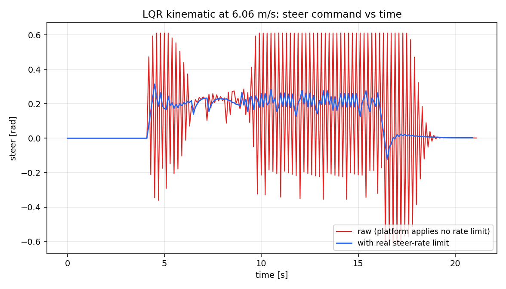

红线（原始）在 `±0.61 rad` 上高频等幅振荡，蓝线（加速度率限制后）平稳落在 `≈0.21 rad` ——
**正好等于理论值 `arctan(Lκ) = 0.2054 rad`。**

**图 14 —— 每拍转角跳变 vs 执行器上限**（`figures/fig14_max_dsteer_vs_limit.png`）

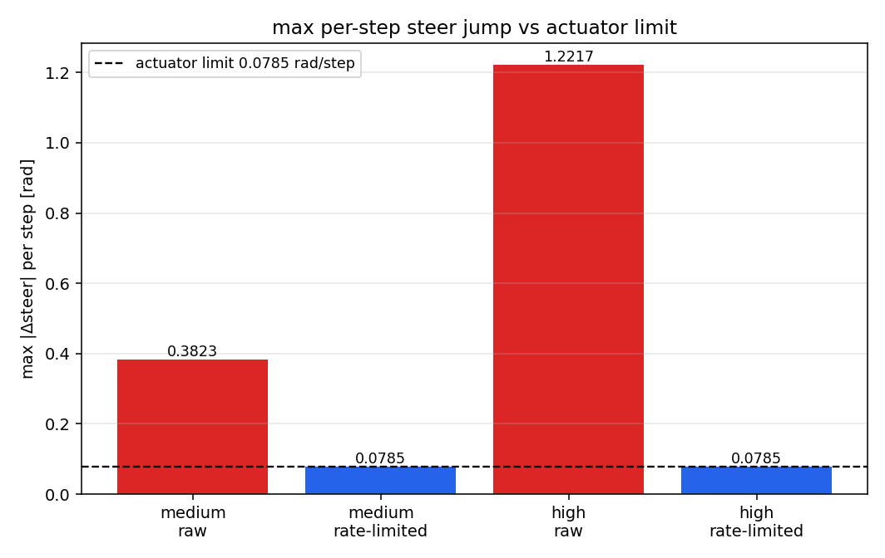

**结论：LQR k 的高速"振荡"是测试平台不执行转角速率限制造成的伪现象。**
控制器每拍都在命令一个物理上不可能的转角跳变，这个跳变又通过 `e_yaw_dot` 里的
`previous_control.steer` 反馈回下一拍的解，形成逐拍正负交替的极限环。执行器速率一旦被真实
约束，这个回路就被切断。

> 这不代表 LQR 在高速下没有真问题 —— 它的精度确实随速度下降（§2.5）。
> 但"高速振荡"这个具体现象应归因于**平台**，而不是算法。
> **固定 `K` 的跨速度裕度是够的，不需要 gain scheduling。**

---

## 6 三算法对比

| 指标（高速档） | PP | LQR kinematic | MPC |
| --- | ---: | ---: | ---: |
| 稳态横向误差 / m | 0.4790 | 0.3292 | **0.2987** |
| 稳态最大误差 / m | 0.5251 | 0.4761 | **0.3475** |
| 全程最大误差 / m | 0.5251 | 0.4761 | **0.3475** |
| 稳态速度 / m/s（目标 7.0） | 6.070 ‡ | 6.060 ‡ | **6.952** |
| `max\|Δsteer\|` / rad | **0.0328** | 1.2217 § | 0.1735 § |
| 越界拍数（上限 0.0785 rad/拍） | **0 / 207（0%）** | 126 / 211（59.7%）§ | 87 / 195（44.6%）§ |
| 是否到达终点 | 是 | 是 | 是 |

‡ 见 §7 缺陷二。 § 见 §5③ 缺陷一。

**精度：MPC > LQR kinematic > PP**，三档速度下排序完全一致，高速差距最大（MPC 比 PP 好 38%）。

**平滑性要看"每拍跳变是否超过执行器速率上限"，不能看 `J_delta`**（后者受缺陷一污染）：

**图 16 —— 三算法转角越界比例**（`figures/fig16_steer_rate_violations.png`）

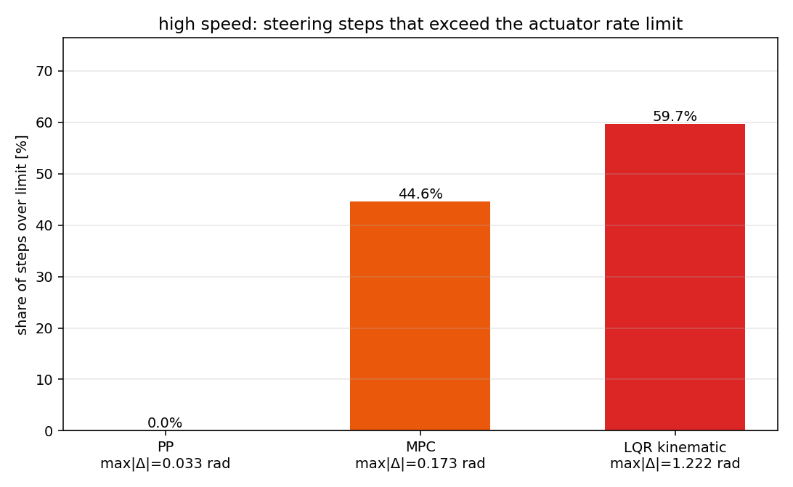

- **PP 完全满足速率约束（0% 越界）** —— 它的转角是前视点的**纯几何函数**，前视点连续移动，
  没有任何振荡激励源。代价是精度（见上表）。
- **MPC 有 44.6% 越界**，幅度小（0.1735 rad）。原因是我的 QP 把速率约束写成
  `|u[1,t+1] − u[1,t]| ≤ rate·dt`，**只约束时域内部的相邻控制量，没约束 `u[1,0]` 相对
  上一拍已执行指令的跳变**。这是可以修的实现细节。
- **LQR k 越界 59.7%、幅度最大（1.2217 rad）**，即 §5③ 的伪振荡。

> **关于"是否与任务 1 的其他路线一致"：本报告没有数据支撑，不做断言。**
> 本次只覆盖 `circle` 一条路线；`double_lane_change` / `right_angle` / `s_curve` /
> `mixed_course` 未运行。

---

## 7 发现的两个平台缺陷

| # | 位置 | 问题 | 影响 | 建议修法 |
| --- | --- | --- | --- | --- |
| 1 | `vdm_lab/common/vehicle.py` `limit_command()` | 只 `clamp` 转角**大小**，从不施加 `max_steer_rate` | 控制器可命令 9 rad/s 的转角跳变（限值 0.7854）；LQR 高速因此出现伪振荡，所有平滑性指标失真 | 加上 `clamp(steer, prev ± max_steer_rate·dt)` |
| 2 | 同文件 `speed_pid()` | 终点接近限速用**欧氏直线距离**而非沿路径剩余弧长 | `circle` 这类闭环路线在圆弧中段被误判"快到终点"而意外减速 | 改用 `s_total − s_vehicle` |

**缺陷二的证据**（高速档 PP / LQR k 的稳态速度只有 6.070 / 6.060，目标 7.0）：

```
if distance_to_goal < 14.0:
    target_speed = min(target_speed, (2.0 * 0.9 * distance_to_goal) ** 0.5)
```

`distance_to_goal` 是车辆到路径**终点**的直线距离。`circle` 是首尾相接的闭环，
车辆绕圈时会从终点附近经过：PP 高速稳态段 89 拍中有 **23 拍到终点直线距离 < 14 m**
（最近 8.52 m），触发限速 `v ≤ √(1.8 × 8.52) = 3.92 m/s`，实测最低跌到 4.247 m/s。
低速档因为目标速度 3.0 本来就低于限速值，完全不受影响。MPC 的速度在 QP 里直接跟踪参考速度、
不经过 `speed_pid`，所以不受影响（6.952 m/s）。

**图 15 —— LQR 高速速度曲线:圆弧中段被误减速**（`figures/fig15_lqrk_high_speed.png`）

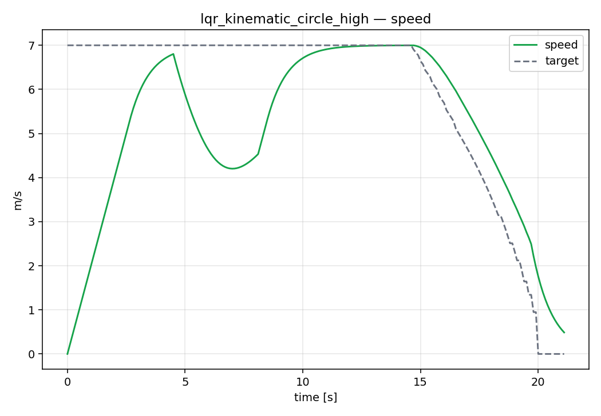

t ≈ 5～8 s 处速度从 6.8 掉到 4.2 再爬回 7.0，正是车辆经过终点附近的那一段。

**这两个缺陷都不影响本文关于"速度—难度"的主要结论**（`a_n = v²κ` 的验证、`Lf·β` 内切机理、
精度排序），因为它们建立在稳态几何量上；但**引用表 2 的高速 `J_delta` 与稳态速度时需要注意**。

---

## 8 结论与工程建议

**速度越快，路径跟踪越难 —— 三条原因：**

1. **平方级动力学代价**：`a_n = v²κ`。速度翻倍，转弯所需侧向加速度变 4 倍
   （实测 `0.750 → 3.172 m/s²`，理论验证误差 ≤ 3.42%）。物理层面的硬约束。
2. **线性级几何代价（主因）**：稳态内切量 `≈ 0.93·Lf·β`（`R² = 0.99881`）。
   PP 的转角公式建立在**无侧偏**假设上，而车辆实际沿 `ψ+β` 运动；
   `Lf = L₀ + 0.35v` 又把速度线性地放大这个偏置。**这是本文最具体的"速度—难度"定量关系。**
3. **单位路程修正机会按 `1/v` 减少**：控制周期固定，高速下每拍前进更远，
   可用控制拍数变少。**本实验未单独验证它**（§4）。

**工程建议：**

- **前视距离不能盲目随速度增大。** `Lf` 每增加 1 m，稳态内切就增加 `≈ 0.93·β` m。
  需要在 `Lf = L₀ + k·v` 之外引入**曲率前馈或转角偏置补偿** —— LQR / MPC 的实测精度优势
  正来自它们显式建模了曲率。
- **终点接近限速必须用沿路径剩余弧长**，否则闭环/折返路线会在中段误减速。
- **仿真平台必须在执行器层施加 `max_steer_rate`**，否则任何控制器的平滑性指标都不可信 ——
  本文的 LQR 就是被这一点冤枉的。

---

## 附录 A：复现命令

```bash
# 1) 跑 9 组实验（3 算法 × 3 速度档）
for algo in pp lqr_kinematic mpc; do
  for speed in low medium high; do
    python run_experiment.py --algo "$algo" --version student \
      --route circle --speed-mode "$speed" --save-log --save-fig
  done
done

# 2) 表 1–4 与图 1、2、3、4、5、6、7、8
python scripts/analyze_circle_speed.py

# 3) 内切量归因的三组受控实验，图 9–12
python scripts/analyze_pp_corner_cut.py

# 4) 把单次运行的拼版图拆成独立单图（轨迹/误差/速度/控制）
python scripts/plot_run_panels.py

# 5) 转角速率限制前后对比，图 13、14
python scripts/verify_steer_rate_limit.py

# 6) 汇总成报告用图集 docs/figures/（图 1–18，单图不拼版）
python scripts/make_report_figures.py
```

| 内容 | 路径 |
| --- | --- |
| 表 1 / 2 / 3 / 4 | `outputs/analysis_circle_speed/tables.md` |
| 四表 CSV | `outputs/analysis_circle_speed/table{1,2,3,4}_*.csv` |
| 内切量受控实验原始数据 | `outputs/analysis_pp_corner_cut/sweep_{lookahead,geometry,ds}.csv` |
| 速率限制对比 | `outputs/analysis_steer_rate/rate_limit_compare.{md,csv}` |
| 单次运行日志 | `outputs/20260912_1518xx_*/{trajectory,reference_path}.csv`、`metrics.json` |
| 报告用图（18 张独立单图） | `docs/figures/fig01…fig18_*.png` |

## 附录 B：本报告未覆盖的内容

诚实标注，避免读者误以为已经测过：

1. **`lqr_dynamic`（动力学 LQR）未实现、未测试。** 任务文档中列为进阶选做；本文只有运动学 LQR。
2. **只测了 `circle` 一条路线**，无法回答"是否与其他路线一致"。
3. **原因 3 未被单独验证**（§4）。
4. **两个平台缺陷未修复，只是被识别和绕开。** 本文所有数据都在**未修复**的平台上采集；
   §5③ 的速率限制对比是事后加的一层控制器外包装，没有改动 `vdm_lab/common/vehicle.py`。
5. **表 2 的高速 `J_delta` 与稳态速度不可直接引用**（分别受缺陷一、二污染）。
   §6 的"每拍转角跳变越界比例"是更可靠的平滑性替代指标。
6. **MPC 的转角速率约束不完整**，导致 44.6% 越界（§6）。
7. **`ds` 对稳态值的影响未分离。** 上表用的是默认 `ds = 0.5 m`，其中含约 0.06 m 的离散化贡献；
   §2.3 的 `R² = 0.99881` 是在 `ds = 0.05 m` 下拟合的。

> 更长的归因过程与逐项推导见 `docs/问题1_分析细节_完整版备份.md`。
