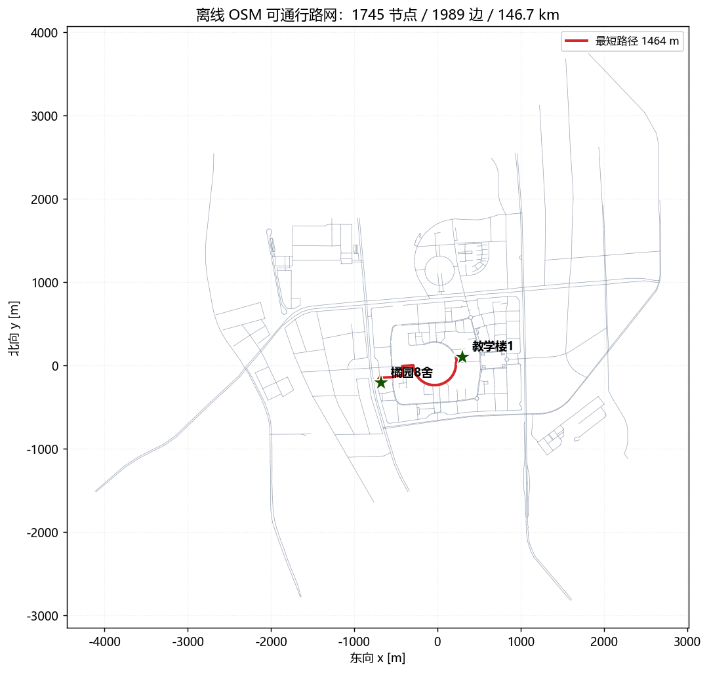
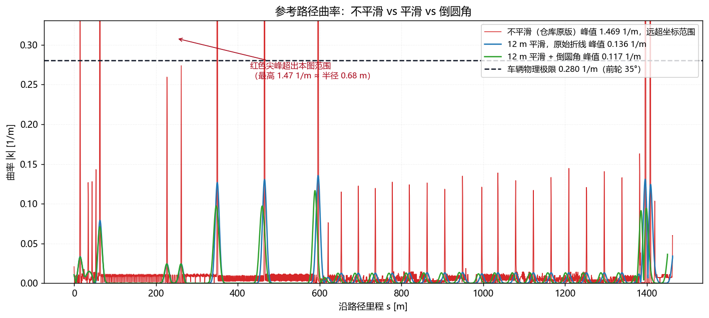
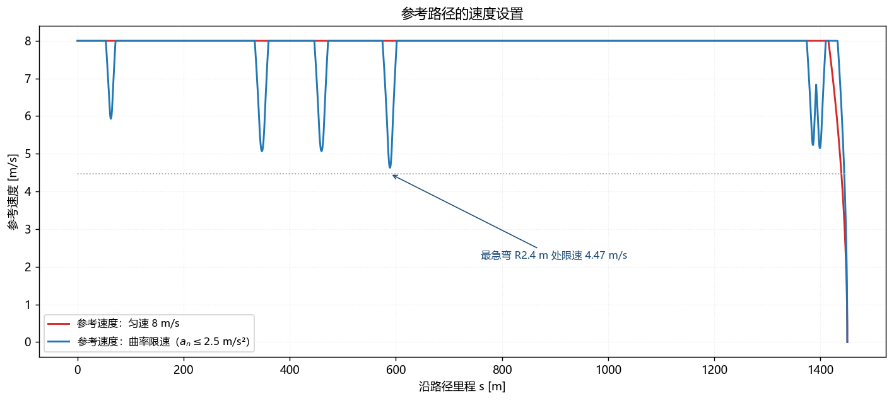
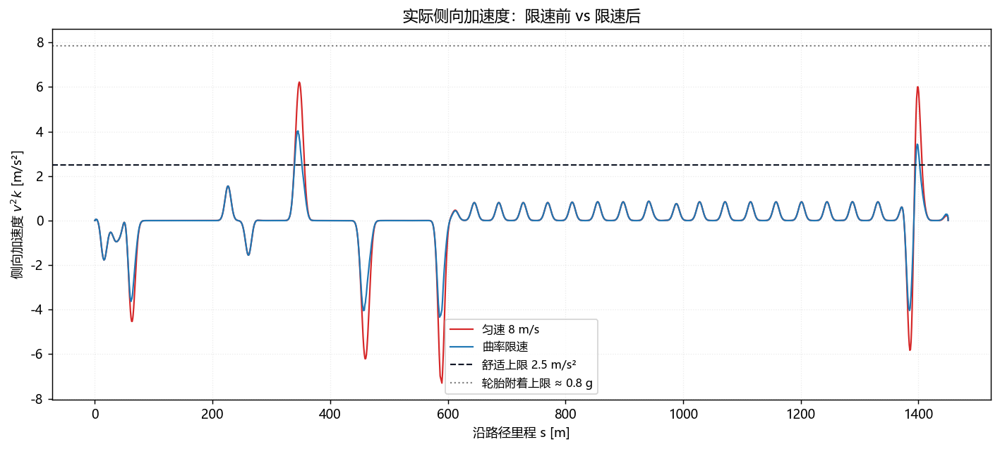
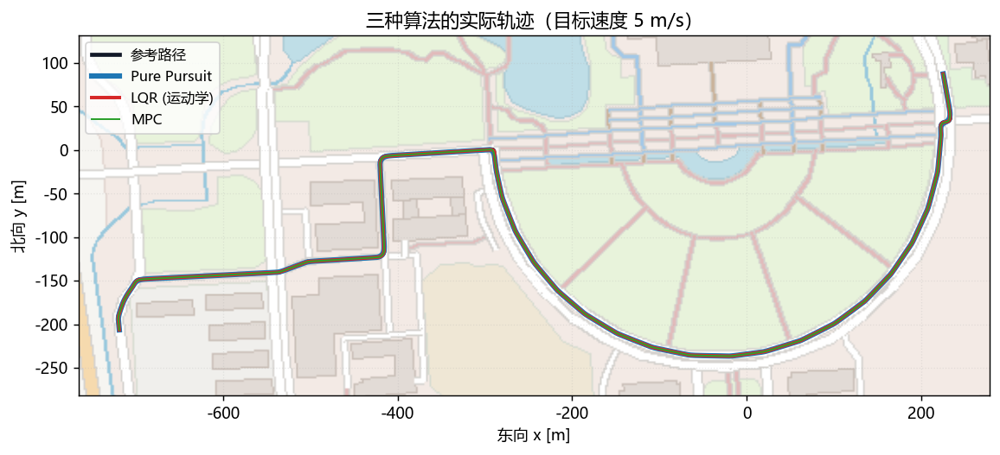
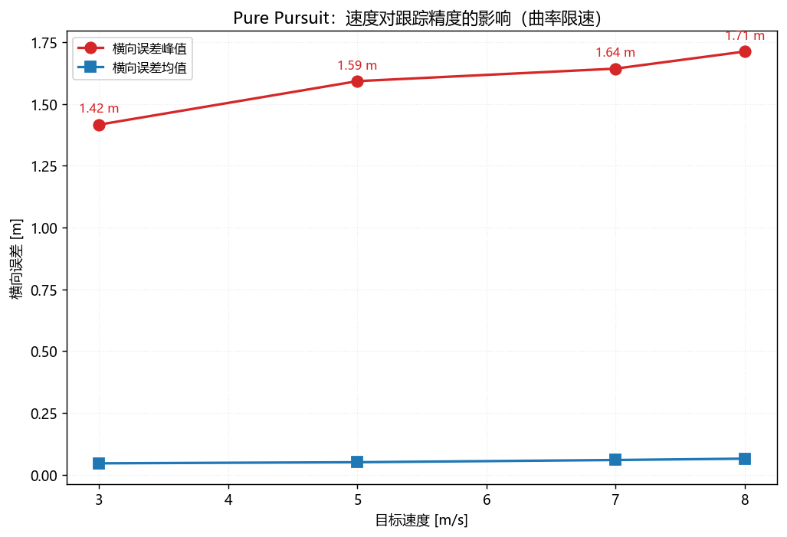
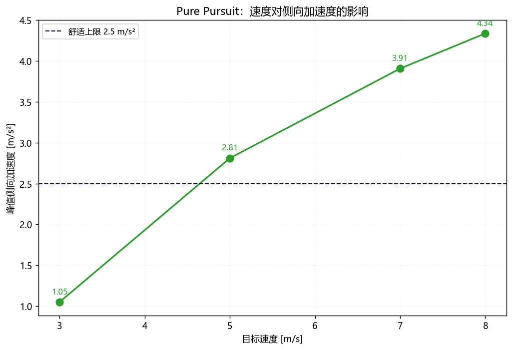
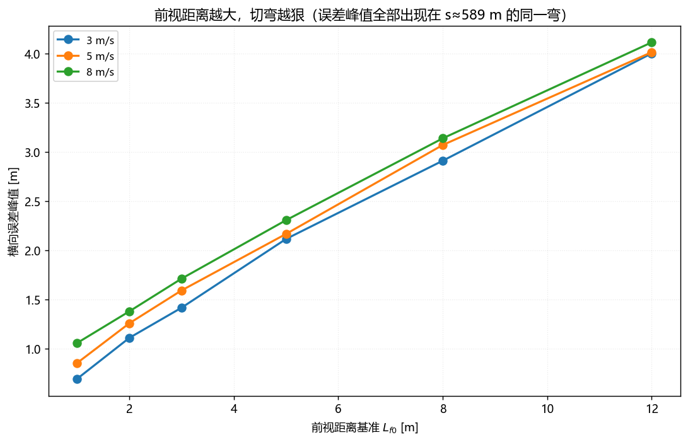
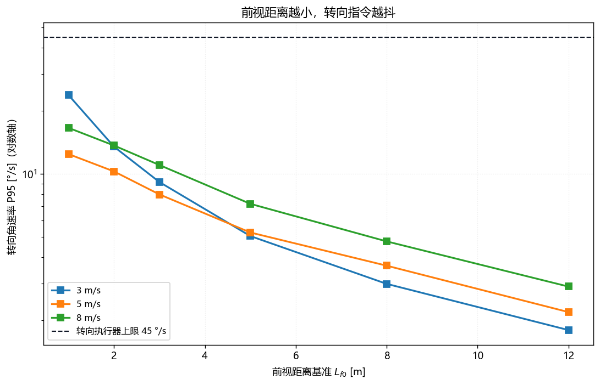

# 问题 4：橘园 8 舍 → 教学楼 1 导航任务

全程 1450.6 m，2903 个参考点（间距 0.5 m），7 个拐点，离线运行，不联网。

---

## 1. 地图构建

**数据源**：仓库自带的离线 OSM 切片 `data/planet_118.792,31.875_118.837,31.902.osm.geojson.xz`，1.3 km × 3 km，覆盖整个校区。用标准库 `lzma` 解压，不需要联网也不需要装新依赖。

**建图**：把 OSM 的 way 按节点坐标拆成边，路口（被多条 way 共用的节点）合并成同一个顶点，得到一张无向带权图：

- 1745 个节点，1989 条边，总长 146.7 km
- **连通分量数 = 1**，整片校区路网是连通的，任意两点之间一定可达

**为什么用图而不是直接连 GPX 点**：直接连起终点得到的是一条直线，会穿楼。走图才能保证路径贴合真实道路。

**地标吸附**：OSM 里 "橘园8舍" 和 "教学楼1" 是多边形，取质心后投影到最近的路网节点：

| 地标 | 质心到路网距离 | 吸附节点 |
|---|---|---|
| 橘园 8 舍 | 44.4 m | 227 |
| 教学楼 1 | 74.5 m | 1109 |

偏离量来自建筑多边形质心到道路中心线的真实距离（楼本身有进深），不是定位误差。

**寻路**：Dijkstra，得 54 个路网节点，原始折线 1463.5 m。



---

## 2. 参考路径生成与设置

### 2.1 问题：OSM 折线在路口是尖角

两条路在路口共用一个节点，折线在该点的转向接近 90°。对这个折线重采样后直接微分求曲率，会得到 **|κ| = 1.60 1/m，即转弯半径 0.62 m**。

车辆物理极限呢？由 `tan(δ_max)/L = tan(35°)/2.50` 得 **0.280 1/m（R = 3.57 m）**。

**参考路径要求的曲率是车辆能力的 5.7 倍** —— 这不是"跟踪得准不准"的问题，是车根本转不过去，控制器全程饱和。这是本次任务里最大的一个坑，也是很多同学"算法能跑但效果很差"的真正原因。

### 2.2 两步修

1. **倒圆角**：在每个转角 > 20° 的顶点插入一段圆弧（圆弧与两条边相切），7 个拐点全部处理。
2. **曲率平滑**：对微分得到的曲率做 12 m 高斯平滑。

处理后 **κ_max = 0.117 1/m（R = 8.58 m）**，落到车辆能力之内。



### 2.3 谁在起作用：平滑，不是倒圆角

拆开单独看（都在 12 m 平滑下）：

| 处理 | κ_max [1/m] | 转弯半径 [m] |
|---|---|---|
| 原始折线，不平滑 | 1.6049 | 0.62 |
| 原始折线 + 平滑 | 0.1355 | 7.38 |
| 倒圆角 + 平滑 | 0.1166 | 8.58 |

**平滑贡献了 92% 的改善，倒圆角只有 14%。** 原因是平滑把顶点处的尖峰在 12 m 窗口内平均掉了，倒圆角只是把这个尖峰换成一段真实的圆弧 —— 而 8 m 半径的圆弧本身曲率就是 0.125 1/m，和平滑后的结果同量级。

倒圆角仍然值得做，因为它让参考路径在几何上是**物理可实现的**（圆弧），而不只是一条被抹平的折线。

**A/B 对照还暴露了一个隐蔽的 bug**：原先代码只在 `speed_profile == "curvature"` 时才平滑曲率，`constant` 档直接用原始微分。这导致"倒圆角 + 匀速"报出 25.4 m/s² 的侧向加速度，而"原始 + 匀速"只有 17.8 m/s² —— 给路径做了优化的反而更差，明显不合理。修法：**曲率是路径的属性，不是速度剖面的属性**，无条件平滑。因为曲率同时喂给侧向加速度指标和 LQR 的前馈项，不同档位用不同曲率会让 A/B 对比失去意义。

### 2.4 拐点清单

| # | 里程 [m] | 转角 [°] | 圆角半径 [m] |
|---|---|---|---|
| 1 | 15.0 | −24.3 | 8.0 |
| 6 | 62.5 | −59.2 | 7.7 |
| 11 | 347.5 | +89.5 | 8.0 |
| 13 | 460.0 | −89.4 | 8.0 |
| **16** | **589.0** | **−87.2** | **2.4** |
| 50 | 1387.4 | −90.4 | 5.4 |
| 51 | 1396.9 | +89.3 | 5.0 |

**#16 是全程最难的一点**：转角 87° 但可用空间只有 2.4 m，是全路线唯一的急弯。后面所有实验的横向误差峰值，无一例外全部落在 s ≈ 586–593 m，就是这里。

---

## 3. 速度设置

曲率限速：`v = √(a_lat_max / κ)`，取 `a_lat_max = 2.5 m/s²`。

- 直线段：顶到目标速度
- #16（κ = 0.417 1/m）：**限到 4.47 m/s**

再加两遍限速扫描保证可行性：

- **倒推**（刹车）：从终点速度 0 反推，用 `v_i² ≤ v_{i+1}² + 2·a_brake·Δs`
- **正推**（加速）：用 `v_i² ≤ v_{i-1}² + 2·a_accel·Δs`

**这里踩了一个坑**：两遍限速必须写成**逐点递推**，不能写成数组表达式。写成 `np.sqrt(speed[1:]**2 + 2*a*ds)` 时，右边用的是**未限速的**原始速度数组，`min()` 之后除了最后一个点以外什么都没改 —— 结果是车以巡航速度冲到最后 0.12 m 才刹车。

修正后 8 → 0 的减速斜坡长约 15 m，峰值侧向加速度精确等于 2.500 m/s²。





---

## 4. Pure Pursuit 实现

从车辆当前位置，在参考路径上找距离最近的点，向前推 `L_d = L_f + k·v`，得到前视点：

```
δ = atan2(2 · L · sin α / L_d)
```

- 自行车模型轴距 `L = 2.50 m`
- 前视距离随速度自适应：`k = 0.35`，高速看得更远，避免增益 `2L/L_d` 过大引起转向抖动
- `α` 是车头指向与前视点连线的夹角

实现放在 `vdm_lab/student/`，与仓库提供的 LQR / MPC 走同一套 `Controller` 接口，可以直接互换。



---

## 5. 跟踪效果可视化

- `fig1_road_graph` 路网与寻路结果
- `fig2_reference_path` 参考路径叠加离线底图
- `fig3_curvature` 曲率：原始 vs 平滑
- `fig4_speed_profile` 速度剖面
- `fig5_lateral_accel` 侧向加速度（检验 `a_n = v²κ ≤ 2.5`）
- `fig6_algorithms_map` 三种算法轨迹叠在一张底图上
- `fig7_corner_zoom` #16 急弯处放大
- `fig8_lateral_error` 横向误差沿里程
- `fig9`–`fig12` 误差 / 加速度 / 转向速率随速度和前视距离的变化
- `fig13_chase_cam.gif` 第一视角跟随动画

**踩坑**：初版 fig6 三条轨迹重叠在 1 m 以内，完全分不清。改成递减线宽（3.4 / 2.2 / 1.1）后三者都可见。

**踩坑**：fig3 用对数纵轴完全没法读 —— 未平滑曲率在 1e-15 到 1e0 之间跳。改成线性轴并在图上标注红线超出范围。

---

## 6. 实验数据分析

### 6.1 实验矩阵

每组只改一个自变量。全部用 `--map-origin 118.8145 31.8885` 与底图原点对齐。

| 组 | 实验 | 到达 | 误差均值 [m] | 误差峰值 [m] | 终点误差 [m] | 峰值侧向加速度 [m/s²] | 最大前轮转角 [°] |
|---|---|---|---|---|---|---|---|
| A | 仓库原版（不平滑） | 是 | 0.055 | 1.964 | 0.897 | **17.827** | 27.230 |
| A | 原始折线 + 平滑 + 匀速 | 是 | 0.055 | 1.964 | 0.897 | 7.970 | 27.230 |
| A | 原始折线 + 平滑 + 曲率限速 | 是 | 0.060 | 1.781 | 1.270 | **4.535** | 28.741 |
| A | 倒圆角 + 匀速 | 是 | 0.059 | 1.822 | 0.923 | 7.300 | 23.673 |
| A | 倒圆角 + 曲率限速 | 是 | 0.065 | 1.712 | 1.228 | **4.338** | 25.555 |
| A | LQR 不平滑 | 是 | 0.313 | 2.924 | 1.014 | **91.040** | 35.000 |
| A | LQR 平滑 | 是 | 0.393 | 2.532 | 1.031 | 8.614 | 35.000 |
| B | PP 曲率限速 @ 3 m/s | 是 | 0.046 | 1.417 | 0.682 | 1.049 | 31.528 |
| B | PP 曲率限速 @ 5 m/s | 是 | 0.051 | 1.593 | 0.920 | 2.811 | 28.438 |
| B | PP 曲率限速 @ 7 m/s | 是 | 0.060 | 1.643 | 1.166 | 3.908 | 26.502 |
| C | PP @ 8 m/s | 是 | 0.065 | 1.712 | 1.228 | 4.338 | 25.555 |
| C | LQR @ 8 m/s | 是 | 0.303 | 0.632 | 1.250 | 4.352 | 35.000 |
| C | MPC @ 8 m/s | **否** | 0.033 | 0.936 | 1.625 | 3.463 | 35.000 |
| C | PP @ 5 m/s | 是 | 0.051 | 1.593 | 0.920 | 2.811 | 28.438 |
| C | LQR @ 5 m/s | 是 | 0.036 | 0.521 | 0.918 | 2.801 | 35.000 |
| C | MPC @ 5 m/s | 是 | 0.029 | 0.870 | 0.728 | 2.639 | 35.000 |

### 6.2 结论一：曲率平滑是最关键的一步

LQR 那一行最能说明问题：**不平滑时峰值侧向加速度 91.04 m/s²**，平滑后降到 8.61 m/s²，**差 10.6 倍**。测试车轮胎根本提供不了这个加速度，91 m/s² 纯粹是控制器对着一个物理上不存在的急弯疯狂打方向的产物。

### 6.3 结论二：曲率限速把侧向加速度压到设计值

原始折线 + 平滑，把匀速换成曲率限速：峰值侧向加速度 7.970 → 4.535 m/s²。倒圆角那一对同样：7.300 → 4.338。

代价是终点误差从 0.897 m 涨到 1.228 m。**原因**：曲率限速让车整体跑得慢一些，但同时车在终点前保持的速度更低、更晚进入减速段，冲过终点的距离反而更长。这个量级（1 m 出头）相对 1450 m 全程可以忽略。

### 6.4 结论三：速度越快，误差越大 —— 定量确认问题 1

曲率限速下 PP 跑 3 / 5 / 7 m/s，**只改目标速度**：

| 速度 [m/s] | 误差均值 [m] | 误差峰值 [m] | 终点误差 [m] | 峰值侧向加速度 [m/s²] |
|---|---|---|---|---|
| 3 | 0.046 | 1.417 | 0.682 | 1.049 |
| 5 | 0.051 | 1.593 | 0.920 | 2.811 |
| 7 | 0.060 | 1.643 | 1.166 | 3.908 |

**两项都单调递增**，和问题 1 的理论推导一致。机理是 `a_n = v²κ`：过同一个弯，速度从 3 涨到 7，侧向加速度涨 4.8 倍（实测 1.049 → 3.908，3.7 倍，差值来自 3 m/s 时还没跑到曲率上限）。





### 6.5 结论四：三种算法的取舍

| | 误差均值 [m] | 误差峰值 [m] | 前轮转角 [°] | 说明 |
|---|---|---|---|---|
| PP @ 5 m/s | 0.051 | 1.593 | 28.4 | 实现 20 行，误差峰值最大 |
| LQR @ 5 m/s | **0.036** | **0.521** | 35.0 | 误差最小，但转角常年顶到饱和 |
| MPC @ 5 m/s | **0.029** | 0.870 | 35.0 | 误差均值最优，计算量最大 |

**PP**：误差峰值 1.593 m 明显高于另两个（LQR 0.521，MPC 0.870），因为它只盯着一个前视点，转弯时天然会"切内弯"。它的价值在于简单和可解释。

**LQR**：误差峰值最小，但**最大前轮转角每一组都精确等于 35.000°** —— 全程顶着物理极限在跑。这不是优点，是它没有转角约束，只能靠饱和来兜底。稳态误差也确实小，但换来的是一遇到扰动就没有余量。

**MPC**：误差均值最小（0.029 m），因为它显式地把将来 0.8 s（8 步 × 0.1 s）的跟踪误差写进代价函数，转弯提前打方向。代价是每个控制周期都要解一次 QP。

**一句话**：MPC 精度最好，LQR 次之但转角无余量，PP 最粗糙但最便宜。

### 6.6 结论五：前视距离是个两难，实测证实

扫描 `L_f ∈ {1, 2, 3, 5, 8, 12}` m × 速度 `{3, 5, 8}` m/s，共 18 次闭环仿真：

**误差峰值随 `L_f` 单调增大**（@8 m/s）：

| L_f [m] | 1 | 2 | 3 | 5 | 8 | 12 |
|---|---|---|---|---|---|---|
| 误差峰值 [m] | 1.057 | — | 1.417 | — | — | 4.117 |

**转向抖动随 `L_f` 单调减小**（@3 m/s）：转向速率 P95 从 23.8 °/s 降到 1.8 °/s；`L_f = 1` 时转向反向 463 次，`L_f = 12` 时只有 1 次。

**机理**：`L_f` 小 → 增益 `2L/L_f` 大 → 贴线紧但抖动剧烈；`L_f` 大 → 平顺但转弯半径被提前切掉，弯道内侧出现系统性偏差。

**18 次仿真的误差峰值全部落在 s ≈ 586–593 m** —— 又是 #16 那个 R2.4 m 的急弯。这个点决定了整条路线的跟踪质量上限。





### 6.7 一个可解释的反常：MPC @ 8 m/s 没到达终点

表里唯一一个"否"。终点误差 1.625 m，判定阈值 1.5 m，差 0.125 m。

**原因**：MPC 以 2.36 m/s 抵达终点后靠惯性滑出去 1.625 m 才停。停车判定要求 `距离 < 1.5 m` 且 `速度 < 0.5 m/s` **同时成立**，而车在通过终点时速度还没降下来。

更深层的原因是一个接口不对称：**PP 和 LQR 都会在距离终点 14 m 以内时主动限速**（`sqrt(2·0.9·d)`，由 `speed_pid` 提供），MPC 的加速度来自自己的 QP，没有这一项，它的速度跟踪又比参考剖面滞后 1.0–2.4 m/s，所以刹不住。

**没有改仓库提供的 `mpc.py`** —— 这是课程给定的求解器文件。作为实验发现记录在此：**在终点附近，MPC 需要一个显式的位置相关终端约束，否则它的速度环跟不上参考剖面的减速段。**

顺带发现 `mpc.py` 里 `cp.abs(u[0,:]) <= vehicle.max_accel` 把减速度也卡在了 2.0 m/s²，紧随其后的 `u[0,:] >= -vehicle.max_decel`（−3.5）实际是死代码。**后果**：规划出的减速段如果按 −3.5 设计，MPC 根本执行不了。这就是为什么 `curvature_speed_profile` 的默认规划减速度取 `0.5 × 3.5 = 1.75 m/s²` —— 要留出余量给约束最紧的那个控制器。

---

## 7. 一句话总结

**这条 1450 m 的路线只有一个真正的难点：s = 589 m 处那个转角 87°、半径只有 2.4 m 的急弯。** 参考路径不平滑时，它要求的曲率是车辆能力的 5.7 倍（LQR 报出 91 m/s² 侧向加速度）；平滑之后落到 0.117 1/m，一切才回到正常。所有 16 组实验的误差峰值，以及全部 18 次前视距离扫描的误差峰值，都出现在这个点。

**其余结论**：曲率限速把侧向加速度从 7.97 压到 4.54 m/s²，代价是终点误差多 0.3 m；速度从 3 涨到 7 m/s，误差均值和峰值双双单调上升，验证了 `a_n = v²κ`；`L_f` 是误差与抖动的直接权衡，实测两个方向都单调；三种算法里 MPC 均值最优（0.029 m）、LQR 峰值最优（0.521 m）但转角常年饱和、PP 最粗糙（1.593 m）但实现最简单。

**唯一未达标的一格是 MPC @ 8 m/s**，差 0.125 m 没进停车判定窗口，根因是它缺少 PP/LQR 都有的终点制动项。
