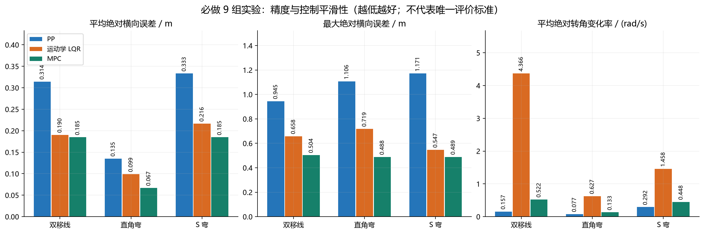
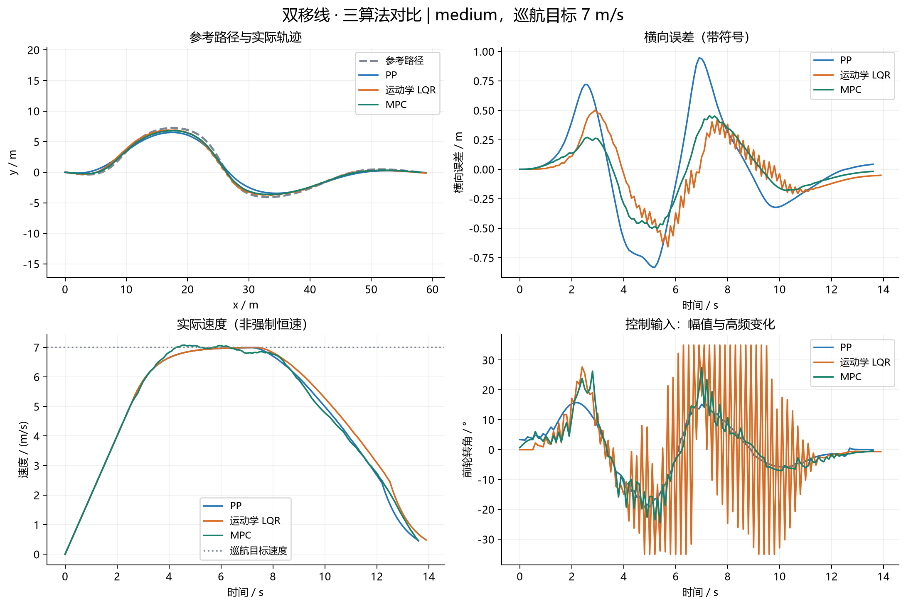
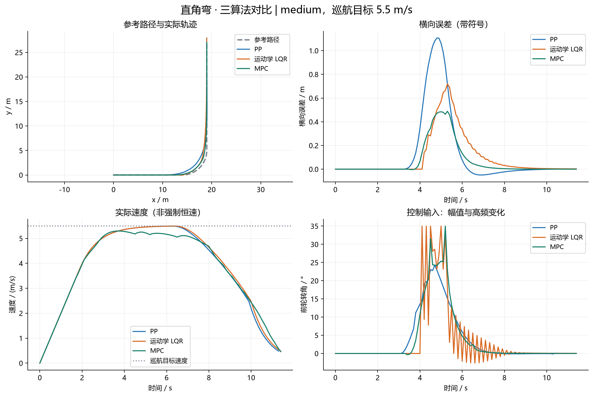
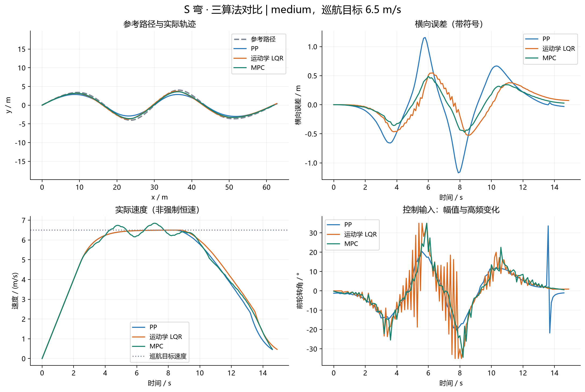
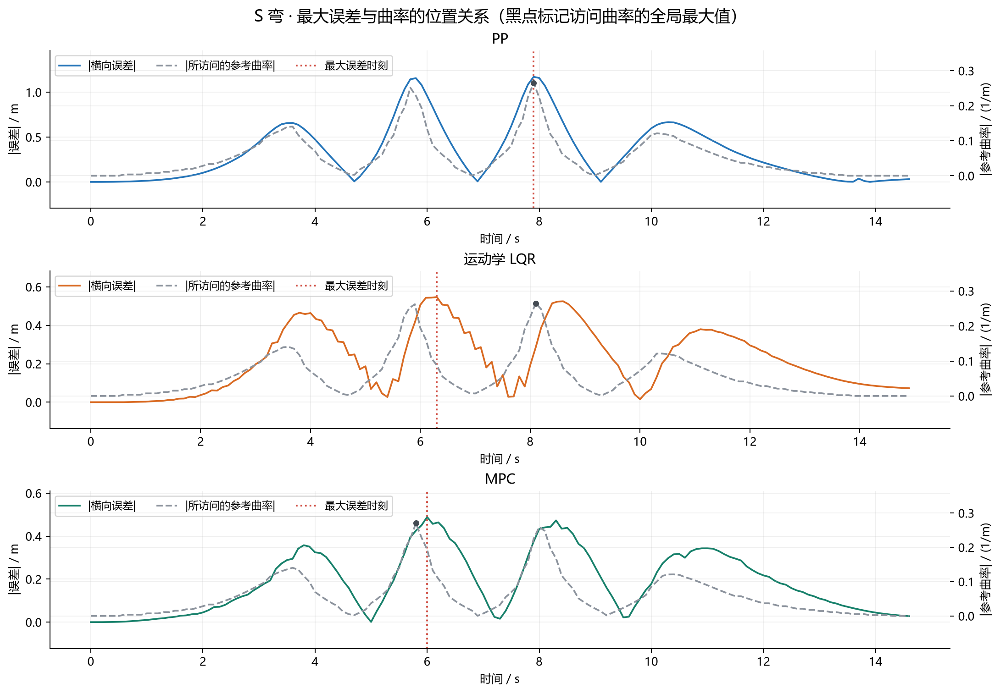
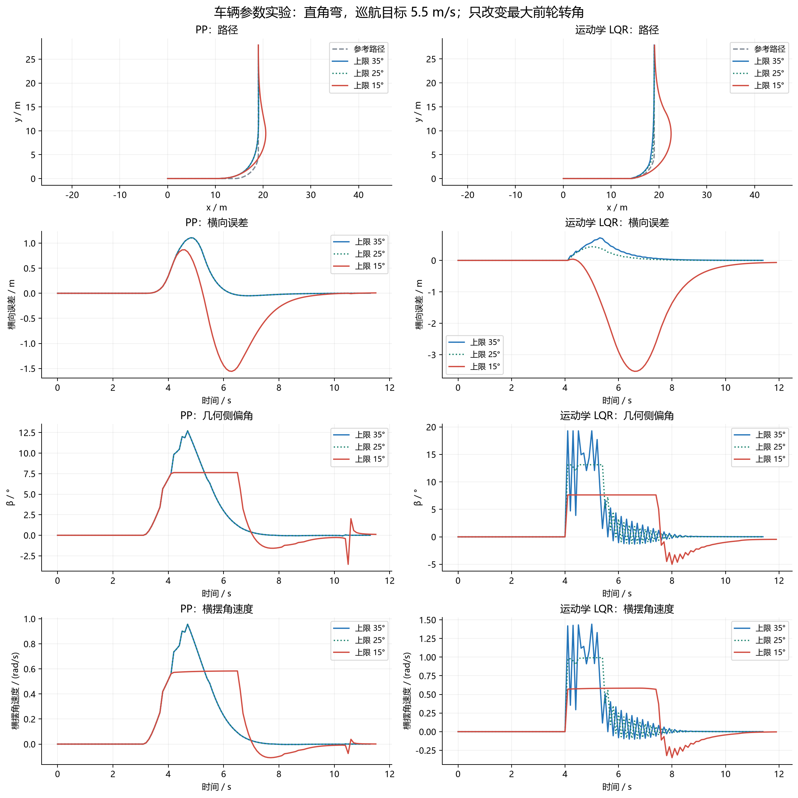
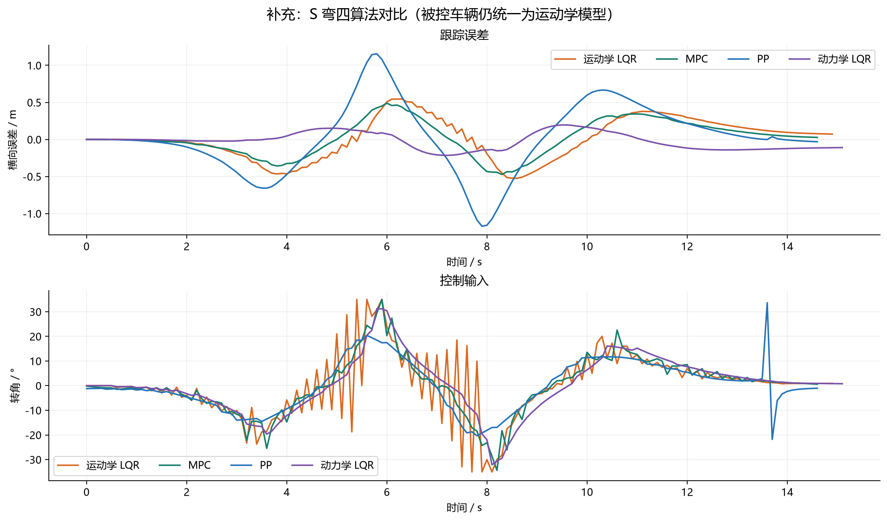

# 实验任务 1：PP、LQR 和 MPC 在不同场景中的表现

实验日期：2026-09-11

任务依据：[仓库实验任务书，第 1 节](../../vdm_lab/tasks/README.md)

代码基线：`5ebeb963c016857281dd1b39357778dc20ff5a68`

数据目录：[outputs/task1/20260911_task1](../../outputs/task1/20260911_task1)

实现范围：使用仓库 `solution` 控制器，新增实验、汇总与校验脚本，未修改原控制器或车辆模型。

## 摘要

在统一车辆与仿真设置下，对 PP、运动学 LQR 和 MPC 在双移线、直角弯和 S 弯上的表现进行了 9 组对比；另在直角弯上比较了 35°、25°、15°三种前轮转角上限，并补充动力学 LQR 的 S 弯和综合路线实验。35°参数基准复用必做实验，因此共有 **15 组独立配置**，不是 17 组。

15 组均满足仓库的到达终点条件，无求解异常或超时。在 9 组必做实验中，MPC 的平均和最大横向误差均最小，PP 的平均绝对转角变化率最低，运动学 LQR 在双移线上出现明显的高频转角振荡。参数实验表明，限幅与性能并非简单单调关系：运动学 LQR 的转角上限从 35°降至 25°，平均误差降低约 39.0%；降至 15°后，平均误差却增至基准的约 7.53 倍，最大误差达 3.5283 m。

上述结论仅适用于本次确定性仿真、默认控制器参数和所选速度，不意味着某类算法在所有工况下最优，也不构成真实车辆安全性结论。

## 1. 模型推导与代码对应

### 1.1 运动学自行车模型

设车辆质心为 C，前、后轴到质心的距离为 `lf`、`lr`，轴距 `L = lf + lr`。车辆航向为 `ψ`，质心速度大小为 `v`，速度方向与车身方向的夹角为 `β`，前轮转角为 `δf`。假设平面运动、后轮不转向、轮胎侧向无滑动，车辆仅前进。几何示意见仓库 [KMLM.png](../../vdm_lab/KMLM.png)。

后轮侧向速度为零，故：

```text
v sinβ − lr ψ_dot = 0
```

前轴处的纵、横向速度分别为 `v cosβ` 和 `v sinβ + lf ψ_dot`。前轮速度沿轮平面，因此：

```text
tanδf = (v sinβ + lf ψ_dot) / (v cosβ)
       = L ψ_dot / (v cosβ)
```

联立得到：

```text
β     = atan[(lr / L) tanδf]
ψ_dot = (v / L) tanδf cosβ
x_dot = v cos(ψ + β)
y_dot = v sin(ψ + β)
v_dot = a
```

在 `v = 0` 时直接使用最终公式，不进行中间步骤的除零运算。代码采用前向 Euler 离散：`x[k+1] = x[k] + dt × x_dot[k]`，其余状态类似，速度还会限幅，航向角会归一化。

这里的 `β` 是运动学几何侧偏角；即使车轮侧向无滑动，质心速度方向也不必与车身方向一致。不能将其直接解释为轮胎打滑角或失稳证据。

| 物理量或关系 | 代码位置 | 日志字段 |
| --- | --- | --- |
| 前轮转角 δf | `ControlCommand.steer`；`vehicle.limit_command()` | `steer`，rad |
| 几何侧偏角 β | `bicycle_model.front_steer_slip_angle()` | `beta`，rad |
| 横摆角速度 ψ_dot | `bicycle_model.yaw_rate_from_steer()` | `yaw_rate`，rad/s |
| x_dot、y_dot | `bicycle_model.kinematic_derivatives()` | `x`、`y`、`yaw`、`speed` |
| 离散状态更新 | `vehicle.update_state()` | 相邻时刻状态 |
| 横向误差、航向误差 | `reference.ReferenceTracker.nearest()` | `lateral_error`、`heading_error` |
| 车辆参数 | `config/vehicle_params.py` 中的 `student_car` | 各实验 `config.json` |

完整实现见 [bicycle_model.py](../../vdm_lab/common/bicycle_model.py)、[vehicle.py](../../vdm_lab/common/vehicle.py)、[reference.py](../../vdm_lab/common/reference.py)。

### 1.2 参考曲率与法向加速度

圆周运动关系为 `a_n = v² / R = v²κ`。本仓库逐时刻记录的是：

```text
normal_accel = 当前车辆速度² × 当前匹配参考点的曲率
```

因此，表中将其明确称为“参考法向加速度”：它表示以当前速度沿该参考曲率运动的加速度需求，并非直接从实际轨迹或轮胎力测量出的加速度。车辆偏离参考路径时，两者可以不同。模型没有摩擦系数、轮胎饱和或侧翻约束，不能因某组需求值很大就断言发生了打滑；也不能因仿真到达终点就断言真实车辆能够安全完成。

## 2. 实验设计与评价方法

### 2.1 固定设置

| 项目 | 设置 |
| --- | --- |
| 车辆 | `student_car`；`lf = lr = 1.25 m`，轴距 2.5 m |
| 被控车辆模型 | `KinematicBicycleBackend`，四种控制器均相同 |
| 初始状态 | 路线首点、首点航向、速度 0 m/s |
| 仿真步长 | `dt = 0.1 s` |
| 参考点采样参数 | `waypoint_ds = 0.5 m` |
| 最大仿真时间 | 90 s；本次各组均提前满足终点条件 |
| 终点判据 | 到终点欧氏距离 < 1.5 m，且速度 < 0.5 m/s |
| 默认转角上限 | ±35° |
| 外部加速度、速度限制 | 加速不超过 2.0 m/s²，减速幅值不超过 3.5 m/s²，速度 0～12 m/s |
| PP 前视距离 | `Ld = 3.0 + 0.35v`，单位 m |
| LQR 权重 | `Q = diag(2, 0.2, 3, 0.2)`，`R = 1.5` |
| MPC | 预测步数 8，对应 0.8 s；每步最多 5 次线性化迭代，OSQP 求解 |

PP 和两种 LQR 使用仓库的纵向速度控制；MPC 同时优化加速度和转角。虽然外部车辆设置和目标速度曲线一致，各车实际速度并不严格相同。MPC 还在优化问题中施加了 `abs(acceleration) ≤ 2`，使其预测减速幅值事实上也限制在 2 m/s²；这与 PP/LQR 的实现不同。本实验比较的是仓库中完整算法实现，不声称已经隔离出纯横向控制律的差异。

### 2.2 场景与实验矩阵

| 场景 | 中速档巡航目标 | 特征 | 必做算法 |
| --- | --- | --- | --- |
| 双移线 `double_lane_change` | 7.0 m/s | 多次曲率换向、连续换道 | PP、运动学 LQR、MPC |
| 直角弯 `right_angle` | 5.5 m/s | 半径 5 m 的四分之一圆弧，曲率从 0 跳至 0.2 再回到 0 | PP、运动学 LQR、MPC |
| S 弯 `s_curve` | 6.5 m/s | 连续正负曲率和多个局部峰值 | PP、运动学 LQR、MPC |

同一路线的参考坐标、曲率、速度曲线和配置已逐项校验相同。不同路线的“中速”并非同一数值，因此主要在每条路线内部比较算法，不把跨路线误差变化单独归因于道路几何。

车辆参数实验固定直角弯与 5.5 m/s 目标速度，分别在 PP、运动学 LQR 下将 `max_steer` 设为 35°、25°、15°，其他参数完全不变。选取转角上限可以直接检验转向能力与控制振荡之间的关系，不涉及同时修改 `wheelbase`、`lf`、`lr` 的一致性问题。

另外按任务书建议运行动力学 LQR 的 S 弯和综合路线，中速档分别为 6.5、7.0 m/s。补充数据单列，不将其计入必做 9 组。

### 2.3 指标定义

```text
平均绝对横向误差 = mean(abs(e_y[k]))
最大绝对横向误差 = max(abs(e_y[k]))
横向误差 RMSE    = sqrt(mean(e_y[k]²))
Jδ               = mean(abs(δ[k] − δ[k−1]) / dt)
转角饱和比例     = 达到转角上限的采样点数 / 采样点总数
```

平均误差不是带符号误差的平均，避免左右偏差相互抵消。`Jδ` 越低表示平均控制变化越小，但不能保证没有个别尖峰，因此同时检查最大变化率和时间曲线。按任务书定义，统计保留全部日志采样，包括终点判定时记录的控制量，未删去低速或不理想片段。

横向误差是车辆相对匹配离散参考点的法向投影，参考匹配采用单调前进的局部搜索；它不是车辆与连续曲线的精确最短距离。样条路线日志中的 `s` 是仓库插值参数，近似里程但不严格等于平滑曲线弧长。失败实验的完成时间应记为缺失，不能用 90 s 上限冒充有效用时；本次没有失败配置。

实验没有添加随机噪声，每个固定配置运行一次。另对每种主要算法的一条完整路线做数值复现检查；这些检查不是新的独立工况。本报告不计算统计显著性或随机工况下的置信区间。

## 3. 必做九组实验结果

### 3.1 统一指标表

所有最大值均指绝对值的最大值。CSV 保留完整精度，正文四舍五入至四位小数。

| 路线 | 算法 | 到达终点 | 平均误差/m | 最大误差/m | 最大转角/rad | 最大参考法向加速度/(m/s²) | 最大横摆角速度/(rad/s) |
| --- | --- | --- | --- | --- | --- | --- | --- |
| 双移线 | PP | 是 | 0.3143 | 0.9447 | 0.3355 | 9.2065 | 0.9428 |
| 双移线 | 运动学 LQR | 是 | 0.1904 | 0.6584 | 0.6109 | 9.2139 | 1.8485 |
| 双移线 | MPC | 是 | 0.1849 | 0.5036 | 0.4787 | 8.7656 | 1.3659 |
| 直角弯 | PP | 是 | 0.1352 | 1.1064 | 0.4238 | 5.9703 | 0.9567 |
| 直角弯 | 运动学 LQR | 是 | 0.0989 | 0.7186 | 0.6109 | 5.9791 | 1.4418 |
| 直角弯 | MPC | 是 | 0.0667 | 0.4881 | 0.6109 | 5.5359 | 1.3615 |
| S 弯 | PP | 是 | 0.3332 | 1.1710 | 0.5871 | 11.1857 | 0.9468 |
| S 弯 | 运动学 LQR | 是 | 0.2164 | 0.5469 | 0.6109 | 11.1877 | 1.7177 |
| S 弯 | MPC | 是 | 0.1848 | 0.4891 | 0.6109 | 10.3271 | 1.6280 |

原始表格：[core_metrics.csv](tables/core_metrics.csv)。其余指标，包括航向误差、RMSE、侧偏角、终点距离、实际平均速度及峰值位置，见 [all_metrics.csv](tables/all_metrics.csv)。



在这三条路线中，平均误差和最大误差的排名均为 MPC、运动学 LQR、PP，主对比的排名没有发生反转。MPC 相比 PP 的平均误差分别降低约 41.2%、50.6%、44.5%；相比运动学 LQR 分别降低约 2.9%、32.5%、14.6%。双移线中 MPC 与运动学 LQR 的平均误差比较接近，但 MPC 的最大误差仍更低，且控制平滑性差异很大。

平均和最大误差最小的算法在本次主实验中恰好相同，但二者定义不同：平均值描述全程表现，最大值强调局部最坏情况。不能由三条路线上的一致排名推导出二者在任何实验中都必然给出相同结论。

### 3.2 双移线：低误差未必代表控制平滑



PP 的前视距离随速度增大，在 7 m/s 时为 5.45 m。前视几何使转角变化相对平缓，但遇到连续换向时会产生切角和误差积累，其最大横向误差为 0.9447 m。

运动学 LQR 使用曲率前馈与四维误差状态反馈，在误差较低的同时出现持续高频转角振荡，部分相邻采样间直接从 −35°跳至 +35°。其最大变化率为 `70° / 0.1 s = 700°/s = 12.2173 rad/s`，转角饱和采样比例为 19.29%。因此，只报告平均误差 0.1904 m 会遗漏重要的控制品质问题。

MPC 的预测和输入变化惩罚在该场景中取得了更低误差，并比当前运动学 LQR 实现平滑，但仍比 PP 的平均变化率高。MPC 的预测模型采用 `v cosψ`、`v sinψ`，被控模型则采用 `v cos(ψ+β)`、`v sin(ψ+β)`，预测与执行模型并不完全一致；不能把 MPC 的非零误差单纯归因于求解精度。

### 3.3 直角弯：局部峰值大于全程平均值所暗示的难度



PP 的平均误差为 0.1352 m，但最大误差达 1.1064 m。这说明大段直线上的小误差会降低总体均值，弯道局部表现仍需要单独检查。PP 在进入曲率突变前就开始转向，弯中出现明显切角。

运动学 LQR 通过 `Lκ` 曲率前馈响应弯道，在曲率从 0 跳至 0.2 1/m 时，前馈项本身约产生 0.5 rad 的变化，叠加反馈后部分时刻达到转角上限。MPC 的最大误差为 0.4881 m，低于另外两种算法，但其控制并非完全无突变。

### 3.4 S 弯：区分平均平滑性与终点附近尖峰



PP、运动学 LQR、MPC 的最大误差分别为 1.1710、0.5469、0.4891 m。连续曲率换向使 PP 的几何前视在局部产生较大跟踪误差，运动学 LQR 则仍存在振荡。

PP 的平均变化率低于另外两种主算法，但其最大变化率达 9.6745 rad/s。日志显示：`t = 13.6 s` 时距终点仅约 0.004 m，速度仍为 1.454 m/s，转角约 +33.64°；下一步经过终点附近，转角变为约 −21.79°。此时前视目标已经固定为最后一个路径点，目标方位在近距离通过过程中变化很快。这是该 PP 实现终点处理的局部问题，不应解释成高速弯道上的持续振荡，也不应为了使结果更好看而删除。

### 3.5 控制平滑性与转角速率约束

| 路线 | 算法 | 完成用时/s | Jδ/(rad/s) | 最大变化率/(rad/s) | 超过配置45°/s的比例 |
| --- | --- | --- | --- | --- | --- |
| 双移线 | PP | 13.6 | 0.1568 | 0.6297 | 0.00% |
| 双移线 | 运动学 LQR | 13.9 | 4.3656 | 12.2173 | 62.59% |
| 双移线 | MPC | 13.6 | 0.5218 | 2.3217 | 27.21% |
| 直角弯 | PP | 11.3 | 0.0767 | 0.7659 | 0.00% |
| 直角弯 | 运动学 LQR | 11.4 | 0.6268 | 6.1087 | 28.07% |
| 直角弯 | MPC | 11.4 | 0.1326 | 2.1044 | 4.39% |
| S 弯 | PP | 14.6 | 0.2918 | 9.6745 | 2.05% |
| S 弯 | 运动学 LQR | 14.9 | 1.4576 | 9.3766 | 40.27% |
| S 弯 | MPC | 14.6 | 0.4480 | 2.8137 | 19.86% |

依据 [vehicle.limit_command()](../../vdm_lab/common/vehicle.py)，被控车辆只执行转角幅值和加速度限幅，没有统一执行转角速率限制。PP 与 LQR 因而可能出现很大的逐步转角变化。

[MPC 的约束代码](../../vdm_lab/solutions/mpc.py)限制的是**同一次预测时域内部**的 `u[1,t+1] − u[1,t]`。它没有将本次准备执行的首个转角与上一次实际执行的转角连接起来；输入变化惩罚也没有覆盖这一连接。因此，配置中存在 `max_steer_rate = 45°/s` 并不等于实际闭环指令始终满足该上限。表中的超过比例是实现诊断指标，不是求解器违反了已经建立的约束。

本次保留原实现，不在对比中途添加限速器或修改权重。若后续修正该连接约束，应作为新的版本重新运行全部算法对比，不能直接将旧结果与新结果混合。

## 4. 最大误差与曲率峰值的关系

完整逐组位置表见 [peak_locations.csv](tables/peak_locations.csv)，曲线见 [双移线](figures/curvature_error_double_lane_change.png)、[直角弯](figures/curvature_error_right_angle.png)、[S 弯](figures/curvature_error_s_curve.png)。



- **双移线**：三算法访问到的全局曲率最大值均为约 0.2133 1/m，出现在 2.5 s；最大误差却分别出现在 PP 的 6.9 s、运动学 LQR 的 5.7 s、MPC 的 5.3 s。最大误差不位于全局最大曲率处。检查相邻弯道的局部峰值，PP 的误差峰值比附近 6.8 s 的曲率峰值晚约 0.1 s，运动学 LQR 比附近 5.3 s 的局部峰值晚约 0.4 s，而 MPC 的误差峰值恰与该次局部曲率峰值同一采样时刻出现。
- **直角弯**：曲率最大值是整段圆弧的 0.2 1/m，不是唯一尖峰。三算法的最大误差都出现在这个曲率平台上；PP 在 4.8 s，运动学 LQR 与 MPC 在 5.3 s。不能用“平台首次出现时刻”与误差峰值之差直接定义唯一的控制延迟。
- **S 弯**：PP 的最大误差在 7.9 s，恰为它访问到的最大曲率时刻。运动学 LQR 的误差峰值在 6.3 s，此时参考曲率绝对值已经降至约 0.0876 1/m，比附近 5.9 s 的局部曲率峰值晚约 0.4 s。MPC 的误差峰值在 6.0 s，比附近 5.8 s 的峰值晚约 0.2 s。

这说明误差不仅取决于曲率大小，也受曲率变化历史、前视/预测、反馈动态、实际速度及约束影响。这里的时间差是曲线上的描述性观察，不是通过系统辨识得到的固定延迟。跨越不同弯道比较两个全局峰值，尤其不能直接解释为因果滞后。

不同算法一次控制步可能跨过不同参考点，故日志中“访问曲率的最大值”不一定相同。例如 S 弯的 PP 和运动学 LQR 访问峰值约为 0.2650 1/m，MPC 为 0.2705 1/m。这不表示输入路线不同，输入数组已校验完全相同。局部峰值辅助表采用 `find_peaks(abs(curvature), prominence=0.02)`，平台按中点处理，见 [local_diagnostics.csv](tables/local_diagnostics.csv)。

## 5. 车辆参数实验：最大前轮转角

### 5.1 数据结果

固定直角弯、`student_car`、中速档和原控制器权重，只改变 `max_steer`。所有组均到达终点。

| 算法 | 上限/° | 平均误差/m | 最大误差/m | 最大绝对β/rad | 最大绝对横摆角速度/(rad/s) | 转角饱和比例 | Jδ/(rad/s) |
| --- | --- | --- | --- | --- | --- | --- | --- |
| PP | 35 | 0.1352 | 1.1064 | 0.2219 | 0.9567 | 0.00% | 0.0767 |
| PP | 25 | 0.1352 | 1.1064 | 0.2219 | 0.9567 | 0.00% | 0.0767 |
| PP | 15 | 0.3109 | 1.5571 | 0.1332 | 0.5834 | 20.69% | 0.0868 |
| 运动学 LQR | 35 | 0.0989 | 0.7186 | 0.3368 | 1.4418 | 3.48% | 0.6268 |
| 运动学 LQR | 25 | 0.0603 | 0.4360 | 0.2291 | 0.9939 | 10.43% | 0.2778 |
| 运动学 LQR | 15 | 0.7444 | 3.5283 | 0.1332 | 0.5837 | 28.33% | 0.1016 |



### 5.2 PP：约束未激活时，结果不变

35°基准下 PP 的实际最大转角仅为 24.2821°，因此降低上限至 25°并不会触发限幅。两组不只是四舍五入后的指标相同，逐行轨迹数据也已验证完全一致。

当上限降至 15°，转角受到明显限制，最大几何侧偏角降至 0.1332 rad，最大横摆角速度降至约 0.5834 rad/s，但平均横向误差上升为基准的约 2.30 倍。较小的 β、横摆角速度并不自动意味着更好的跟踪，它们也可能反映车辆无法及时完成需要的转向。

### 5.3 运动学 LQR：适度裁剪改善本例，过强限幅损害跟踪

从 35°降至 25°，运动学 LQR 的平均和最大误差分别下降约 39.0%、39.3%，`Jδ` 下降约 55.7%。图中的 β 和横摆角速度尖峰同步减小，表明在这组默认权重和道路设置下，裁剪过大的转向修正可以改善表现。饱和比例从 3.48%增至 10.43%，但误差下降，因此也不能将“发生饱和”单独视为性能必然恶化的证据。

继续降至 15°后，平均误差增至 0.7444 m，最大误差为 3.5283 m；尽管 `Jδ` 更低，跟踪显著恶化。其最大误差出现在 6.6 s，此时匹配点已在出弯直线上，参考曲率为零，反映出弯后的残余偏差与恢复过程。

“适度限幅抑制过度修正”与时间曲线一致，但尚未通过单独改变反馈权重、模型误差或离散步长的消融实验分离各因素贡献。因此，不将 25°宣称为普遍最优值，也不认为降低物理转向能力通常能提升性能。

### 5.4 与转弯几何的对应

对恒定转角、稳态圆周运动，质心转弯半径为：

```text
R_C = L / (tanδf cosβ)
    = sqrt[(L / tanδf)² + lr²]
```

代入 `L = 2.5 m`、`lr = 1.25 m`，三个上限对应的最小稳态半径约为：

| 最大前轮转角 | 最小质心稳态转弯半径 |
| --- | --- |
| 35° | 3.783 m |
| 25° | 5.505 m |
| 15° | 9.413 m |

沿半径 5 m 的圆弧进行零误差稳态跟踪，完整几何公式要求转角约 27.312°；忽略 β 时近似为 `atan(2.5/5) ≈ 26.565°`。15°明显不足，因而出现较大的外侧偏差。

25°也不足以严格实现该半径的零误差稳态圆周运动，但本实验只是有限长度的四分之一圆弧，还包含提前转向、过渡和出弯恢复，因此仍可能在非零误差下完成任务，甚至优于过度校正的 35°基准。稳态几何能力与有限路径上的闭环平均误差不是同一个指标。

## 6. 动力学 LQR 补充实验

| 路线 | 到达终点 | 平均误差/m | 最大误差/m | Jδ/(rad/s) | 最大参考法向加速度/(m/s²) |
| --- | --- | --- | --- | --- | --- |
| S 弯 | 是 | 0.0922 | 0.2148 | 0.2323 | 11.3297 |
| 综合路线 | 是 | 0.0706 | 0.1518 | 0.1296 | 7.0526 |



在同一 S 弯设置下，动力学 LQR 的平均和最大误差均低于三种主算法；其平均变化率也低于这条路线上的 PP，但仍有局部转角变化。这说明主表中“MPC 最优”的结论具有明确的比较对象，不能扩大为它优于所有控制器。

动力学 LQR 控制律使用了质量、横摆惯量和侧偏刚度等参数，但仿真状态更新仍由统一的运动学后端完成。本结果不能验证线性轮胎模型的真实适用范围，更不能证明真实高侧向加速度工况下稳定。综合路线只运行了动力学 LQR 补充案例，未进行该路线的四算法完整对比，因此不提供跨算法排名。

## 7. 结论、失败情况与适用边界

1. **精度**：在默认参数、指定中速档和三条主路线下，MPC 的平均与最大横向误差均优于 PP 和运动学 LQR，主对比排名未反转。加入动力学 LQR 的 S 弯补充结果后，最优者发生变化。
2. **平滑性**：PP 在主对比中平均变化率最低，但终点附近可能出现尖峰；运动学 LQR 的双移线结果存在明显高频振荡。平均误差低不足以证明控制输入适合真实执行器。
3. **局部机制**：最大误差可能位于最大曲率处、曲率平台内、局部曲率峰值之后，甚至出弯后的直线段。应结合完整时间序列和空间位置判断，不能只比较两个全局峰值。
4. **参数影响**：限幅作用取决于约束是否激活以及控制器行为。PP 的 35°→25°变化完全不生效；运动学 LQR 的同一变化改善本例，而 15°明显损害跟踪。小 β、小横摆角速度、低 `Jδ` 都不能单独代表高质量跟踪。
5. **失败情况**：15 组均满足终点判据，没有数值异常、求解失败或超时案例。15°下运动学 LQR 的 3.5283 m 最大偏差是明确的跟踪性能退化，但不能改写为“未到达终点”。仿真未设置车道边界或碰撞判据，不能据此宣称安全通过。

从本次结果看，PP 适合作为结构简单、易理解的几何基线；LQR 适合研究模型、前馈与反馈参数的影响，但当前运动学实现需要关注振荡与执行器约束；MPC 适合研究预测、误差权重与约束之间的折中，但需审查滚动时域连接、模型一致性和求解开销。这里没有进行公平的实时计算性能测试，不能据运行脚本的墙钟时间直接判断实时性。

## 8. 复现与交付文件

环境与依赖详见 [ENVIRONMENT.md](../../ENVIRONMENT.md) 和 [requirements.lock.txt](../../requirements.lock.txt)。本次使用 Python 3.11.15、NumPy 1.26.4、SciPy 1.17.1、Matplotlib 3.11.1、CVXPY 1.7.5、OSQP 1.1.3。

在仓库根目录运行；输出目录必须尚不存在，以保护已有结果：

```bash
source .venv/bin/activate
python scripts/run_task1.py --output outputs/task1/reproduction --jobs 3
python scripts/analyze_task1.py --input outputs/task1/reproduction --output reports/task1_reproduction
python -m unittest discover -s tests -v
```

实验脚本生成 9 组主实验、4 组新参数实验与 2 组补充实验。`--skip-dynamic` 可省去建议补充项；本次交付没有省去。并行仅用于缩短等待时间，三个线性代数线程环境变量均设为 1；性能讨论不使用并行时的墙钟耗时。

分析脚本生成图表和 `data_tables.md`，**不会生成或覆盖这份单独撰写的分析报告**。对新配置重新运行后，正文结论需要重新检查，不能自动沿用。若仅重绘已有数据，可使用 `--refresh-generated`，它只更新生成的图表和校验文件。

| 文件 | 用途 |
| --- | --- |
| [run_task1.py](../../scripts/run_task1.py) | 批量运行、参数隔离、失败诊断、配置和代码哈希记录 |
| [analyze_task1.py](../../scripts/analyze_task1.py) | 校验原始日志、生成指标表和对比图 |
| [test_task1.py](../../tests/test_task1.py) | 实验矩阵、指标、失败保留与复现测试 |
| [manifest.json](../../outputs/task1/20260911_task1/manifest.json) | 代码版本、源文件哈希、环境和实验清单 |
| 各 `runs/<case>/` 目录 | `config.json`、`trajectory.csv`、`reference_path.csv`、`metrics.json`、`run_info.json`、`summary.png`；MPC 另有预测状态 CSV |
| [data_tables.md](data_tables.md)、[tables/](tables/) | 完整数值汇总；CSV 可直接导入表格软件 |
| [validation.json](validation.json) | 15 组日志公式、状态更新和指标重算校验结果 |
| [figures/](figures/) | 三路线对比图、指标图、参数图、曲率诊断图和补充图 |

任务书要求的三张原框架 `summary.png` 代表图也已单独保留：[MPC 双移线](figures/summary_mpc_double_lane_change.png)、[MPC 直角弯](figures/summary_mpc_right_angle.png)、[MPC S 弯](figures/summary_mpc_s_curve.png)。采用静态图已满足可视化提交要求，本次未对全部正式实验生成 GIF，以节省空间和导出时间。

## 参考依据

- [实验任务书](../../vdm_lab/tasks/README.md)：实验数量、对比原则、指标与报告问题。
- [课程自行车模型材料](../../VehicleDynamicsMobility_01_BicycleModel.pdf)及其仓库配套图与公式；本文的具体计算以本地模型实现为准。
- [路线构造](../../vdm_lab/common/path.py)、[路线与速度配置](../../vdm_lab/config/routes.py)、[车辆配置](../../vdm_lab/config/vehicle_params.py)：实验输入与约束。
- [PP](../../vdm_lab/solutions/pure_pursuit.py)、[运动学 LQR](../../vdm_lab/solutions/lqr_kinematic.py)、[动力学 LQR](../../vdm_lab/solutions/lqr_dynamic.py)、[MPC](../../vdm_lab/solutions/mpc.py)：算法机制及实现边界。
- 本次生成的原始日志和完整配置；报告数字均来自这些数据或已写出的几何公式。
