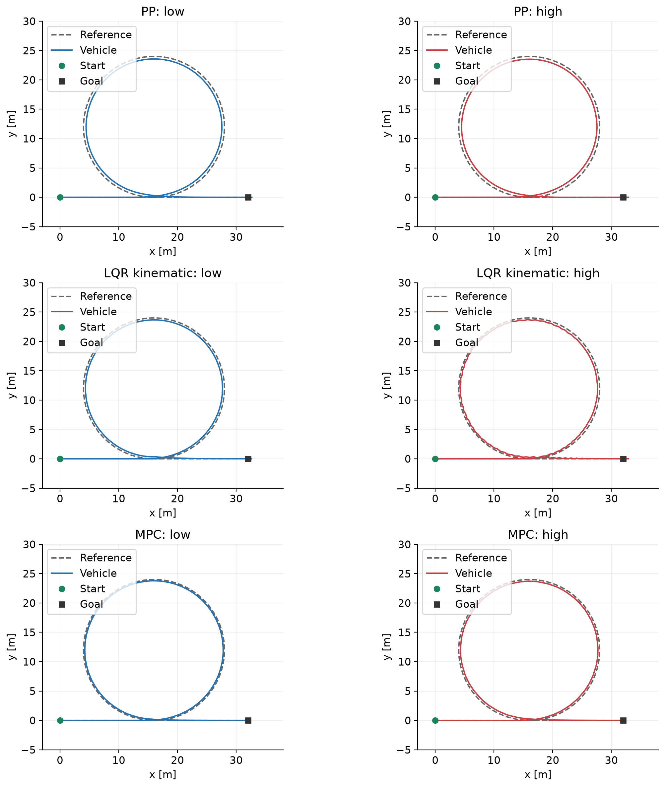
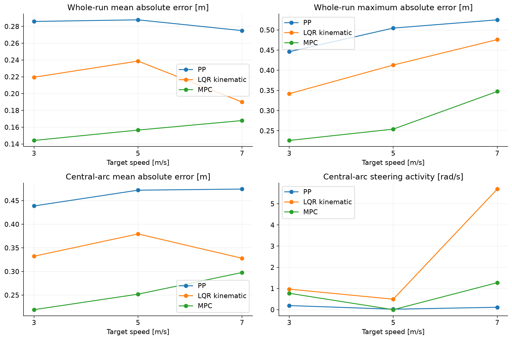
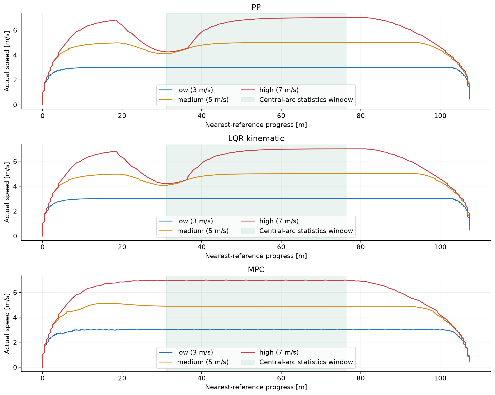
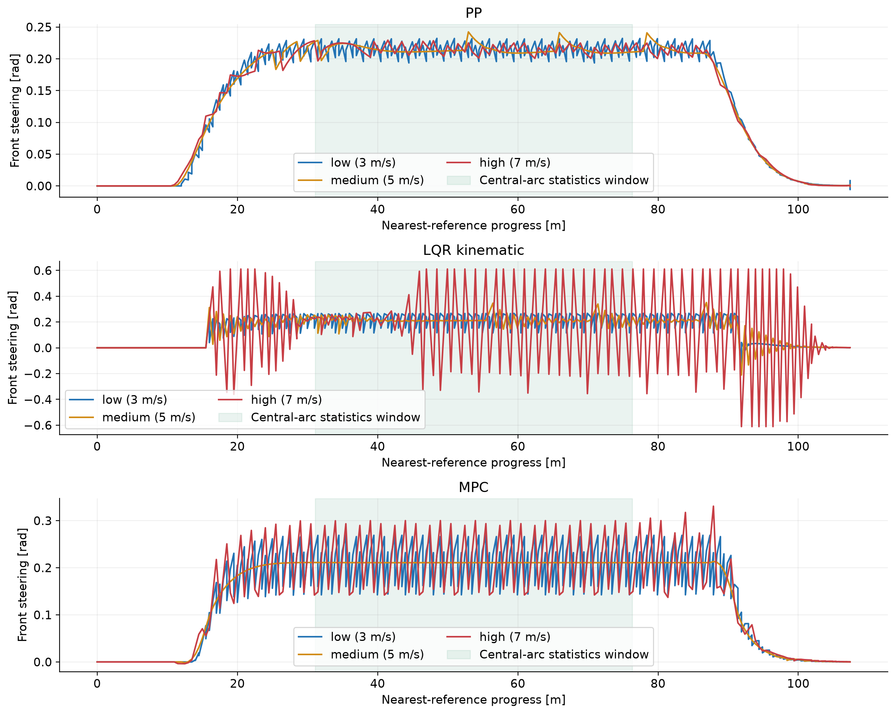
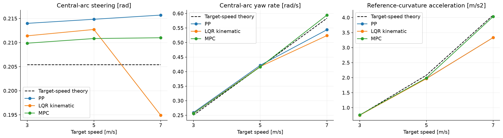

# 智能驾驶与车辆工程课程作业：任务二

## 圆形路径上为什么速度越快跟踪越难

本报告使用 `results/baseline/` 中实际运行并保存的9组实验结果。控制器复用教学仓库答案版，新增代码集中在本目录 `main.py`。正文数值按4位小数或适当有效数字展示，完整精度见CSV与JSON。

## 1. 实验目的

在相同车辆和固定曲率的圆形路径上，比较 Pure Pursuit（PP）、运动学 LQR 和 Linear MPC 在低、中、高速下的总体误差、圆弧中段误差、控制平滑性和任务完成情况。验证曲率、转角、横摆角速度、法向加速度之间的理论关系，并解释高速对跟踪控制提出的额外要求。

实验不能预先假定所有误差指标都会随速度单调增长。本任务同时检查峰值、振荡、实际速度和统计窗口，避免把平均误差降低误判为控制品质改善。

## 2. 模型与理论计算

### 2.1 运动学自行车模型

车辆后轮不转向，轴距为 `L = lf + lr`。课程模型为：

```text
beta = atan(lr/L * tan(delta_f))
x_dot = v*cos(psi + beta)
y_dot = v*sin(psi + beta)
psi_dot = v/L * tan(delta_f)*cos(beta)
```

这里 `beta` 是质心速度方向与车身航向的夹角，不能直接当成真实轮胎失去附着的测量值。当前后端不模拟轮胎侧向力、摩擦圆、侧滑失稳或车辆侧倾。

### 2.2 圆周运动关系

对于半径 `R = 12 m` 的圆：

```text
kappa = 1/R = 0.0833333 1/m
delta_f ≈ atan(L/R)
psi_dot ≈ v/R
a_n = v²/R
```

默认 `student_car` 参数为 `lf = lr = 1.25 m`，轴距 `L = 2.5 m`，故：

```text
delta_f ≈ atan(2.5/12) = 0.2053954 rad ≈ 11.77 deg
```

| 速度档 | 目标速度 / m/s | 近似稳态转角 / rad | 近似横摆角速度 / rad/s | 法向加速度需求 / m/s² |
|---|---:|---:|---:|---:|
| low | 3 | 0.2054 | 0.2500 | 0.7500 |
| medium | 5 | 0.2054 | 0.4167 | 2.0833 |
| high | 7 | 0.2054 | 0.5833 | 4.0833 |

速度从3增至7 m/s，横摆角速度需求增至 `7/3 = 2.33` 倍，法向加速度需求增至 `49/9 = 5.44` 倍。理想稳态转角主要由几何曲率决定，因此近似不变。

课程转角关系忽略了 `cos(beta)` 的影响。若要求质心严格沿半径R稳态运动，保留侧偏几何可得到 `delta_f = atan(L/sqrt(R²-lr²))`。此外，实际轨迹与参考圆不完全重合，反馈修正、离散采样和控制器模型差异也会使平均转角偏离课程近似。

## 3. 实验设置与复现

### 3.1 公平对比设置

| 项目 | 设置 |
|---|---|
| 控制器 | PP、运动学LQR、Linear MPC，均为 `solution` 版 |
| 车辆 | `student_car`，保持原默认参数 |
| 路径 | `circle`：16 m切入直线、半径12 m完整圆、16 m驶出直线 |
| 路径采样间距 | 0.5 m |
| 仿真采样周期 | 0.1 s |
| 最大仿真时间 | 90 s |
| 标称速度 | 3、5、7 m/s |
| 初始状态 | 参考起点、参考航向、速度0 m/s |
| 最大前轮转角 | 35°，即0.6108652 rad |
| 到达终点 | 保留原框架 `reached_goal` 判据 |
| 默认车辆后端 | 运动学自行车模型，前进运动 |

原参数中虽有45°/s的最大转角速率，但默认车辆更新只限幅转角大小，并未统一执行转角速率限制。MPC限制预测时域内相邻转角，未约束首个预测转角与上一步实际转角的衔接。因此本实验保持原实现，不将三种算法说成具有统一执行器速率约束。

PP前视距离为 `3.0 + 0.35*v` 米。LQR与MPC的权重、预测长度等均不另行调参，完整设置见每组 `config.json`。本次Python为3.12.13，NumPy 1.26.4、SciPy 1.17.1、Matplotlib 3.11.2、CVXPY 1.7.5、OSQP 1.1.3。

### 3.2 运行方法

Windows PowerShell，从仓库根目录执行：

```powershell
task2/.venv/Scripts/python.exe -B task2/main.py --output task2/results/new_run
```

程序依次运行3种算法与3档速度。每组的等价原框架命令写入 `manifest.json`，例如：

```powershell
python run_experiment.py --algo pp --version solution --route circle --vehicle student_car --speed-mode high --save-log --save-fig
```

本报告所用原始结果已经保存，无需重新运行。9组均正常结束，全部到达终点，MPC未记录求解器警告。

### 3.3 统一圆弧统计窗口

先选 `abs(curvature - 1/12) < 0.005` 的圆弧候选记录，再按参考弧长剔除圆弧前后各20%。圆弧起点弧长约16 m，末端约91.393 m，统一中间窗口为：

```text
31.0786 m ≤ nearest-reference progress ≤ 76.3142 m
```

每组按 `target_index` 对应的参考弧长筛选，不按固定时间筛选。样本数量不同是速度不同的正常结果。圆弧中间窗口只是“稳态候选区”，LQR高速组仍有明显振荡，不能因处于该区间就声称达到稳定平衡。

平均横向误差使用 `mean(abs(lateral_error))`，最大误差使用最大绝对值。有符号均值和总体标准差分别记录。转角变化率：

```text
J_delta = mean(abs(steer[k]-steer[k-1])/(time[k]-time[k-1]))
```

只计算统计窗口内相邻的仿真步，不跨越被剔除的间隙。

## 4. 实验结果

### 4.1 9组总体指标

| 算法 | 速度档 | 到达终点 | 全程平均绝对误差 / m | 全程最大绝对误差 / m | 最大转角 / rad | 最大参考曲率加速度 / m/s² | 最大横摆角速度 / rad/s |
|---|---|---|---:|---:|---:|---:|---:|
| PP | low | 是 | 0.2859 | 0.4462 | 0.2321 | 0.7500 | 0.2817 |
| PP | medium | 是 | 0.2878 | 0.5046 | 0.2423 | 2.0833 | 0.4896 |
| PP | high | 是 | 0.2750 | 0.5251 | 0.2293 | 4.0816 | 0.6363 |
| LQR | low | 是 | 0.2195 | 0.3419 | 0.2749 | 0.7500 | 0.3348 |
| LQR | medium | 是 | 0.2387 | 0.4130 | 0.3514 | 2.0833 | 0.7212 |
| LQR | high | 是 | 0.1900 | 0.4761 | 0.6109 | 4.0819 | 1.8501 |
| MPC | low | 是 | 0.1442 | 0.2260 | 0.2690 | 0.7779 | 0.3283 |
| MPC | medium | 是 | 0.1566 | 0.2541 | 0.2134 | 2.1896 | 0.4213 |
| MPC | high | 是 | 0.1679 | 0.3475 | 0.3308 | 4.0660 | 0.8647 |

三种算法的全程最大误差均随速度档升高而增加。MPC的全程平均误差也单调增加；PP和LQR的全程平均误差不单调。全程均值按仿真时刻平均，包含起步、直线、入弯、出弯与停车，各阶段的样本占比会随速度改变，因此不能只凭该指标判断高速更易控制。

### 4.2 圆弧中段均值

| 算法 | 速度档 | 样本数 | 实际平均速度 / m/s | 平均绝对误差 / m | 平均转角 / rad | 平均横摆角速度 / rad/s | 平均参考曲率加速度 / m/s² |
|---|---|---:|---:|---:|---:|---:|---:|
| PP | low | 145 | 3.0000 | 0.4387 | 0.2140 | 0.2593 | 0.7500 |
| PP | medium | 89 | 4.8604 | 0.4721 | 0.2149 | 0.4216 | 1.9738 |
| PP | high | 70 | 6.2462 | 0.4745 | 0.2157 | 0.5440 | 3.3344 |
| LQR | low | 146 | 3.0000 | 0.3323 | 0.2114 | 0.2566 | 0.7500 |
| LQR | medium | 90 | 4.8525 | 0.3795 | 0.2127 | 0.4173 | 1.9679 |
| LQR | high | 71 | 6.2469 | 0.3280 | 0.1949 | 0.5240 | 3.3367 |
| MPC | low | 147 | 3.0179 | 0.2191 | 0.2099 | 0.2558 | 0.7590 |
| MPC | medium | 90 | 4.8875 | 0.2519 | 0.2109 | 0.4161 | 1.9907 |
| MPC | high | 63 | 6.9580 | 0.2978 | 0.2110 | 0.5944 | 4.0345 |

PP/MPC中段平均误差随速度增加。LQR高速中段均值虽然降低，但控制输入剧烈振荡，该均值不代表更高的平稳性。

### 4.3 波动与控制平滑性

| 算法 | 速度档 | 中段最大绝对误差 / m | 中段有符号误差标准差 / m | 中段最大beta / rad | 中段J_delta / rad/s |
|---|---|---:|---:|---:|---:|
| PP | low | 0.4462 | 0.0036 | 0.1176 | 0.1939 |
| PP | medium | 0.5046 | 0.0164 | 0.1230 | 0.0230 |
| PP | high | 0.4872 | 0.0067 | 0.1162 | 0.1135 |
| LQR | low | 0.3419 | 0.0057 | 0.1364 | 0.9695 |
| LQR | medium | 0.4125 | 0.0197 | 0.1785 | 0.4952 |
| LQR | high | 0.4761 | 0.0722 | 0.3368 | 5.6942 |
| MPC | low | 0.2260 | 0.0049 | 0.1370 | 0.7742 |
| MPC | medium | 0.2522 | 0.0005 | 0.1068 | 0.0000447 |
| MPC | high | 0.3177 | 0.0122 | 0.1535 | 1.2742 |

高速LQR的误差标准差约为低速的12.75倍，J_delta约为低速的5.87倍。高速MPC也存在转角波动，但远弱于LQR。**高速精度最佳为MPC，转角变化最平缓为PP**，两个结论不能合并成“同一算法各方面都最好”。

## 5. 理论值与仿真值对比

### 5.1 按标称速度计算的相对误差

理论值见2.2节，仿真均值见4.2节。相对误差为 `abs(simulation-theory)/abs(theory)*100%`。

| 算法 | 速度档 | 转角相对误差 / % | 横摆角速度相对误差 / % | 参考曲率加速度相对误差 / % |
|---|---|---:|---:|---:|
| PP | low | 4.1912 | 3.7180 | 0.000029 |
| PP | medium | 4.6042 | 1.1946 | 5.2594 |
| PP | high | 5.0257 | 6.7510 | 18.3415 |
| LQR | low | 2.9302 | 2.6467 | 0.000026 |
| LQR | medium | 3.5717 | 0.1612 | 5.5404 |
| LQR | high | 5.0992 | 10.1763 | 18.2851 |
| MPC | low | 2.1851 | 2.3092 | 1.2010 |
| MPC | medium | 2.6563 | 0.1454 | 4.4480 |
| MPC | high | 2.7346 | 1.8966 | 1.1956 |

### 5.2 实际速度修正与公式边界

原日志的 `normal_accel` 定义就是 `v² * reference.curvature`。中段曲率恒为1/12，故它与 `mean(v²)/12` 的相对误差为零或浮点舍入量级。这验证了日志与公式的一致性，**不是独立的物理测量验证**。

高速组的实际速度修正如下：

| 算法 | 中段实际速度范围 / m/s | mean(v)/R / rad/s | mean(v²)/R / m/s² | 横摆角速度对实际速度理论的相对误差 / % |
|---|---|---:|---:|---:|
| PP | 4.2473～6.9970 | 0.5205 | 3.3344 | 4.5022 |
| LQR | 4.2021～6.9973 | 0.5206 | 3.3367 | 0.6526 |
| MPC | 6.9302～6.9852 | 0.5798 | 4.0345 | 2.5115 |

PP/LQR的速度控制调用 `speed_pid()`，在车辆距最终终点的**欧氏距离小于14 m**时提前限速。圆形路径绕回终点附近，因此尚未完成圆弧时也可能触发减速。速度图在参考里程约20～40 m附近出现下降，与这段限速逻辑吻合。这是本次实验的重要混杂因素，不能把high组当作全圆弧恒定7 m/s。

PP高速中段加速度均值相对低速增长约4.446倍，LQR约4.449倍，MPC约5.316倍。前两者低于标称5.444倍，主要因为实际速度下降。若按每步实际v计算，平方关系仍满足原日志定义。MPC的纵向速度通过优化求解，并不使用同一 `speed_pid()`，因此不能认为三算法的速度轨迹完全一致。

平均横摆角速度接近 `mean(v)/R`，但平均值可能掩盖瞬时大幅振荡。例如高速LQR最大横摆角速度达到1.8501 rad/s，明显高于标称稳态0.5833 rad/s。其0.6526%的实际速度修正均值误差并不能证明瞬态响应优秀。

## 6. 任务要求的逐项分析

### 问题1：法向加速度是否近似随速度平方增长？

理论需求严格随v²增长；原日志也按此关系计算。标称速度比较时，高速PP/LQR约有18%的中段均值偏差；引入实际速度及 `mean(v²)` 后偏差消失。原因主要来自提前减速和速度波动，不应归因于轮胎附着不足。真实车辆的侧向力需求 `F_y = m*a_n` 也随速度平方增大，但本后端未模拟实际轮胎能否提供该力。

### 问题2：理论转角不变，实际误差为什么增大？

理想稳态转角由L/R决定，不包含v。但从直线进入圆弧、修正位置和航向误差都需要过程。固定dt=0.1 s时，标称每步前进距离由0.3 m增至0.7 m，航向转动需求由0.025 rad增至0.0583 rad，修正误差的空间余量降低。

PP的前视距离随速度增加，对离散目标点和曲率切换的响应也发生变化。LQR的模型和反馈增益随速度变化，高速反馈出现交替修正与限幅。MPC存在有限预测时域、离散模型和参考点取整误差，而且其预测模型忽略beta，与实际后端不完全一致。这些控制和建模因素足以产生速度相关误差，不需要假定几何转角本身随速度增加。

### 问题3：主要问题来自瞬态还是稳态？

按圆弧前20%、中60%、后20%分别统计：

| 算法 | 速度档 | 切入圆弧区最大误差 / m | 中段最大误差 / m | 驶出圆弧区最大误差 / m | 全程峰值所在区 |
|---|---|---:|---:|---:|---|
| PP | low | 0.4414 | 0.4462 | 0.4404 | 中段 |
| PP | medium | 0.5037 | 0.5046 | 0.4755 | 中段 |
| PP | high | 0.5251 | 0.4872 | 0.4851 | 切入 |
| LQR | low | 0.3293 | 0.3419 | 0.3413 | 中段 |
| LQR | medium | 0.3895 | 0.4125 | 0.4130 | 驶出 |
| LQR | high | 0.4021 | 0.4761 | 0.3622 | 中段 |
| MPC | low | 0.2251 | 0.2260 | 0.2260 | 中段 |
| MPC | medium | 0.2541 | 0.2522 | 0.2533 | 切入 |
| MPC | high | 0.3153 | 0.3177 | 0.3475 | 驶出 |

PP高速的最高峰来自入弯，但仍存在约0.4745 m中段偏差；LQR高速问题主要表现为中段振荡；MPC高速峰值出现在驶出区，同时中段误差也高于低速。不能统一断言三算法的困难都发生在同一阶段。前后20%的空间分区是透明、可复现的分析口径，不是严格的系统收敛时间定义。

### 问题4：高速是否出现饱和、振荡、滞后或未完成？

- 9组均到达终点，无程序异常或MPC求解失败。
- 高速PP未出现转角大小饱和；转角相对平缓，但入弯峰值和中段偏差偏大。
- 高速LQR最大转角达到35°，全程约22.64%的记录接近转角限值；误差及转角呈交替振荡。最大观测转角变化率12.2173 rad/s，远高于参数中的0.7854 rad/s，进一步说明后端没有执行统一速率约束。
- 高速MPC没有转角大小饱和，但存在周期性转角波动，中段J_delta为1.2742 rad/s。其每步首控制量衔接未受同样速率约束，因此不能仅凭预测时域约束宣称实际控制输入完全满足执行器限制。
- PP/LQR中段实际速度没有持续达到7 m/s；MPC中段接近7 m/s。速度偏离必须纳入比较。
- 入弯/出弯存在跟踪过渡，曲线可反映提前转向或误差修正过程；本实验没有估计频率响应、延迟参数或相位角，所以不把所有峰值一概称为已经定量证明的相位滞后。

### 问题5：高速精度和平滑性哪个最好？

高速中段平均误差排序：`MPC 0.2978 m < LQR 0.3280 m < PP 0.4745 m`。高速全程最大误差也是MPC最小。高速转角变化率排序：`PP 0.1135 < MPC 1.2742 < LQR 5.6942 rad/s`。因此本次默认设置下，MPC精度最好，PP输入最平缓，LQR平滑性最差。

本任务只运行circle路线，没有任务一的其他路线实验数据，不能确认排名是否跨场景一致。算法排名取决于路径、速度、参数及模型假设，本结论仅适用于本次基准设置。

## 7. 图表证据

图1为低速/高速轨迹对比，图2展示误差与平滑性指标随速度变化。图3和图4分别支撑提前减速与高速振荡的分析；图5为理论均值对照。











有符号误差随里程变化的完整图另见 `results/baseline/figures/error_by_progress.png`。每组的原始汇总图见 `runs/算法_速度/summary.png`。

## 8. 结论与局限

1. 固定曲率下，理想稳态几何转角近似不变，横摆速度需求线性增长，法向加速度需求平方增长。
2. 本次三算法最大横向误差均随速度档升高而增加。高速LQR振荡与饱和明显，表明高速会增加控制难度，但平均误差并非必然单调增加。
3. 高速精度与平滑性存在取舍：MPC误差最小，PP转角变化最平缓。单一平均指标无法完整评价性能。
4. PP/LQR提前减速、采样分布变化、模型近似和参考离散都会影响比较；必须记录实际速度并区分过渡区与中段。
5. 本仿真没有真实轮胎侧向力/附着模型，也没有统一执行器速率限制。它支持对教学控制器和运动学关系的分析，不能给出真实车辆安全极限或证明高速侧滑失稳。

后续改进可先在独立扩展实验中统一纵向速度策略，并加入全控制器共用的转角速率限制，再比较误差与平滑性的变化。进一步研究真实高速稳定性需要动力学车辆后端与轮胎模型。本报告未擅自改变基准实现，这些均为后续建议。

## 9. 资料与可追溯性

- 教学任务书：`vdm_lab/tasks/README.md`，实验任务2及实验前理论准备。
- 课程课件：`VehicleDynamicsMobility_01_BicycleModel.pdf`，法向加速度、圆周运动、运动学自行车模型。
- 控制器：`vdm_lab/solutions/pure_pursuit.py`、`lqr_kinematic.py`、`mpc.py`。
- 模型与速度控制：`vdm_lab/common/bicycle_model.py`、`vehicle.py`、`vehicle_backend.py`。
- 全部运行命令、依赖版本、原模型源文件SHA-256及实验状态：`results/baseline/manifest.json`。
- 新增统计口径的单元与集成验证：`test_main.py`。原始日志保留，重分析不重新运行控制器。
