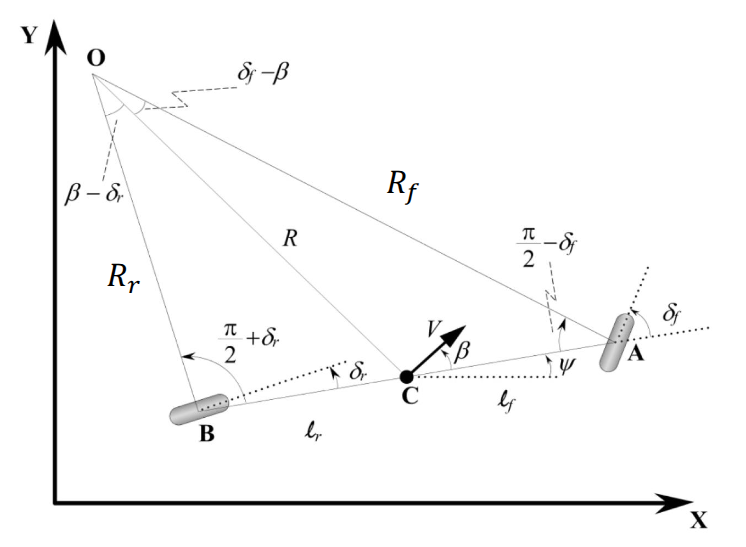
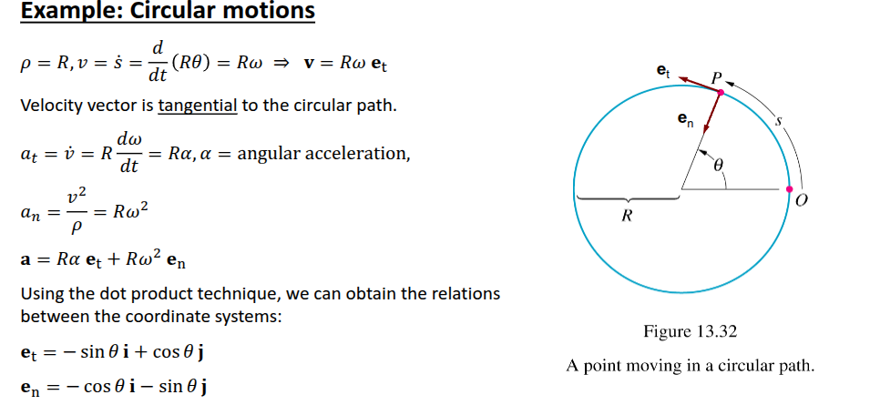
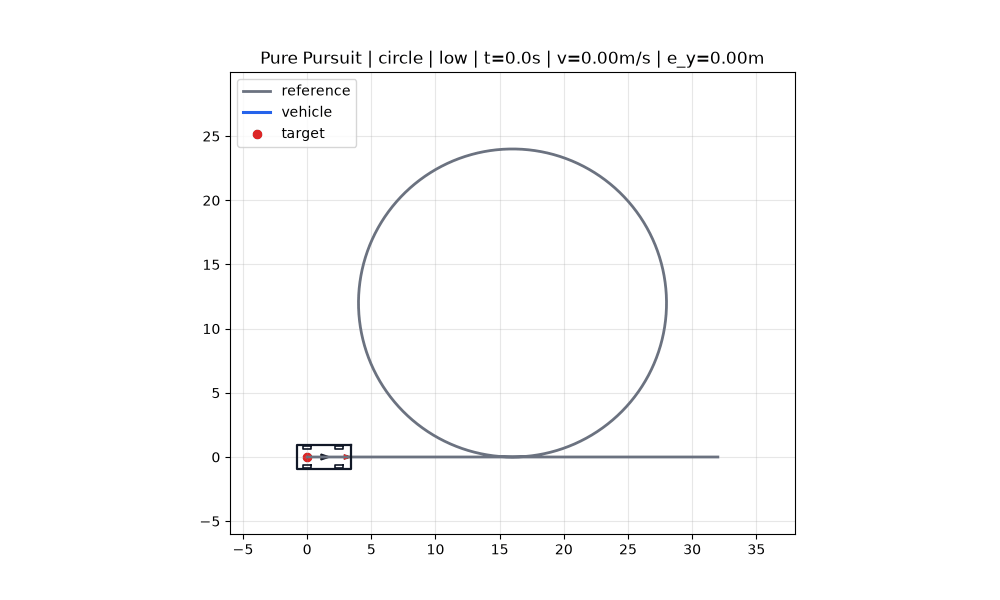
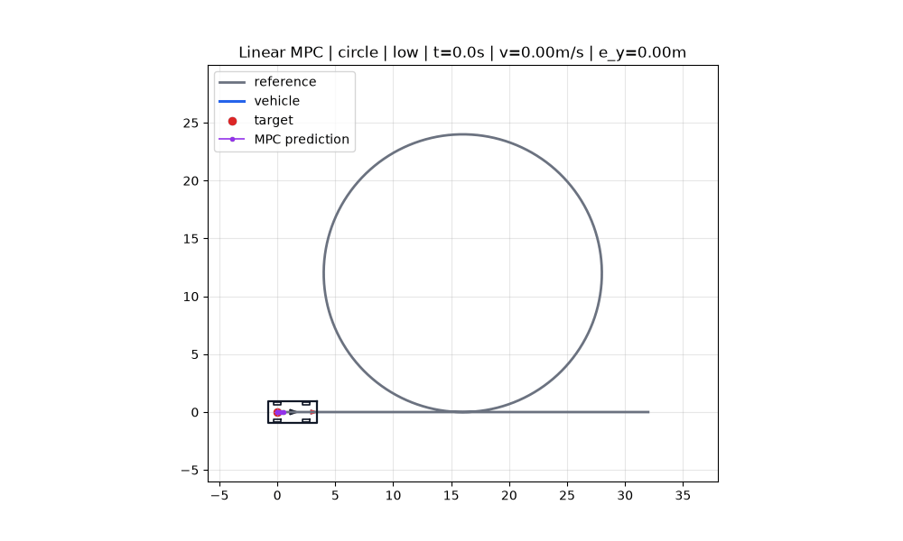

# 课程任务：自行车模型与路径跟踪

本任务对应 `VehicleDynamicsMobility_01_BicycleModel.pdf` 中的 Bicycle Model、Circular Motions、Path Tracking 内容。任务目标不是只跑通代码，而是把课程公式和仿真变量对应起来。

本文件是课程任务书，重点放在公式推导、变量对应、数据处理和报告要求。环境部署、完整运行入口、路线库和 GIF 生成通用说明见主文档 [../../README.md](../../README.md)。

## 课程图 1：运动学自行车模型



### 题目 1：从几何关系推导并解释代码中的车辆模型

根据上图中的 `C`、`A`、`B`、`lf`、`lr`、`R`、`Rf`、`Rr`、`β`、`δf`，完成以下问题：

1. 在后轮不转向 `δr = 0` 的假设下，推导侧偏角：

   ```text
   beta = atan(lr / (lf + lr) * tan(delta_f))
   ```

2. 推导横摆角速度：

   ```text
   psi_dot = v / (lf + lr) * tan(delta_f) * cos(beta)
   ```

3. 解释连续时间运动学模型：

   ```text
   x_dot = v * cos(psi + beta)
   y_dot = v * sin(psi + beta)
   psi_dot = v / (lf + lr) * tan(delta_f) * cos(beta)
   ```

4. 在代码中找到这些公式对应的位置：

   - `vdm_lab/common/bicycle_model.py`
   - `vdm_lab/common/vehicle.py`
   - `vdm_lab/config/vehicle_params.py`

5. 在 `trajectory.csv` 中找到 `steer`、`beta` 和 `yaw_rate`，说明它们分别对应 PDF 里的 `delta_f`、`beta` 和 `psi_dot`。
6. 改变 `student_car` 中的 `lf`、`lr` 或 `max_steer`，分别运行 PP 和 LQR，比较 `metrics.json` 中的横向误差、最大侧偏角和最大横摆角速度变化。

建议命令：

```bash
python run_experiment.py --algo pp --route double_lane_change --save-log --save-fig --save-gif
python run_experiment.py --algo lqr_kinematic --route right_angle --save-log --save-fig --save-gif
```

提交内容：

- 推导过程
- 修改的车辆参数
- 两次实验的 `metrics.json` 对比表，至少包含 `mean_lateral_error_m`、`max_side_slip_beta_rad`、`max_yaw_rate_radps`
- 一张 `summary.png` 或 `animation.gif`

## 课程图 2：圆周运动、曲率与法向加速度



### 题目 2：用曲率和速度解释为什么高速更难跟踪

根据圆周运动关系：

```text
rho = 1 / kappa
a_n = v^2 / rho = v^2 * kappa
```

完成以下问题：

1. 解释为什么同一条路线在 `high` 速度档下比 `low` 更难跟踪。
2. 对同一算法、同一路线分别运行低速、中速、高速：

   ```bash
   python run_experiment.py --algo pp --route s_curve --speed-mode low --save-log
   python run_experiment.py --algo pp --route s_curve --speed-mode medium --save-log
   python run_experiment.py --algo pp --route s_curve --speed-mode high --save-log
   ```

3. 打开输出目录中的 `trajectory.csv`，观察：

   - `curvature`
   - `normal_accel`
   - `beta`
   - `yaw_rate`
   - `lateral_error`
   - `steer`

4. 用 `metrics.json` 对比三档速度下的：

   - `mean_lateral_error_m`
   - `max_lateral_error_m`
   - `max_normal_acceleration_mps2`
   - `max_steer_rad`

提交内容：

- 低速、中速、高速三组指标表
- 对 `a_n = v^2 * kappa` 和误差变化关系的解释
- 对 PP、LQR 或 MPC 哪个更适合高速弯道跟踪的简短判断

## 课程图 3：圆形路径稳态跟踪

### 题目 3：用圆形路径验证自行车模型中的曲率、转角和横摆角速度

圆形路径 `circle` 由一段直线切入、一整圈半径 `R = 12 m` 的圆和一段直线驶出组成。保留驶出段是为了避免完整闭环路线在切入点和终点重合，导致仿真提前停车。圆弧段曲率近似为：

圆形路径低速参考效果如下，GIF 默认保留历史车辆姿态虚影，便于观察车辆是否进入圆周稳态。

| PP 圆形路径 | LQR 运动学圆形路径 | MPC 圆形路径 |
| --- | --- | --- |
|  |  |  |

```text
kappa = 1 / R = 0.0833 1/m
```

在低速稳态跟踪时，可以近似认为横向误差较小、车辆速度接近目标速度。此时学生需要把仿真输出和课程公式联系起来：

```text
delta_f ≈ atan((lf + lr) * kappa)
psi_dot ≈ v * kappa
a_n = v^2 * kappa
```

完成以下问题：

1. 分别运行 PP、运动学 LQR 和 MPC 的圆形路径低速实验：

   ```bash
   python run_experiment.py --algo pp --route circle --speed-mode low --save-log --save-fig --save-gif
   python run_experiment.py --algo lqr_kinematic --route circle --speed-mode low --save-log --save-fig --save-gif
   python run_experiment.py --algo mpc --route circle --speed-mode low --save-log --save-fig --save-gif
   ```

2. 在 `trajectory.csv` 中截取车辆进入圆弧后的稳定段，例如选择 `curvature` 接近 `0.0833` 的记录，并忽略刚进入圆弧和即将驶出圆弧的过渡步，统计：

   - `steer` 的平均值
   - `yaw_rate` 的平均值
   - `normal_accel` 的平均值
   - `lateral_error` 的平均值和最大值

3. 使用 `vdm_lab/config/vehicle_params.py` 中的 `lf + lr` 和圆形路线的 `kappa = 0.0833 1/m`，手算理论转角 `delta_f`，并和 CSV 中的平均 `steer` 对比。
4. 使用低速目标速度 `v = 3.0 m/s`，手算 `psi_dot ≈ v * kappa` 和 `a_n = v^2 * kappa`，并和 CSV 中的平均 `yaw_rate`、`normal_accel` 对比。
5. 对比 PP、LQR、MPC 在同一圆形路径上的误差和控制平滑性，说明哪个算法更接近理论稳态值。

提交内容：

- 三个算法的圆形路径 `metrics.json` 对比表
- 稳定段 `steer`、`yaw_rate`、`normal_accel` 的均值表
- 理论值和仿真均值的误差百分比
- 一张能显示历史车辆姿态虚影的 `animation.gif`
